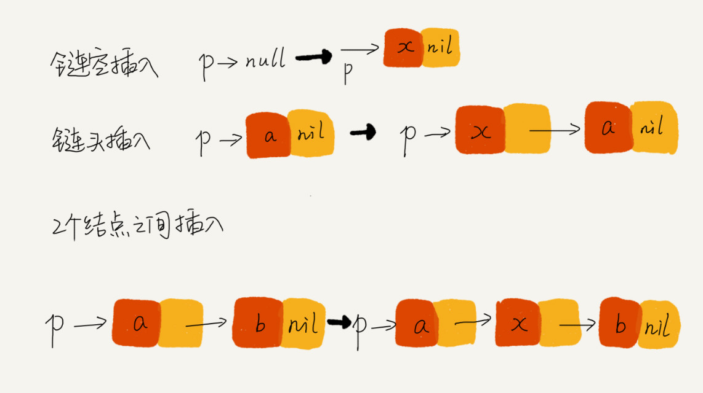

### 存储结构

- 数组需要一块连续的内存空间来存储
- 链表通过“指针”将一组零散的内存块串联起来使用

### 单链表


- 链表插入和删除操作的时间复杂度是 O(1)
- 链表随机访问（第 k 个）的时间复杂度是 O(n)

### 循环链表

循环链表是一种特殊的单链表。

循环链表的优点是从链尾到链头比较方便，当要处理的数据具有环型结构特点时，就特别适合采用循环链表，比如著名的约瑟夫问题。


### 双向链表


在实际的软件开发中，从链表中**删除**一个数据无外乎这两种情况：

- 删除结点中“值等于某个给定值”的结点；
- 删除给定指针指向的结点。

第一种情况：

不管是单链表还是双向链表，为了查找到值等于给定值的结点，都需要从头结点开始一个一个依次遍历对比，直到找到值等于给定值的结点，然后再通过前面讲的**指针操作**将其删除。

单纯的删除操作时间复杂度是 O(1)，遍历查找的时间复杂度为 O(n)。总时间复杂度为 O(n)。

第二种情况：

已经找到了要删除的结点，但是删除某个结点 q 需要知道其前驱结点，而单链表并不支持直接获取前驱结点，所以，为了找到前驱结点，还是要从头结点开始遍历链表，直到 p->next=q，说明 p 是 q 的前驱结点。

但是对于双向链表来说，结点已经保存了前驱结点的指针，不需要像单链表那样遍历。

单链表删除操作需要 O(n) 的时间复杂度，而双向链表只需要在 O(1) 的时间复杂度内就搞定了！

同理，如果希望在链表的某个**指定结点前面插入**一个结点，双向链表比单链表有很大的优势。双向链表可以在 O(1) 时间复杂度搞定，而单向链表需要 O(n) 的时间复杂度。

除了插入、删除操作有优势之外，对于一个有序链表，双向链表的按值查询的效率也要比单链表高一些。因为，我们可以记录上次查找的位置 p，每次查询时，根据要查找的值与 p 的大小关系，决定是往前还是往后查找，所以平均只需要查找一半的数据。

**用空间换时间**

对于执行较慢的程序，可以通过消耗更多的内存（空间换时间）来进行优化；

而消耗过多内存的程序，可以通过消耗更多的时间（时间换空间）来降低内存的消耗。

**双向循环链表**

### 链表 VS 数组性能大比拼


数组和链表的对比，并不能局限于时间复杂度。

数组简单易用，在实现上使用的是连续的内存空间，**可以借助 CPU 的缓存机制，预读数组中的数据**，所以访问效率更高。而链表在内存中并不是连续存储，所以**对 CPU 缓存不友好**，没办法有效预读。

数组的缺点是大小固定，一经声明就要占用整块连续内存空间。如果声明的数组过大，系统可能没有足够的连续内存空间分配给它，导致“内存不足（out of memory）”。如果声明的数组过小，则可能出现不够用的情况。这时只能再申请一个更大的内存空间，把原数组拷贝进去，非常费时。

链表本身没有大小的限制，天然地支持动态扩容。

如果代码对内存的使用非常苛刻，那数组更适合。因为链表中的每个结点都需要消耗额外的存储空间去存储一份指向下一个结点的指针，所以内存消耗会翻倍。

### 如何基于链表实现 LRU 缓存淘汰算法

最近最少使用策略 LRU（Least Recently Used）

维护一个有序单链表，越靠近链表尾部的结点是越早之前访问的。当有一个新的数据被访问时，我们从链表头开始顺序遍历链表。

1. 如果此数据之前已经被缓存在链表中了，我们遍历得到这个数据对应的结点，并将其从原来的位置删除，然后再插入到链表的头部。
2. 如果此数据没有在缓存链表中，又可以分为两种情况：
    - 如果此时缓存未满，则将此结点直接插入到链表的头部；
    - 如果此时缓存已满，则链表尾结点删除，将新的数据结点插入链表的头部。

缓存访问的时间复杂度为 O(n)

可以引入散列表（Hash table）来记录每个数据的位置，将缓存访问的时间复杂度降到 O(1)。

### 如何轻松写出正确的链表代码

1. 理解指针或引用的含义

    指针 = 引用

    **将某个变量赋值给指针，实际上就是将这个变量的地址赋值给指针，或者反过来说，指针中存储了这个变量的内存地址，指向了这个变量，通过指针就能找到这个变量。**

2. 警惕指针丢失和内存泄漏

    

    插入结点时，一定要注意操作的顺序：要先将结点 x 的 next 指针指向结点 b，再把结点 a 的 next 指针指向结点 x，这样才不会丢失指针，导致内存泄漏。

    ```jsx
    a->next = x;  // 将a的next指针指向x结点；
    x->next = a->next;  // 将x结点的next指针指向b结点；
    // 错误，此时 a->next 已不是指向 b 节点
    // 需先执行第二行 再执行第一行
    ```

    同理，**删除链表结点时，也一定要记得手动释放内存空间。**当然，对于像 Java 这种虚拟机自动管理内存的编程语言来说，就不需要考虑这么多了。

3. 利用哨兵简化实现难度

    在结点 p 后面插入一个新的结点

    ```jsx
    new_node->next = p->next;
    p->next = new_node;
    ```

    向一个空链表中插入第一个结点

    ```jsx
    // head 表示链表的头结点
    if (head == null) {
      head = new_node;
    }
    ```

    删除结点 p 的后继结点

    ```jsx
    p->next = p->next->next;
    ```

    删除链表中的最后一个结点

    ```jsx
    // head=null 表示链表中没有结点了
    if (head->next == null) { head = null;}
    ```

    **针对链表的插入、删除操作，需要对插入第一个结点和删除最后一个结点的情况进行特殊处理。**

    引入哨兵结点，在任何时候，不管链表是不是空，head 指针都会一直指向这个哨兵结点。我们也把这种有哨兵结点的链表叫**带头链表**。相反，没有哨兵结点的链表就叫作**不带头链表**。

    哨兵结点是不存储数据的。

    

    因为哨兵结点一直存在，所以插入第一个结点和插入其他结点，删除最后一个结点和删除其他结点，都可以统一为相同的代码实现逻辑了（不存在 head == null / head->next == null 的情况，不用做多余判断）。

    利用哨兵简化编程难度的技巧

    ```jsx
    // 在数组a中，查找key，返回key所在的位置
    // 其中，n表示数组a的长度
    int find(char* a, int n, char key) {
      // 边界条件处理，如果a为空，或者n<=0，说明数组中没有数据，就不用while循环比较了
      if(a == null || n <= 0) {
        return -1;
      }
      
      int i = 0;
      // 这里有两个比较操作：i<n和a[i]==key.
      while (i < n) {
        if (a[i] == key) {
          return i;
        }
        ++i;
      }
      
      return -1;
    }
    ```

    ```jsx
    // 在数组a中，查找key，返回key所在的位置
    // 其中，n表示数组a的长度
    // 我举2个例子，你可以拿例子走一下代码
    // a = {4, 2, 3, 5, 9, 6}  n=6 key = 7
    // a = {4, 2, 3, 5, 9, 6}  n=6 key = 6
    int find(char* a, int n, char key) {
      if(a == null || n <= 0) {
        return -1;
      }
      
      // 这里因为要将a[n-1]的值替换成key，所以要特殊处理这个值
      if (a[n-1] == key) {
        return n-1;
      }
      
      // 把a[n-1]的值临时保存在变量tmp中，以便之后恢复。tmp=6。
      // 之所以这样做的目的是：希望find()代码不要改变a数组中的内容
      char tmp = a[n-1];
      // 把key的值放到a[n-1]中，此时a = {4, 2, 3, 5, 9, 7}
      a[n-1] = key;
      
      int i = 0;
      // while 循环比起代码一，少了i<n这个比较操作
      while (a[i] != key) {
        ++i;
      }
      
      // 恢复a[n-1]原来的值,此时a= {4, 2, 3, 5, 9, 6}
      a[n-1] = tmp;
      
      if (i == n-1) {
        // 如果i == n-1说明，在0...n-2之间都没有key，所以返回-1
        return -1;
      } else {
        // 否则，返回i，就是等于key值的元素的下标
        return i;
      }
    }
    ```

    第二段代码中，我们通过一个哨兵 a[n-1] = key，成功省掉了一个比较语句 i<n，不要小看这一条语句，当累积执行万次、几十万次时，累积的时间就很明显了。

    这只是为了举例说明哨兵的作用，写代码的时候千万不要写第二段那样的代码，因为可读性太差了。大部分情况下，我们并不需要如此追求极致的性能。

4. 重点留意边界条件处理

    - 如果链表为空时，代码是否能正常工作？
    - 如果链表只包含一个结点时，代码是否能正常工作？
    - 如果链表只包含两个结点时，代码是否能正常工作？
    - 代码逻辑在处理头结点和尾结点的时候，是否能正常工作？

5. 举例画图，辅助思考

    比如往单链表中插入一个数据这样一个操作，我一般都是把各种情况都举一个例子，画出插入前和插入后的链表变化，如图所示：

    

6. 多写多练，没有捷径

    - 单链表反转
    - 链表中环的检测
    - 两个有序的链表合并
    - 删除链表倒数第 n 个结点
    - 求链表的中间结点