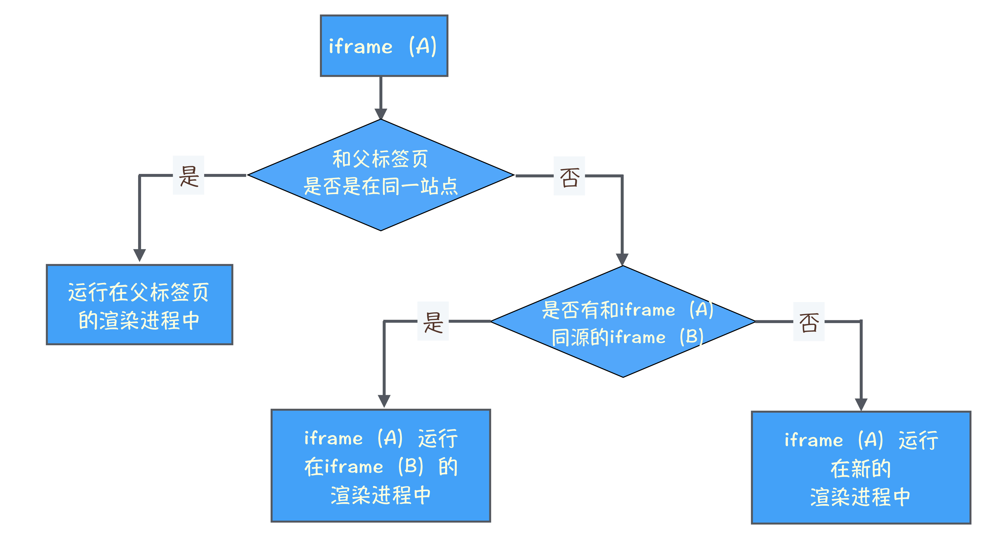

## 浏览上下文组：如何计算Chrome中渲染进程的个数？

标签页之间的连接

1. 是通过标签来和新标签建立连接

    新标签页中的 window.opener 的值指向上个签页中的 window

2. 通过 JavaScript 中的 window.open 方法来和新标签页建立连接

    ```jsx
    new_window = window.open("http://time.geekbang.org")
    ```

    可以在当前标签页中通过 new_window 来控制新标签页，还可以在新标签页中通过 window.opener 来控制当前标签页

这一类具有相互连接关系的标签页(不一定同一站点)称为**浏览上下文组 ( browsing context group)**。

Chrome 浏览器会将**浏览上下文组中属于同一站点的标签**分配到同一个渲染进程中 (可能需要在对方的标签页中执行脚本)

a 标签 ref 的值含 noopener 时，通过这个链接打开的标签页中的 opener 值设置为 null；含 noreferrer 时是告诉浏览器，新打开的标签页不要有引用关系。

站点隔离



如果 A 标签页和 B 标签页属于同一站点，却不属于同源站点，那么你依然无法通过 opener 来操作父标签页中的 DOM，这依然会受到同源策略的限制。

Chrome 为什么使用同一站点划分渲染进程，而不是使用同源策略来划分渲染进程？

1. 通常同一站点安全性是有保障的
2. 便于资源复用（同源要求较严格）

## 任务调度：有了setTimeOut，为什么还要使用rAF？

**单消息队列的队头阻塞问题**


在单消息队列架构下，存在着低优先级任务会阻塞高优先级任务的情况

迭代一：**引入高优先级队列**

高优先级任务：

- 通过鼠标触发的点击任务、滚动页面任务；
- 通过手势触发的页面缩放任务；
- 通过 CSS、JavaScript 等操作触发的动画特效等任务。

引入任务调度器，负责从多个消息队列中选出合适的任务，先按照顺序从高优先级队列中取出任务，如果高优先级的队列为空，那么再按照顺序从低优级队列中取出任务。

缺陷：大多数任务需要**保持其相对执行顺序**，如果将用户输入的消息或者合成消息添加进多个不同优先级的队列中，那么这种任务的相对执行顺序就会被打乱，甚至有可能出现还未处理输入事件，就合成了该事件要显示的图片。

迭代二：**根据消息类型来实现消息队列**

为不同类型的任务创建不同优先级的消息队列


缺陷：在交互阶段，采用这种静态优先级的策略没有什么太大问题，但是在页面加载阶段，如果依然要优先执行用户输入事件和合成事件，那么页面的解析速度将会被拖慢。

迭代三：**动态调度策略**


 默认：页面解析，JavaScript 脚本执行...

- 当在执行用户交互的任务时，将合成任务的优先级调整到最高（接下来大概率要进行绘制合成操作）
- 合成线程在工作时可以把下个合成任务的优先级调整为最低，并将页面解析、定时器等任务优先级提升（这样在合成线程工作时，主线程也同时在工作，因为下次合成任务需要等这次合成任务完成？）

迭代四：**任务饿死**

迭代三缺陷：在某个状态下，一直有新的高优先级的任务加入到队列中，这样就会导致其他低优先级的任务得不到执行，这称为任务饿死。

解决方案：给每个队列设置执行权重，也就是如果连续执行了一定个数的高优先级的任务，那么中间会执行一次低优先级的任务，这样就缓解了任务饿死的情况。

**VSync**

显示器从前缓冲区读取图片和浏览器生成新的图像到后缓冲区的过程是不同步的，会出现以下问题：

- 渲染进程生成帧的速率 > 屏幕刷新率，丢帧
- 渲染进程生成帧的速率 < 屏幕刷新率，卡顿
- 就算频率一样，但由于在两个不同的系统，很难同步起来，会出现不连贯的现象

如何解决：

当显示器将一帧画面绘制完成后，并在准备读取下一帧之前，显示器会发出一个垂直同步信号（vertical synchronization）给 GPU，简称 VSync。（一般16ms发一次 / 60HZ）

当 GPU 接收到 VSync 信号后，会将 VSync 信号同步给浏览器进程，浏览器进程再将其同步到对应的渲染进程，渲染进程接收到 VSync 信号之后，就可以准备绘制新的一帧。这样就**将显示器的时钟同步周期和浏览器生成页面的周期绑定起来了。**


在合成完成之后，合成线程会提交给渲染主线程完成合成的消息，如果当前合成操作执行的非常快(不到 1/60ms)，那么这个 VSync 时钟周期内就不需要再次生成新的页面了。可以在下个 VSync 周期之前的这段空闲时间内执行一些不那么紧急的任务，比如 V8 的垃圾回收，或者通过 window.requestIdleCallback() 设置的回调任务等。

CSS 动画是由渲染进程自动处理的，渲染进程会让 CSS 渲染每帧动画与 VSync 保持一致, 这样就能保证 CSS 动画的高效率执行。

JS 是由用户控制的，如果采用 setTimeout 来触发动画每帧的绘制，那么其绘制时机很难和 VSync 保持一致，所以 JS 中又引入了 window.requestAnimationFrame，用来和 VSync 的时钟周期同步。**raf的回调任务会在每一帧的开始执行。**

## 加载阶段性能：使用Audits来优化Web性能


- **FP** (First Paint)

    在渲染进程确认要渲染当前的请求后，渲染进程会创建一个空白页面，我们把创建空白页面的这个时间点称为 First Paint

    如果 FP 时间过久，页面的 HTML 文件可能由于网络原因导致加载时间过久

- **FCP** (First Content Paint) 页面绘制第一个像素的时间点
- **FMP** 首次有效绘制

    由于 FMP 计算复杂，所以现在不建议使用该指标了

- **Speed Index** (首屏时间)  = Largest Content Paint (**LCP**)

    如果 FMP 和 LCP 消耗时间过久，那么有可能是加载关键资源花的时间过久，也有可能是 JS 执行过程中所花的时间过久。

- **First CPU Idle = First Interactive** 首次 CPU 空闲时间

    表示页面达到最小化可交互的时间，也就是说并不需要等到页面上的所有元素都可交互，只要可以对大部分用户输入做出响应即可。

    要缩短首次 CPU 空闲时长，我们就需要尽可能快地加载完关键资源，尽可能快地渲染出来首屏内容，因此优化方式和第二项 FMP 和第三项 LCP 是一样的。

- **Time to Interactive (TTI)** 完全可交互时间

    表示页面中所有元素都达到了可交互的时长

    要解决 TTI 时间过久的问题，可以推迟执行一些和生成页面无关的 JS 工作

- **Max Potential First Input Delay** 最大估计输入延时

    Web 页面在加载最繁忙的阶段， 窗口中响应用户输入所需的时间

    为了改善该指标，我们可以使用 WebWorker 来执行一些计算，从而释放主线程。另一个有用的措施是重构 CSS 选择器，以确保它们执行较少的计算。

## 页面性能工具：如何使用Performance？


**概览面板**

页面帧速 (FPS)、CPU 资源消耗、网络请求流量、V8 内存使用量 (堆内存) 

- 如果 FPS 图表上出现了红色块，表示红色块附近渲染出一帧所需时间过久，帧的渲染时间过久，就有可能导致页面卡顿。
- 如果 CPU 图形占用面积太大，表示 CPU 使用率就越高，那么就有可能因为某个 JS 占用太多的主线程时间，从而影响其他任务的执行。
- 如果 V8 的内存使用量一直在增加，就有可能是某种原因导致了内存泄漏。

**性能面板**

- Main 记录渲染主线程的任务执行过程
- Compositor 指标记录了合成线程的任务执行过程
- GPU 指标记录了 GPU 进程主线程的任务执行过程
- Chrome_ChildIOThread 指标对应的就是 IO 线程的任务记录，IO 线程主要用来接收用户输入事件、网络事件、设备相关等事件，如果事件需要渲染主线程来处理，那么 IO 线程还会将这些事件转发给渲染主线程。
- Network 指标，网络记录展示了页面中的每个网络请求所消耗的时长。
- Timings 指标，用来记录一些关键的时间节点在何时产生的数据信息（FP、FCP、LCP 等等）
- Frames 指标，就是浏览器生成每帧的记录
- Interactions 指标，用来记录用户交互操作

**详情面板**

可以通过在性能面板中选中性能指标中的任何历史数据，然后选中记录的细节信息就会展现在详情面板中。

## 性能分析工具：如何分析Performance中的Main指标？

```jsx
<html>
<head>
    <title>Main</title>
    <style>
        area {
            border: 2px ridge;
        }
        box {
            background-color: rgba(106, 24, 238, 0.26);
            height: 5em;
            margin: 1em;
            width: 5em;
        }
    </style>
</head>
<body>
    <div class="area">
        <div class="box rAF"></div>
    </div>
    <br>
    <script>
        function setNewArea() {
            let el = document.createElement('div')
            el.setAttribute('class', 'area')
            el.innerHTML = '<div class="box rAF"></div>'
            document.body.append(el)
        }
        setNewArea()   
    </script>
</body>
</html>
```


**导航阶段**


1. Send request 表示网络请求已被发送。然后该任务进入了等待状态。
2. 接着由网络进程负责下载资源，当接收到响应头的时候，该任务便执行 Receive Respone 过程，该过程表示接收到 HTTP 的响应头了。
3. 接着执行 DOM 事件：pagehide、visibilitychange 和 unload 等事件，如果你注册了这些事件的回调函数，那么这些回调函数会依次在该任务中被调用。
4. 接下来就接收 HTML 数据了，这体现在了 Recive Data 过程，Recive Data 过程表示请求的数据已被接收，如果 HTML 数据过多，会存在多个 Receive Data 过程。

等到所有的数据都接收完成之后，渲染进程会触发另外一个**任务**，该任务主要执行 Finish load **过程**，该过程表示网络请求已经完成。

**解析 HTML 数据阶段**


1. 在 ParserHTML 的过程中，如果解析到了 script 标签，那么便进入了脚本执行过程，也就是图中的 Evalute Script。
2. 在 Evalute Script 过程中，先进入了脚本编译过程，也就是图中的 Complie Script。执行全局代码时，V8 会先构造一个 anonymous 过程，在执行 anonymous 过程中，会调用 setNewArea 过程，setNewArea 过程中又调用了 createElement，由于之后调用了 document.append 方法，该方法会触发 DOM 内容的修改，所以又强制执行了 ParserHTML 过程生成的新的 DOM。
3. DOM 生成完成之后，会触发相关的 DOM 事件，比如典型的 DOMContentLoaded，还有 readyStateChanged。
4. ParserHTML 过程继续计算样式表，也就是 Recalculate Style，这就是生成 CSSOM 的过程。

**生成可显示位图阶段**


1. 在生成完了 DOM 和 CSSOM 之后，渲染主线程首先执行了一些 DOM 事件，诸如 readyStateChange、load、pageshow。如果你使用 JS 监听了这些事件，那么这些监听的函数会被渲染主线程依次调用。
2. 执行布局，这个过程对应图中的 Layout。
3. 然后更新层树 (LayerTree)，这个过程对应图中的 Update LayerTree。
4. 有了层树之后，就需要为层树中的每一层准备绘制列表了，这个过程就称为 Paint。
5. 准备每层的绘制列表之后，就需要利用绘制列表来生成相应图层的位图了，这个过程对应图中的 Composite Layers。

走到了 Composite Layers 这步，主线程的任务就完成了，接下来主线程会将合成的任务完全教给合成线程来执行，你也可以对照着 Composite、Raster 和 GPU 这三个指标来分析。


最终图像是怎么显示出来的

1. 主线程执行到 Composite Layers 过程之后，便会将绘制列表等信息提交给合成线程，合成线程的执行记录你可以通过 Compositor 指标来查看。
2. 合成线程维护了一个 Raster 线程池，线程池中的每个线程称为 Rasterize，用来执行光栅化操作，对应的任务就是 Rasterize Paint。
3. 光栅化操作并不是在 Rasterize 线程中直接执行的，而是在 GPU 进程中执行的，因此 Rasterize 线程需要和 GPU 线程保持通信。
4. 然后 GPU 生成图像，最终这些图层会被提交给浏览器进程，浏览器进程将其合成并最终显示在页面上。

## HTTPS：浏览器如何验证数字证书？

浏览器需要 CA 的数字证书才能验证极客时间的数字证书，接下来我们需要验证 CA 证书的合法性，最简单的方法是将 CA 证书内置在操作系统中。

不过 CA 机构非常多，内置每家的证书到操作系统中是不现实的，于是我们采用了一个折中的策略，将颁发证书的机构划分为两种类型，根 CA(Root CAs)和中间 CA(Intermediates CAs)，通常申请者都是向中间 CA 去申请证书的，而根 CA 作用就是给中间 CA 做认证，一个根 CA 会认证很多中间的 CA，而这些中间 CA 又可以去认证其他的中间 CA。

于是又引出了数字证书链，浏览器先利用中间 CA 的数字证书来验证用户证书，再利用根证书来验证中间 CA 证书的合法性，最后，浏览器会默认相信内置在系统中的根证书。