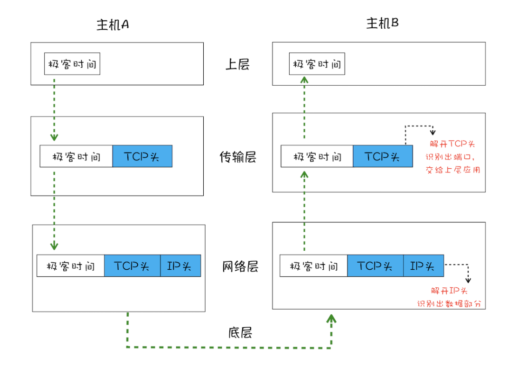
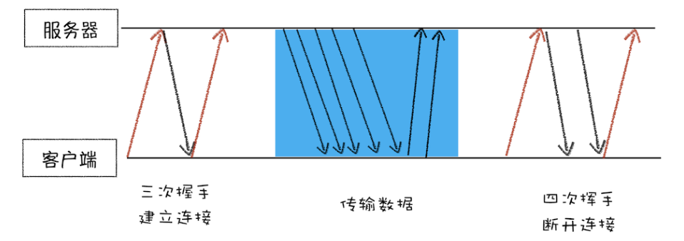
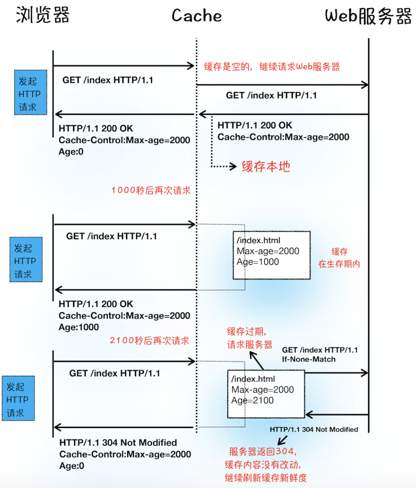
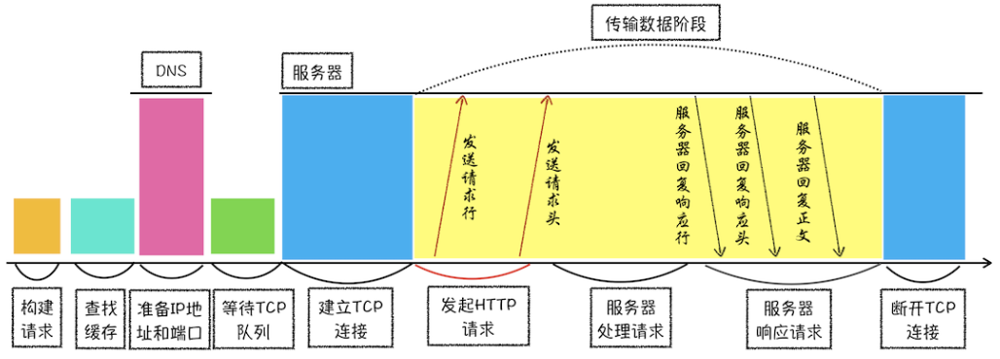
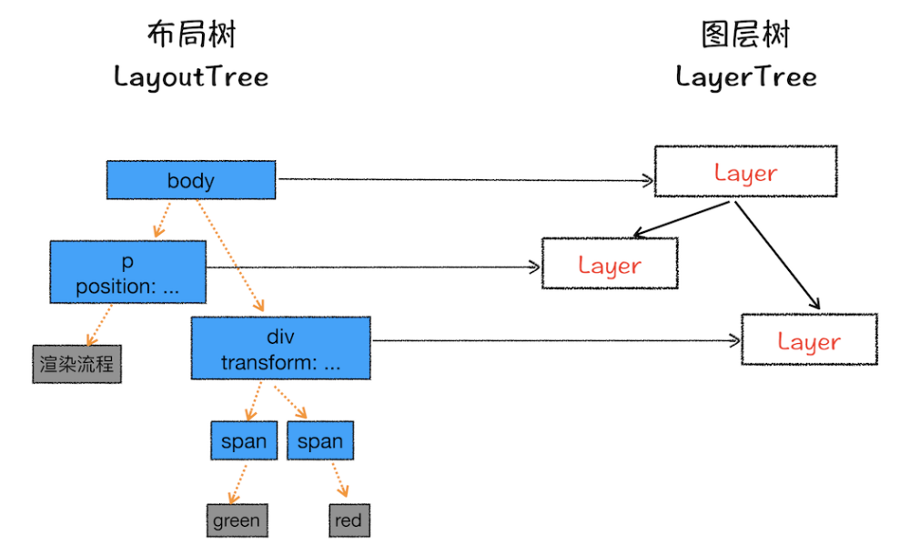

## Chrome架构：仅仅打开了1个页面，为什么有4个进程？

线程

- 线程是不能单独存在的，它是由进程来启动和管理的。
- 线程是依附于进程的，而进程中使用多线程并行处理能提升运算效率。

进程

- 一个进程就是一个程序的运行实例。
- 启动一个程序的时候，操作系统会为该程序创建一块内存，用来存放代码、运行中的数据和一个执行任务的主线程，我们把这样的一个运行环境叫进程。

特点

- 进程中的任意一线程执行出错，都会导致整个进程的崩溃。
- 线程之间共享进程中的数据。
- 当一个进程关闭之后，操作系统会回收进程所占用的内存。（即使其中任意线程因为操作不当导致内存泄漏，当进程退出时，这些内存也会被正确回收。）
- 进程之间的内容相互隔离。进程间通信（IPC）

单进程浏览器

- 浏览器的所有功能模块都是运行在同一个进程里。
- 不稳定、不流畅、不安全

多进程浏览器

- **浏览器进程**。主要负责界面显示、用户交互、子进程管理，同时提供存储等功能。
- **渲染进程**。核心任务是将 HTML、CSS 和 JavaScript 转换为用户可以与之交互的网页，排版引擎 Blink 和 JavaScript 引擎 V8 都是运行在该进程中，默认情况下，Chrome 会为每个 Tab 标签创建一个渲染进程。渲染进程的内容都是通过网络获取的，会存在一些恶意代码利用浏览器漏洞对系统进行攻击，出于安全考虑，渲染进程都是运行在沙箱模式下。
- **GPU 进程**。Chrome 的 UI 界面、部分网页选择 GPU 来绘制
- **网络进程**。负责页面的网络资源加载
- **插件进程**。负责插件的运行

问题：

- 更高的资源占用。
- 更复杂的体系架构。

未来面向服务的架构（Services Oriented Architecture，SOA）

## TCP协议：如何保证页面文件能被完整送达浏览器？

**IP**

- 把数据包送达目的主机
- 计算机的地址就称为 IP 地址，访问任何网站实际上只是你的计算机向另外一台计算机请求信息。

**UDP** — 用户数据包协议（User Datagram Protocol）

- 把数据包送达应用程序
- IP 通过 IP 地址信息把数据包发送给指定的电脑，而 UDP 通过端口号把数据包分发给正确的程序。
- UDP 不能保证数据可靠性，但是传输速度却非常快

**TCP** — Transmission Control Protocol 传输控制协议

- 把数据完整地送达应用程序

相对UDP：

- 于数据包丢失的情况，TCP 提供重传机制；
- TCP 引入了数据包排序机制，用来保证把乱序的数据包组合成一个完整的文件。

简化的 TCP 网络四层传输模型：

一个 TCP 连接的生命周期：

- 面向连接是指在数据通信开始之前先做好两端之间的准备工作。所谓三次握手，是指在建立一个 TCP 连接时，客户端和服务器总共要发送三个数据包以确认连接的建立。
- 传输数据阶段接收端需要对每个数据包进行确认操作。接收端在接收到数据包之后，需要发送确认数据包给发送端。所以当发送端发送了一个数据包之后，在规定时间内没有接收到接收端反馈的确认消息，则判断为数据包丢失，并触发发送端的重发机制。接收端会按照 TCP 头中的序号为数据包排序，从而保证组成完整的数据。

## HTTP请求流程：为什么很多站点第二次打开速度会很快？

浏览器端发起 HTTP 请求流程

1. **构建请求**（请求行）
2. **查找缓存**（浏览器缓存）
3. **准备 IP 地址和端口**（DNS和DNS缓存）
4. **等待 TCP 队列**

    Chrome 同一个域名同时最多只能建立 6 个 TCP 连接，超出的请求会进入排队等待状态

5. **发送 HTTP 请求**
    - 请求行：请求方法、请求 URI、 HTTP 版本协议
    - 请求头：浏览器的基础信息等
    - 请求体：如POST方法的请求数据

服务器端处理 HTTP 请求流程

1. **返回请求**
    - 响应行：版本协议、状态码
    - 响应头：服务器的基础信息等
    - 响应体：具体数据(html,js,json等)
2. **断开连接** 

    通常情况下，一旦服务器向客户端返回了请求数据，它就要关闭 TCP 连接，除非浏览器或者服务器在其头信息中加入了'Connection: Keep-Alive'。

3. **重定向**

## 导航流程：从输入URL到页面展示，这中间发生了什么？

1. **浏览器进程接收到用户输入的 URL 请求，将该 URL 转发给网络进程。**
    - 搜索内容，使用浏览器默认的搜索引擎
    - 符合 URL 规则，那么地址栏会根据规则，把这段内容加上协议
    - 当前页面即将要被替换成新的页面之前，浏览器还给了当前页面一次执行 beforeunload 事件的机会，可以通过 beforeunload 事件来取消导航，让浏览器不再执行任何后续工作。
    - 当浏览器刚开始加载一个地址之后，标签页上的图标便进入了加载状态。需要等待提交文档阶段，页面内容才会被替换。
2. **在网络进程中发起真正的 URL 请求**（参考上节HTTP请求流程）
3. **网络进程解析响应头数据，并将数据转发给浏览器进程**
    - 重定向，发起新的 HTTP 或者 HTTPS 请求
    - Content-Type 字段的值被浏览器判断为下载类型，那么该请求会被提交给浏览器的下载管理器，同时该 URL 请求的导航流程就此结束。但如果是 HTML，那么浏览器则会继续进行导航流程。
4. **浏览器进程接收到响应头数据之后，发送“提交导航/文档”消息到渲染进程**
5. **渲染进程接收到“提交文档”的消息后，会和网络进程建立传输数据的“管道”**
6. **等文档数据传输完成之后，渲染进程会返回“确认提交”的消息给浏览器进程**
7. **浏览器进程在收到“确认提交”的消息后，会更新浏览器界面状态，包括了安全状态、地址栏的 URL、前进后退的历史状态，并更新 Web 页面。**
8. 渲染阶段

Chrome 默认每个标签对应一个渲染进程，但如果从一个页面打开了另一个新页面，而新页面和当前页面属于同一站点的话，那么新页面会复用父页面的渲染进程。

同一站点：根域名（[geekbang.org](http://geekbang.org/)）加上协议（https:// 或者 http://），还包含了该根域名下的所有子域名和不同的端口。

## 渲染流程（上）：HTML、CSS和JavaScript，是如何变成页面的？

按照渲染的时间顺序可分为如下几个子阶段：**构建 DOM 树、样式计算、布局阶段、分层、绘制、分块、光栅化和合成。**

每个子阶段都有其**输入的内容、处理过程、输出内容**。

**构建 DOM 树**

因为浏览器无法直接理解和使用 HTML，所以需要将 HTML 转换为浏览器能够理解的结构——DOM 树。

- 输入内容：HTML 文件
- 处理过程：HTML 解析器解析
- 输出内容：DOM

**样式计算（Recalculate Style）**

样式计算的目的是为了计算出 DOM 节点中每个元素的具体样式，保存在 ComputedStyle 的结构内

1. **把 CSS (三种来源) 转换为浏览器能够理解的结构 — styleSheets** 
(类似一个对象数组，可通过控制台 document.styleSheets 查看)
2. **属性值的标准化**
(将所有值转换为渲染引擎容易理解的、标准化的计算值)
3. **计算出 DOM 树中每个节点的具体样式**
继承规则
层叠规则：定义如何合并来自多个源的属性值

**布局阶段**

计算出 DOM 树中可见元素的几何位置

1. **创建布局树**
构建一棵只包含可见元素布局树

2. **布局计算**
     计算布局树节点的坐标位置，后续详细介绍。

## 渲染流程（下）

**分层**

渲染引擎需要为特定的节点生成专用的图层，并生成一棵对应的图层树（LayerTree）。

- 拥有层叠上下文属性的元素会被提升为单独的一层

    明确定位属性的元素、定义透明属性的元素、使用 CSS 滤镜的元素等

- 需要剪裁的地方也会被创建为图层

    文字溢出（文字部分单独创建图层）、滚动条（单独创建图层）

**图层绘制**

渲染引擎会把一个图层的绘制拆分成很多小的绘制指令，然后再把这些指令按照顺序组成一个待绘制列表，在图层绘制阶段，输出的内容就是这些待绘制列表。

**栅格化（raster）操作**

当图层的绘制列表准备好之后，主线程会把该绘制列表提交（commit）给合成线程。

合成线程会将图层划分为图块（tile），然后按照视口附近的图块来优先生成位图，实际生成位图的操作是由栅格化来执行的。所谓栅格化，是指将图块转换为位图。

图块是栅格化执行的最小单位。渲染进程维护了一个栅格化的线程池，所有的图块栅格化都是在线程池内执行的。

通常，栅格化过程都会使用 GPU 来加速生成，使用 GPU 生成位图的过程叫快速栅格化，或者 GPU 栅格化，生成的位图被保存在 GPU 内存中。

**合成和显示**

GPU 进程中栅格化执行完成，再将结果返回给渲染进程的合成线程，执行合成图层操作(DrawQuad?)

合成的图层会被提交给浏览器进程，并且发送一个绘制命令——“DrawQuad”，浏览器进程里会执行显示合成(Display Compositor)，也就是将所有的图层合成为可以显示的页面图片。

**重排**

更新元素的几何属性，需要更新完整的渲染流水线，所以开销也是最大的。

**重绘**

更新元素的绘制属性，省去了布局和分层阶段，所以执行效率会比重排操作要高一些。

**直接合成阶段**

不会占用主线程的资源，避开了布局和绘制，相对于重绘和重排，合成能大大提升绘制效率。

