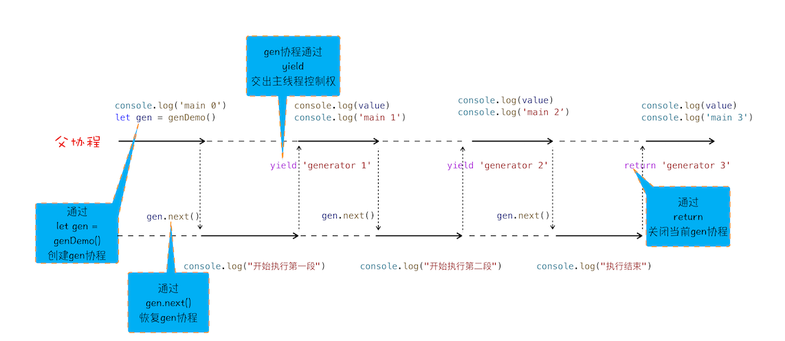

## 消息队列和事件循环：页面是怎么“活”起来的？

浏览器页面是由**消息队列**和**事件循环**系统来驱动的


渲染进程专门有一个 **IO 线程**用来接收其他进程传进来的消息

消息队列中的任务类型：输入事件（鼠标滚动、点击、移动）、微任务、文件读写、WebSocket、JS 定时器等等；还包含了很多与页面相关的事件，如 JS 执行、解析 DOM、样式计算、布局计算、CSS 动画等。

消息队列中的任务称为**宏任务**，每个宏任务中都包含了一个**微任务**队列。等宏任务中的主要功能都直接完成之后，会执行当前宏任务中的微任务。

JS 可以通过回调功能避免单个任务执行时长过久造成的页面卡顿问题。

## WebAPI：setTimeout是如何实现的？

为了让定时器设置的回调事件在规定时间内被执行，还维护了一个延迟队列(hashmap)

处理完消息队列中的任务之后，根据发起时间和延迟时间计算出延迟队列中到期的任务，然后依次执行这些到期的任务。

- 如果当前任务执行时间过久，会影延迟到期定时器任务的执行
- 如果 setTimeout 存在嵌套调用，那么系统会设置最短时间间隔为 4 毫秒

    在 Chrome 中，定时器被嵌套调用 5 次以上，系统会判断该函数方法被阻塞了，如果定时器的调用时间间隔小于 4 毫秒，那么浏览器会将每次调用的时间间隔设置为 4 毫秒。

- 未激活的页面，setTimeout 执行最小间隔是 1000 毫秒
- 延时执行时间有最大值（32bit 2147483647ms）
- 使用 setTimeout 设置的回调函数中的 this 不符合直觉

## WebAPI：XMLHttpRequest是怎么实现的？

将一个函数作为参数传递给另外一个函数，那作为参数的这个函数就是**回调函数**。

回调函数在主函数返回之前执行的，我们把这个回调过程称为**同步回调**。

回调函数在主函数外部执行的过程称为**异步回调**。

当循环系统在执行一个任务的时候，都要为这个任务维护一个**系统调用栈**(C++ 维护)。

XMLHttpRequest 运作机制


1. 创建 XMLHttpRequest 对象。
2. 为 xhr 对象注册回调函数。
3. 配置基础的请求信息。
4. 发起请求。
- 跨域问题
- HTTPS 混合内容的问题

## 宏任务和微任务：不是所有任务都是一个待遇

页面中的大部分任务都是在**主线程**上执行的，这些任务包括了：

- 渲染事件（如解析 DOM、计算布局、绘制）
- 用户交互事件（如鼠标点击、滚动页面、放大缩小等）；
- JS 脚本执行事件；
- 网络请求完成、文件读写完成事件。

这些消息队列中的任务称为**宏任务**。

**微任务**就是一个需要异步执行的函数，执行时机是在主函数执行结束之后、当前宏任务结束之前。

异步回调函数可以封装成一个宏任务，也可以封装成一个微任务。

产生微任务的两种方式：

- 使用 MutationObserver 监控某个 DOM 节点
- Promise

在当前宏任务中的 JS 快执行完成时，也就在 JS 引擎准备退出全局执行上下文(加餐里解释)并清空调用栈的时候，JS 引擎会检查全局执行上下文中的微任务队列，然后按照顺序执行队列中的微任务。


## Promise：使用Promise，告别回调函数

Web 页面的单线程架构决定了异步回调

为了解决嵌套调用，Promise 实现了回调函数的延时绑定(微任务)，并且将回调函数 onResolve 的返回值穿透到最外层。

为了解决多次错误处理，Promise 对象的错误具有“冒泡”性质，会一直向后传递，直到被 onReject 函数处理或 catch 语句捕获为止。

## async/await：使用同步的方式去写异步代码

async/await 的基础技术使用了**生成器**和 **Promise**，生成器是**协程**的实现，利用生成器能实现生成器函数的暂停和恢复。

**协程**是一种比线程更加轻量级的存在，一个线程上可以存在多个协程，但是在线程上同时只能执行一个协程。如果从 A 协程启动 B 协程，我们就把 A 协程称为 B 协程的父协程。

协程不是被操作系统内核所管理，而完全是由程序所控制，不会像线程切换那样消耗资源。

```jsx
function* genDemo() {
    console.log("开始执行第一段")
    yield 'generator 2'

    console.log("开始执行第二段")
    yield 'generator 2'

    console.log("开始执行第三段")
    yield 'generator 2'

    console.log("执行结束")
    return 'generator 2'
}

console.log('main 0')
let gen = genDemo()
console.log(gen.next().value)
console.log('main 1')
console.log(gen.next().value)
console.log('main 2')
console.log(gen.next().value)
console.log('main 3')
console.log(gen.next().value)
console.log('main 4')
```



- gen 协程和父协程是在主线程上交互执行的，并不是并发执行的，它们之前的切换是通过 yield 和 gen.next 来配合完成的。
- 当在 gen 协程中调用了 yield 方法时，JS 引擎会保存 gen 协程当前的调用栈信息，并恢复父协程的调用栈信息。同样，当在父协程中执行 gen.next 时，JavaScript 引擎会保存父协程的调用栈信息，并恢复 gen 协程的调用栈信息。


```jsx
//foo函数
function* foo() {
    let response1 = yield fetch('https://www.geekbang.org')
    console.log('response1')
    console.log(response1)
    let response2 = yield fetch('https://www.geekbang.org/test')
    console.log('response2')
    console.log(response2)
}

//执行foo函数的代码
let gen = foo()
function getGenPromise(gen) {
    return gen.next().value
}
getGenPromise(gen).then((response) => {
    console.log('response1')
    console.log(response)
    return getGenPromise(gen)
}).then((response) => {
    console.log('response2')
    console.log(response)
})
//执行foo函数的代码简化
co(foo());
//再简化，直接把foo函数用 async/await 改写
```

**async** 是一个通过**异步执行**并**隐式返回 Promise** 作为结果的函数。

```jsx
async function foo() {
    console.log(1)
    let a = await 100
		// let promise_ = new Promise((resolve,reject){ resolve(100)})
    console.log(a)
    console.log(2)
}
console.log(0)
foo()
console.log(3)
```


V8 引擎为 async/await 做了大量的语法层面包装：

- 当执行到await 100时，会默认创建一个 Promise 对象
- 在这个 promise_ 对象创建的过程中，在 executor 函数中调用了 resolve 函数，JS 引擎会将该任务提交给微任务队列
- 然后 JS 引擎会暂停当前协程的执行，将主线程的控制权转交给父协程执行，同时会将 promise_ 对象返回给父协程
- 主线程的控制权已经交给父协程了，这时候父协程要做的一件事是调用 promise_.then 来监控 promise 状态的改变
- 父协程将执行结束，在结束之前，会进入微任务的检查点，然后执行微任务队列，微任务队列中有resolve(100)的任务等待执行，执行到这里的时候，会触发 promise_.then 中的回调函数
- 该回调函数被激活以后，会将主线程的控制权交给 foo 函数的协程，并同时将 value 值传给该协程
- foo 协程激活之后，会把刚才的 value 值赋给了变量 a，然后 foo 协程继续执行后续语句，执行完成之后，将控制权归还给父协程。