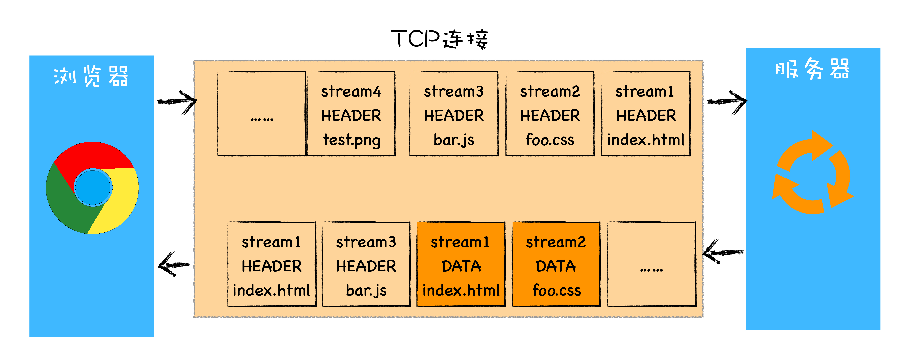

## HTTP/1：HTTP性能优化

**HTTP/0.9**

1991 年提出的，主要用于学术交流，需求很简单——用来在网络之间传递 **HTML** 超文本的内容

- 只有请求行，并没有 HTTP 请求头和请求体
- 服务器没有返回头信息
- 返回的文件内容是以 ASCII 字符流来传输的

**HTTP/1.0**

支持多种类型的文件下载是 HTTP/1.0 的一个核心诉求

新增了请求头和响应头，浏览器和服务器就能进行更加深入的交流

```jsx
// 请求头 文件相关消息
accept: text/html
accept-encoding: gzip, deflate, br
accept-Charset: ISO-8859-1,utf-8
accept-language: zh-CN,zh

// 响应头 文件相关消息
content-encoding: br
content-type: text/html; charset=UTF-8
```

其他特性：状态码、Cache 机制、用户代理(user agent)

**HTTP/1.1**

- **持久连接**

    在一个 TCP 连接上可以传输多个 HTTP 请求，只要浏览器或者服务器没有明确断开连接，那么该 TCP 连接会一直保持。
    默认开启，**Connection**: close 关闭。对于同一个域名，默认允许同时建立 6 个 TCP 持久连接。

- **不成熟的 HTTP 管线化**

    持久连接需要等待前面的请求返回之后，才能进行下一次请求。如果 TCP 通道中的某个请求因为某些原因没有及时返回，那么就会阻塞后面的所有请求(**队头阻塞**)。
    HTTP/1.1 中的管线化是指将多个 HTTP 请求整批提交给服务器的技术，最终被放弃。

- **提供虚拟主机的支持**

    一台物理主机上可以绑定多个虚拟主机，每个虚拟主机都有自己的单独的域名，这些单独的域名都公用同一个 IP 地址。用 **Host** 字段来表示当前的域名地址，这样服务器就可以根据不同的 Host 值做不同2的处理。

- **对动态生成的内容提供了完美支持**

    HTTP/1.0 时，需要在响应头中设置完整的数据大小，如Content-Length: 901，这样浏览器就可以根据设置的数据大小来接收数据。
    HTTP/1.1 通过引入 **Chunk transfer** 机制，服务器会将数据分割成若干个任意大小的数据块，每个数据块发送时会附上上个数据块的长度，最后使用一个零长度的块作为发送数据完成的标志。这样就提供了对动态内容的支持。

- **客户端 Cookie、安全机制**

HTTP/1.1 网络效率优化：

1. 增加了持久连接；
2. 为每个域名最多同时维护 6 个 TCP 持久连接；
3. 使用 CDN 的实现域名分片机制（将一个域名分为多个）

## HTTP/2：如何提升网络速度？

**HTTP/1.1 对带宽的利用率不理想**

- **TCP 的慢启动**

    慢启动是 TCP 为了减少网络拥塞的一种策略，没有办法改变
    页面中常用的一些关键资源文件本来就不大，慢启动推迟了宝贵的首次渲染页面的时长

- **同时开启的多条 TCP 连接会竞争固定的带宽**

    多条 TCP 连接之间不能协商让哪些关键资源优先下载

- **队头阻塞**

HTTP/2 中一个域名只使用一个 TCP 长连接来传输数据，这样整个页面资源的下载过程只需要一次慢启动，同时也避免了多个 TCP 连接竞争带宽所带来的问题。

**HTTP/2 的多路复用**



服务器可以根据自己的喜好来决定优先返回哪些内容，当收到一个优先级高的请求时，比如关键资源的请求，服务器可以暂停之前的请求来优先处理关键资源的请求

**多路复用的实现**


1. 浏览器准备好请求数据
2. 这些数据经过二进制分帧层处理之后，会被转换为一个个带有请求 ID 编号的帧，通过协议栈(上图)将这些帧发送给服务器
3. 服务器接收到所有帧之后，会将所有相同 ID 的帧合并为一条完整的请求信息
4. 然后服务器处理该条请求，并将处理的响应行、响应头和响应体**分别**发送至二进制分帧层
5. 二进制分帧层会将这些响应数据转换为一个个带有请求 ID 编号的帧，经过协议栈发送给浏览器
6. 浏览器接收到响应帧之后，会根据 ID 编号将帧的数据提交给对应的请求

HTTP/2 的通信语言并没有改变(请求头带信息)，发生改变的只是传输方式，开发者不需要重建生态

**HTTP/2 其他特性**

- 可以设置请求的优先级
- 服务器推送
- 头部压缩

## HTTP/3：甩掉TCP、TLS 的包袱，构建高效网络

**HTTP/2 的缺陷：**

- TCP 队头阻塞

    如果在数据传输的过程中，有一个数据因为网络故障或者其他原因而丢包了，那么整个 TCP 的连接就会处于暂停状态，需要等待丢失的数据包被重新传输过来

- TCP 建立连接的延时

    TCP 三次握手消耗 1.5 个 RTT
    如果是 HTTPS，TLS 消耗 1~2 个 RTT

TCP 协议僵化 (中间设备僵化、操作系统更新滞后) 导致很难改进 TCP 协议，所以需要绕过 TCP 协议使用新的传输协议，但是同样因为中间设备的僵化，这些设备只认 TCP 和 UDP。
因此，HTTP/3 选择了一个折衷的方法，基于 UDP 实现了类似于 TCP 的多路数据流、传输可靠性等功能，我们把这套功能称为 **QUIC 协议**


- **实现了类似 TCP 的流量控制、传输可靠性的功能**
- **集成了 TLS 加密功能**
- **实现了 HTTP/2 中的多路复用功能**
- **实现了快速握手功能**


挑战

- 目前服务器和浏览器端都没有对 HTTP/3 提供比较完整的支持
- 系统内核对 UDP 的优化远远没有达到 TCP 的优化程度
- 中间设备僵化，这些设备对 UDP 的优化程度远远低于 TCP