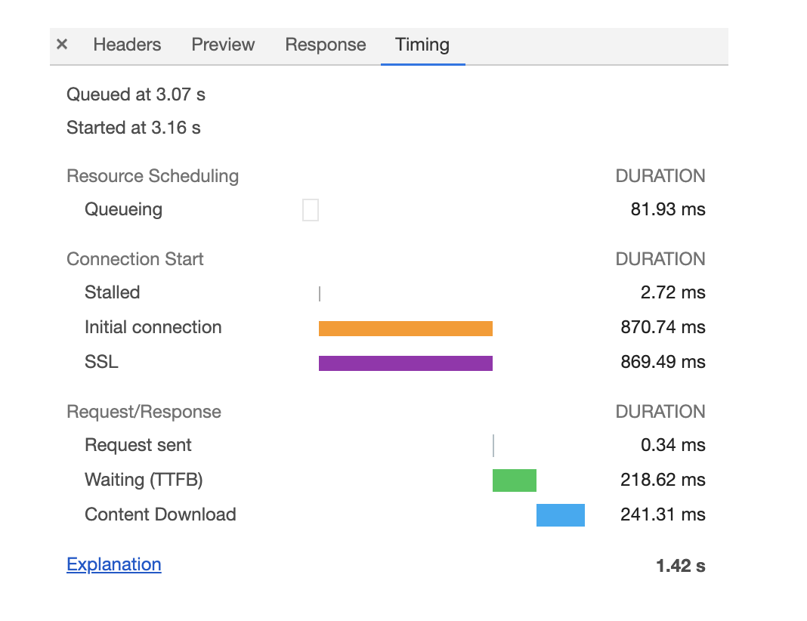
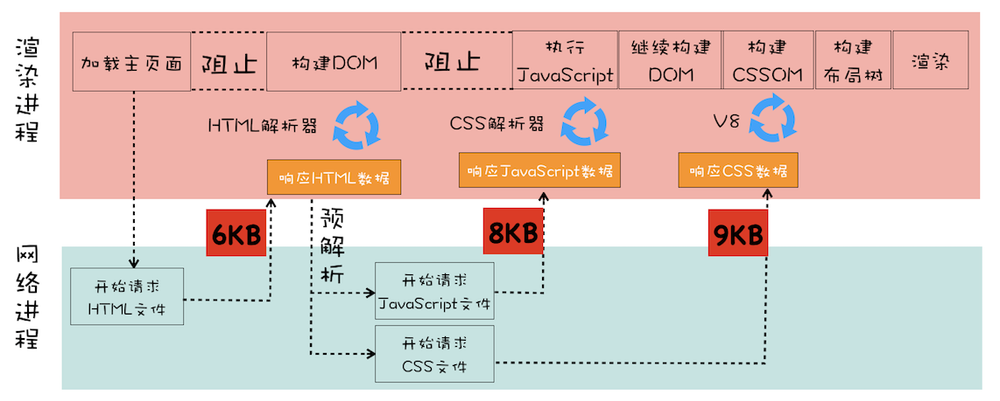

## Chrome开发者工具：利用网络面板做性能分析


网络面板

- **控制器**

    

- **过滤器**
可以通过过滤器模块来筛选你想要的文件类型
- **抓图信息**
需要勾选 capture screenshots，可以用来分析用户等待页面加载时间内所看到的内容
- **时间线**
主要用来展示 HTTP、HTTPS、WebSocket 加载的状态和时间的一个关系
- **详细列表**
详细记录了每个资源从发起请求到完成请求这中间所有过程的状态
- **下载信息概要**
DOMContentLoaded 说明页面已经构建好 DOM 了，这意味着构建 DOM 所需要的 HTML 文件、JS 文件、CSS 文件都已经下载完成了。
Load 说明浏览器已经加载了所有的资源（图像、样式表等）。

网络面板中的详细列表

列表的属性（略）

详细信息（请求行和请求头信息，响应行、响应头和响应体等）

**单个资源的时间线**




**Queuing**

- 页面中的资源是有优先级的，CSS、HTML、JS 等都是页面中的核心文件，所以优先级最高；而图片、视频、音频这类资源就不是核心资源，优先级就比较低。通常当后者遇到前者时，就需要“让路”，进入待排队状态。
- 浏览器会为每个域名最多维护 6 个 TCP 连接，如果发起一个 HTTP 请求时，这 6 个 TCP 连接都处于忙碌状态，那么这个请求就会处于排队状态。
- 网络进程在为数据分配磁盘空间时，新的 HTTP 请求也需要短暂地等待磁盘分配结束。

**Stalled**

排队完成之后，在发起连接之前，还有一些原因可能导致连接过程被推迟，称为 Stalled（停滞）

**Proxy Negotiation**

如果使用了代理服务器，还会增加一个**代理协商**阶段，它表示代理服务器连接协商所用的时间

**Initial connection / SSL**

和服务器建立连接，包括建立 TCP 连接所花费的时间，如果使用了 HTTPS 协议，那么还需要一个额外的 SSL 握手时间。

**Request sent**

准备请求数据，并将其发送给网络。通常这个阶段非常快，只需要把浏览器缓冲区的数据发送出去就结束了。

**Waiting (TTFB)**

第一字节时间，等待接收服务器第一个字节的数据所需要的时间。是反映服务端响应速度的重要指标。

**Content Download**

从第一字节时间到接收到全部响应数据所用的时间。

优化时间线上耗时项

1. **排队（Queuing）时间过久**

    域名分片—让 1 个站点下面的资源放在多个域名下面；
    把站点升级到 HTTP2（没有 TCP 连接数限制）

2. **第一字节时间（TTFB）时间过久**
    - 服务器生成页面数据的时间过久。需要提高服务器的处理速度，比如增加各种缓存。
    - 网络原因。使用 CDN 来缓存一些静态文件。
    - 发送请求头时带上了多余的用户信息。减少一些不必要的 [Cookie] 数据信息。
3. **Content Download 时间过久**

    减少文件大小，比如压缩、去掉源码中不必要的注释等。

## DOM树：JavaScript是如何影响DOM树构建的？

网络进程接收到响应头之后，如果 content-type 的值是“text/html”，那么浏览器就会判断这是一个 HTML 类型的文件，然后为该请求选择或者创建一个渲染进程。
渲染进程准备好之后，**网络进程和渲染进程之间会建立一个共享数据的管道**，网络进程接收到数据后就往这个管道里面放，而渲染进程则从管道的另外一端不断地读取数据，并同时将读取的数据“喂”给 HTML 解析器。

字节流转换为 DOM


1. **通过分词器将字节流转换为 Token**

    

2. **将 Token 解析为 DOM 节点，并将 DOM 节点添加到 DOM 树中（同步进行）**

    HTML 解析器维护了一个 **Token 栈**结构

    - 如果压入到栈中的是 **StartTag Token**，HTML 解析器会为该 Token 创建一个 DOM 节点，然后将该节点加入到 DOM 树中，它的父节点就是栈中相邻的那个元素生成的节点。
    - 如果分词器解析出来是**文本 Token**，那么会生成一个文本节点，然后将该节点加入到 DOM 树中，文本 Token 是不需要压入到栈中，它的父节点就是当前栈顶 Token 所对应的 DOM 节点。
    - 如果分词器解析出来的是 **EndTag** 标签，比如是 EndTag div，HTML 解析器会查看 Token 栈顶的元素是否是 StarTag div，如果是，就将 StartTag div 从栈中弹出，表示该 div 元素解析完成。

    

JS 是如何影响 DOM 生成的

解析到 script 标签时，渲染引擎判断这是一段脚本，此时 HTML 解析器就会暂停 DOM 的解析，因为接下来的 JavaScript 可能要修改当前已经生成的 DOM 结构。这时 JS 引擎介入，并执行 script 标签中的脚本。

如果 JS 是通过文件加载，则在执行 JS 之前需要先下载这段 JS 代码，所以**JS 文件的下载过程会阻塞 DOM 解析**。

浏览器**预解析**优化：当渲染引擎收到字节流之后，会开启一个预解析线程，用来分析 HTML 文件中包含的 JS、CSS 等相关文件，解析到相关文件之后，预解析线程会提前下载这些文件。

其他优化：使用 CDN 来加速 JS 文件的加载，压缩 JS 文件的体积。如果 JS 文件中没有操作 DOM 相关代码，就可以将该 JS 脚本设置为异步加载，通过 **async** 或 **defer** 来标记代码。

如果 JS 中存在操纵 CSSOM 的代码，则在执行 JS 之前，需要先解析 JS 语句之上所有的 CSS 样式。所以如果代码里引用了外部的 CSS 文件，那么在执行 JS 之前，还需要等待外部的 CSS 文件下载完成，并解析生成 CSSOM 对象之后，才能执行 JS 脚本。

而 JS 引擎在解析 JS 之前，是不知道 JS 是否操纵了 CSSOM 的，所以渲染引擎在遇到 JS 脚本时，不管该脚本是否操纵了 CSSOM，都会执行 CSS 文件下载，解析操作，再执行 JS 脚本。

## 渲染流水线：CSS如何影响首次加载时的白屏时间？

```jsx
<html>
<head>
    <link href="theme.css" rel="stylesheet">
</head>
<body>
    <div>geekbang com</div>
</body>
</html>
```


CSSOM(document.styleSheets)具有两个作用:

1. 提供给 JavaScript 操作样式表的能力
2. 为布局树的合成提供基础的样式信息

```jsx
<html>
<head>
    <link href="theme.css" rel="stylesheet">
</head>
<body>
    <div>geekbang com</div>
    <script>
        console.log('time.geekbang.org')
    </script>
    <div>geekbang com</div>
</body>
</html>
```


```jsx
<html>
<head>
    <link href="theme.css" rel="stylesheet">
</head>
<body>
    <div>geekbang com</div>
    <script src='foo.js'></script>
    <div>geekbang com</div>
</body>
</html>
```


从发起 URL 请求开始，到首次显示页面的内容，在视觉上经历的三个阶段: 

1. 等请求发出去之后，到提交数据阶段，这时页面展示出来的还是之前页面的内容。
2. 提交数据之后渲染进程会创建一个空白页面，我们通常把这段时间称为**解析白屏**，并等待 CSS 文件和 JS 文件的加载完成，生成 CSSOM 和 DOM，然后合成布局树，最后还要经过一系列的步骤准备首次渲染。
3. 等首次渲染完成之后，就开始进入完整页面的生成阶段了，然后页面会一点点被绘制出来。

白屏时间的瓶颈主要体现在**下载 CSS 文件**、**下载 JS 文件**和执行 **JS**。

策略：

1. 通过内联 JavaScript、内联 CSS 来移除这两种类型的文件下载，这样获取到 HTML 文件之后就可以直接开始渲染流程了。
2. 但并不是所有的场合都适合内联，那么还可以尽量减少文件大小，比如通过 webpack 等工具移除一些不必要的注释，并压缩 JavaScript 文件。
3. 还可以将一些不需要在解析 HTML 阶段使用的 JavaScript 标记上 async 或者 defer (只能避免下载时阻塞，执行时无法避免)。
4. 对于大的 CSS 文件，可以通过媒体查询属性，将其拆分为多个不同用途的 CSS 文件，这样只有在特定的场景下才会加载特定的 CSS 文件。

**async / defer**

async 标志的脚本文件一旦加载完成，会立即执行（顺序不一定，可能还会影响DOM生成）。
适用场景：脚本并不关心页面中的DOM元素（文档是否解析完毕），并且也不会产生其他脚本需要的数据。

defer 标记的脚本文件，需要在 DOMContentLoaded 事件之前按顺序执行。
适用场景：脚本代码依赖于页面中的DOM元素（文档是否解析完毕），或者被其他脚本文件依赖。

两者的 script 脚本最好没有 DOM 或者 CSSOM 的操作（why？个人猜测：已经生成完 DOM 或者 CSSOM 后再去操作会影响效率）。

script 标签放在 body 尾部：

1. 在没有 defer 的情况下，避免在 script 标签后面的资源(视频、图片等)要等到 JS 执行完成后才能开始加载。
2. 在没有 defer 的情况下，避免操作 script 标签之后未解析的 DOM。
3. 延迟 JS 标签阻止 DOM 解析，在资源下载的同时尽可能多地解析 DOM（能减少白屏时间）。

## 分层和合成机制：为什么CSS动画比JavaScript高效？

**显示器、显卡**

每个显示器都有固定的刷新频率，通常是 60HZ，每秒读取 60 次显卡中**前缓冲区**中的图像。

显卡的职责就是合成新的图像，并将图像保存到**后缓冲区**中，一旦显卡把合成的图像写到后缓冲区，系统就会让后缓冲区和前缓冲区互换，这样就能保证显示器能读取到最新显卡合成的图像。

通常情况下，显卡的更新频率和显示器的刷新频率是一致的。但有时候，在一些复杂的场景中，显卡处理一张图片的速度会变慢，这样就会造成视觉上的卡顿。

一帧的生成方式，有**重排**、**重绘**和**合成**三种方式

渲染路径越长，生成图像花费的时间就越多，合成操作不需要触发布局和绘制两个阶段，如果采用了 GPU，那么合成的效率会非常高。

合成操作是在合成线程上完成的，在执行合成操作时，是不会影响到主线程执行的。

**分层**、**分块**和**合成**

分层体现在生成布局树之后，渲染引擎会根据布局树的特点将其转换为层树（Layer Tree），层树中的每个节点都对应着一个图层，下一步的绘制阶段就依赖于层树中的节点。

合成线程会将每个图层分割为大小固定的图块，然后优先绘制靠近视口的图块，这样就可以大大加速页面的显示速度。

从计算机内存上传到 GPU 内存的操作会比较慢（**纹理上传**），Chrome 采取了一个策略：**在首次合成图块的时候使用一个低分辨率的图片**。

CSS **[will-change](https://developer.mozilla.org/zh-CN/docs/Web/CSS/will-change)** 属性会告诉渲染引擎你会对该元素做一些特效变换（几何、透明度...），渲染引擎会将该元素单独实现一层，等这些变换发生时，渲染引擎会通过合成线程直接去处理变换，这些变换并没有涉及到主线程，这样就大大提升了渲染的效率。

从层树开始，后续每个阶段都会多一个层结构，这些都需要额外的内存，所以你需要恰当地使用will-change。

## 页面性能：如何系统地优化页面？

通常一个页面有三个阶段：加载阶段、交互阶段和关闭阶段。

**加载阶段**



阻塞网页首次渲染的资源称为**关键资源**（HTML CSS JS）

**RTT**（Round Trip Time）是网络中一个重要的性能指标，表示从发送端发送数据开始，到发送端收到来自接收端的确认（TCP），总共经历的时延。通常 1 个 HTTP 的数据包在 14KB 左右。

- 减少关键资源的个数：
    1. 内联 JS 和 CSS
    2. 如果 JS 代码没有 DOM 或者 CSSOM 的操作，则可以添加 async 或者 defer 属性
    3. 对于 CSS，如果不是在构建页面之前（预解析）加载的，则可以添加媒体取消阻止显现的标志（media="print" ...）
- 减少关键资源的大小：
    1. 压缩资源，移除注释
    2. 取消 CSS/JS 中的关键资源
- 减少关键资源 RTT 的次数：
    1. 减少关键资源的个数和减少关键资源的大小搭配来实现
    2. 使用 CDN 来减少每次 RTT 时长

**交互阶段**


优化渲染进程渲染帧的速度

- **减少 JS 脚本执行时间**
    1. 将一次执行的函数分解为多个任务，使得每次的执行时间不要过久
    2. Web Workers，作为主线程之外的线程运行大量计算逻辑
- **避免强制同步布局**

    通过 DOM 接口执行添加元素或者删除元素等操作后，是需要重新计算样式和布局的，不过正常情况下这些操作都是在另外的任务中异步完成的，这样做是为了避免当前的任务占用太长的主线程时间。
    强制同步布局，是指 JS 强制将计算样式和布局操作提前到当前的任务中（比如在添加 DOM 节点之后马上获取父节点的 offsetHeight ）。

- **避免布局抖动**

    布局抖动是指在一次 JS 执行过程中，多次执行强制布局和抖动操作（比如在一个 for 循环语句里面不断读取属性值，每次读取属性值之前都要进行计算样式和布局）。

- **合理利用 CSS 合成动画**
- **避免频繁的垃圾回收**

    垃圾回收也会占用主线程，避免频繁创建临时对象。

## 虚拟DOM：虚拟DOM和实际的DOM有何不同？

**DOM 的缺陷**

每次操作 DOM 渲染引擎都需要进行重排、重绘或者合成等操作，影响性能。

**虚拟 DOM**

- **创建阶段**。首先依据 JSX 和基础数据创建出来虚拟 DOM，它反映了真实的 DOM 树的结构。然后由虚拟 DOM 树创建出真实 DOM 树，真实的 DOM 树生成完后，再触发渲染流水线往屏幕输出页面。
- **更新阶段**。如果数据发生了改变，那么就需要根据新的数据创建一个**新的虚拟 DOM 树**；然后 React 比较两个树，找出变化的地方，并把变化的地方**一次性**（原生的命令式编程会逐次更新）更新到真实的 DOM 树上；最后渲染引擎更新渲染流水线，并生成新的页面。

**React Fiber**

React 比较两个虚拟 DOM 的过程是在一个递归函数里执行的，核心算法是 **reconciliation**，当虚拟 DOM 比较复杂的时候，执行比较函数就有可能占据主线程比较久的时间，这样就会导致其他任务的等待，造成页面卡顿。为了解决这个问题，React 团队重写了 reconciliation 算法，新的算法称为 Fiber(协程) reconciler，之前老的算法称为 Stack reconciler。

## 渐进式网页应用（PWA）：它究竟解决了Web应用的哪些问题？

PWA(Progressive Web App)是一套理念，渐进式增强 Web 的优势(自由和开放，容易达成共识；不像安卓、ios 以及各种小程序标准不一)，并通过技术手段渐进式缩短和本地应用或者小程序的距离。

相对于本地应用，Web 页面的缺陷

- 离线、弱网环境下的使用能力
- 无法推送消息
- 缺少一级入口

**Service Worker**

运行在浏览器进程中

在页面和网络之间增加一个拦截器，用来缓存和拦截请求

能实现消息推送

除了必须要使用 HTTPS，Service Worker 还需要同时支持 Web 页面默认的安全策略、储入同源策略、内容安全策略（CSP）等


## WebComponent：像搭积木一样构建Web应用

组件化：**对内高内聚，对外低耦合**。对内各个元素彼此紧密结合、相互依赖，对外和其他组件的联系最少且接口简单。

阻碍前端组件化的因素

- CSS 影响全局
- 任何地方都可以直接读取和修改 DOM

WebComponent

```jsx
<!DOCTYPE html>
<html>
<body>
    <!--
            一：定义模板
            二：定义内部CSS样式
            三：定义JavaScript行为
    -->
    <template id="geekbang-t">
        <style>
            p {
                background-color: brown;
                color: cornsilk
            }
            div {
                width: 200px;
                background-color: bisque;
                border: 3px solid chocolate;
                border-radius: 10px;
            }
        </style>
        <div>
            <p>time.geekbang.org</p>
            <p>time1.geekbang.org</p>
        </div>
        <script>
            function foo() { console.log('inner log') }
        </script>
    </template>
    <script>
        class GeekBang extends HTMLElement {
            constructor() {
                super()
                //获取组件模板
                const content = document.querySelector('#geekbang-t').content
                //创建影子DOM节点
                const shadowDOM = this.attachShadow({ mode: 'open' })
                //将模板添加到影子DOM上
                shadowDOM.appendChild(content.cloneNode(true))
            }
        }
        customElements.define('geek-bang', GeekBang)
    </script>

    <geek-bang></geek-bang>
    <div>
        <p>time.geekbang.org</p>
        <p>time1.geekbang.org</p>
    </div>
    <geek-bang></geek-bang>
</body>
</html>
```

在影子 DOM 定义的 JS 函数依然可以被外部访问，这是因为 JS 语言本身已经可以很好地实现组件化了

浏览器如何实现影子 DOM

- 当通过 DOM 接口去查找元素时，渲染引擎会去判断元素属性下面的 shadow-root 元素是否是影子 DOM，如果是影子 DOM，那么就直接跳过 shadow-root 元素的查询操作。
- 当生成布局树的时候，渲染引擎也会判断元素属性下面的 shadow-root 元素是否是影子 DOM，如果是，那么在影子 DOM 内部元素的节点选择 CSS 样式的时候，会直接使用影子 DOM 内部的 CSS 属性。