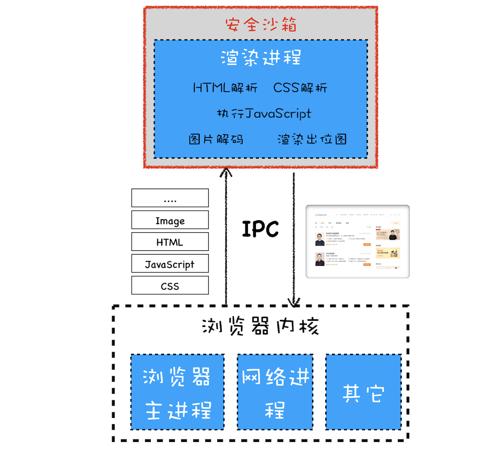
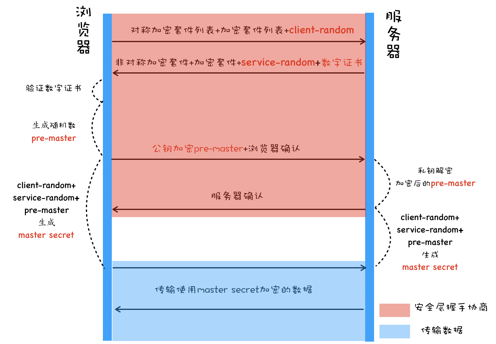

## 同源策略：为什么XMLHttpRequest不能跨域请求资源？

如果两个 URL 的协议、域名和端口都相同，我们就称这两个 URL 同源

同源策略主要表现在 DOM、Web 数据和网络这三个层面：

- 限制了来自不同源的 JS 脚本对当前 DOM 对象读写操作

    同源可以通过 opener 属性访问

- 同源策略限制了不同源的站点读取当前站点的 Cookie、IndexDB、LocalStorage 等数据

    同源可以通过 opener 属性访问

- xhr 不能访问跨域的资源

安全和便利性的权衡

- 页面中可以嵌入第三方资源

    有可能遭受 XSS 攻击 (注入第三方 JS)，所以浏览器引入了内容安全策略 CSP
    CSP 的核心思想是让服务器决定浏览器能够加载哪些资源，让服务器决定浏览器是否能够执行内联 JS 代码

- 跨域资源共享和跨文档消息机制

    跨域资源共享 CORS
    跨文档消息机制，可以通过 window.postMessage 接口来和不同源的 DOM 进行通信

## 跨站脚本攻击（XSS）：为什么Cookie中有HttpOnly属性？

XSS (Cross Site Scripting)，为了与“CSS”区分开来，故简称 XSS。指往 HTML 文件中或者 DOM 中注入恶意脚本

- 窃取 Cookie 信息
- 监听用户行为
- 修改 DOM
- 在页面内生成浮窗广告

脚本是怎么注入的

- **存储型 XSS 攻击**
    1. 利用站点漏洞将一段恶意 JS 代码提交到网站的数据库中 (input 输入等)
    2. 用户向网站请求包含了恶意 JS 脚本的页面
    3. 用户浏览该页面的时候，恶意脚本就会将用户的 Cookie 信息等数据上传到服务器
- **反射型 XSS 攻击**

    恶意 JS 脚本是用户发送给网站请求中的一部分，随后网站又把恶意 JS 脚本返回给用户
    例子：诱导链接 [http://localhost:3000/?xss=](http://localhost:3000/?xss=)<script>alert('你被xss攻击了')</script>
    xss 内容显示到页面上
    Web 服务器不会存储反射型 XSS 攻击的恶意脚本，这是和存储型 XSS 攻击不同的地方

- **基于 DOM 的 XSS 攻击**

    通过各种手段将恶意脚本注入用户的页面中：比如通过网络劫持在页面传输过程中修改 HTML 页面的内容，WiFi 路由器劫持、本地恶意软件劫持等等。

如何阻止 XSS 攻击

1. **服务器对输入脚本进行过滤或转码**
2. **充分利用 [CSP](https://developer.mozilla.org/zh-CN/docs/Web/HTTP/CSP)** (HTTP header Content-Security-Policy)
    - 限制加载其他域下的资源文件，这样即使插入了一个 JS 文件，这个 JS 文件也是无法被加载的
    - 禁止向第三方域提交数据，这样用户数据也不会外泄
    - 禁止执行内联脚本和未授权的脚本
    - 提供上报机制，这样可以帮助我们尽快发现有哪些 XSS 攻击，以便尽快修复问题
3. **使用 HttpOnly 属性**

    使用 HttpOnly 标记的 Cookie 只能使用在 HTTP 请求过程中，所以无法通过 JavaScript 来读取这段 Cookie

## CSRF攻击：陌生链接不要随便点

Cross-site request forgery 跨站请求伪造，黑客利用用户的登录状态，并通过第三方的站点来实行攻击（在第三方站点调用 A 站点的接口，会自动带上cookie）

当用户打开了黑客的页面后，黑客有三种方式去实施 CSRF 攻击

1. **自动发起 Get 请求**

    ```jsx
     
    ```

2. **自动发起 POST 请求**

    ```jsx
    <form id='hacker-form' action="https://time.geekbang.org/sendcoin" method=POST>
      <input type="hidden" name="user" value="hacker" />
      <input type="hidden" name="number" value="100" />
    </form>
    <script> document.getElementById('hacker-form').submit(); </script>
    ```

3. **引诱用户点击链接**

    ```jsx
     </img> </div> <div>
    <a href="https://time.geekbang.org/sendcoin?user=hacker&number=100" taget="_blank">
    	点击下载照片
    </a>
    ```

避免途径

1. **充分利用好 Cookie 的 SameSite 属性**
2. **验证请求的来源站点** (通过 header 中的 Origin / Referer)
3. **CSRF Token**

    ```jsx
    // 在浏览器向服务器发起请求时，服务器生成一个 CSRF Token
    <form action="https://time.geekbang.org/sendcoin" method="POST">
      <input type="hidden" name="csrf-token" value="nc98P987bcpncYhoadjoiydc9ajDlcn">
      <input type="text" name="user">
      <input type="text" name="number">
      <input type="submit">
    </form>
    ```

## 安全沙箱：页面和系统之间的隔离墙

安全沙箱将渲染进程和操作系统进行隔离，安全沙箱最小的保护单位是进程。



影响

1. **持久存储**
    - 渲染进程通过 IPC 告诉浏览器内核进行 Cookie 数据的读写再 IPC 回来
    - 一些缓存文件的读写也是由浏览器内核实现的，比如网络文件缓存的读取
2. **网络访问**

    在渲染进程内部也是不能直接访问网络的，需要通过浏览器内核。浏览器内核在处理 URL 请求之前，会检查渲染进程是否有权限请求该 URL，比如检查 XMLHttpRequest 或者 Fetch 是否是跨站点请求，或者检测 HTTPS 的站点中是否包含了 HTTP 的请求。

3. **用户交互**

    **窗口句柄**：操作系统会提供一个界面允许应用程序与用户交互，允许应用程序在该界面上进行绘制

    渲染进程不能直接访问窗口句柄

    - 渲染进程需要渲染出位图发送到浏览器内核，然后浏览器内核将位图复制到屏幕上。
    - 操作系统将用户输入事件传递给浏览器内核，如果当前焦点位于浏览器地址栏中，则输入事件会在浏览器内核内部处理；如果当前焦点在页面的区域内，则浏览器内核会将输入事件转发给渲染进程。

**站点隔离（Site Isolation）**

指 Chrome 将同一站点（相同根域名和相同协议的地址）中相互关联的页面放到同一个渲染进程中。

最开始 Chrome 划分渲染进程是以标签页为单位，这就导致了多个不同站点中的内容通过 iframe 同时运行在同一个渲染进程中。

恶意 iframe 可以利用两个 A 级漏洞——幽灵（Spectre）和熔毁（Meltdown），这两个漏洞是由处理器架构导致的，很难修补，黑客通过这两个漏洞可以直接入侵到进程的内部，如果入侵的进程没有安全沙箱的保护，那么黑客还可以发起对操作系统的攻击。

## HTTPS：让数据传输更安全

浏览器安全主要划分为三大块内容：**页面安全**、**系统安全**和**网络安全**

HTTP 传输的内容很容易被中间人窃取、伪造和篡改，通常我们把这种攻击方式称为**中间人攻击**


安全层有两个主要的职责

- **对发起 HTTP 请求的数据进行加密操作**
- **对接收到 HTTP 的内容进行解密操作**

**第一版：使用对称加密**

对称加密是指加密和解密都使用的是相同的密钥


加密套件是指加密的方法

传输 client-random 和 service-random 的过程是明文的，这意味着黑客也可以拿到协商的加密套件和双方的随机数，由于利用随机数合成密钥的算法是公开的，所以黑客拿到随机数之后，也可以合成密钥，这样数据依然可以被破解。

**第二版：使用非对称加密**

非对称加密算法有 A、B 两把密钥，如果你用 A 密钥来加密，那么只能使用 B 密钥来解密；反过来，如果你要 B 密钥来加密，那么只能用 A 密钥来解密。


- 非对称加密的效率太低。
- 无法保证服务器发送给浏览器的数据安全。黑客依然可以拿到公钥用来解密私钥加密的数据。

**第三版：对称加密和非对称加密搭配使用**

在传输数据阶段依然使用对称加密，但是对称加密的密钥采用非对称加密来传输。


**第四版：添加数字证书**

通过对称和非对称混合方式，可以完美地实现数据的加密传输。

不过这种方式依然存在着问题，比如我要打开极客时间的官网，但是黑客通过 DNS 劫持将极客时间官网的 IP 地址替换成了黑客的 IP 地址，这样我访问的其实是黑客的服务器了，黑客就可以在自己的服务器上实现公钥和私钥，而对浏览器来说，它完全不知道现在访问的是个黑客的站点。

极客时间要证明这个服务器就是极客时间的，需要使用权威机构颁发的证书，这个权威机构称为 **CA（Certificate Authority）**，颁发的证书就称为数字证书**（Digital Certificate)**。

对于浏览器来说，数字证书有两个作用：一个是**通过数字证书向浏览器证明服务器的身份**，另一个是**数字证书里面包含了服务器公钥**。



如何申请数字证书

1. 准备一套私钥和公钥，私钥留着自己使用
2. 向 CA 机构提交公钥、公司、站点等信息并等待认证
3. CA 签发认证的数字证书，包含了之前准备的公钥、组织信息、CA 的信息、有效时间、证书序列号等，这些信息都是明文的，同时包含一个 CA 生成的签名。

CA 使用 Hash 函数来计算提交的明文信息，并得出信息摘要；然后 CA 再使用它的私钥对信息摘要进行加密，加密后的密文就是 CA 颁发的数字签名。

浏览器如何验证数字证书

采用 CA 签名时相同的 Hash 函数来计算并得到信息摘要 A；然后再利用对应 CA 的公钥解密签名数据，得到信息摘要 B；对比信息摘要 A 和信息摘要 B，如果一致，则可以确认证书是合法的。