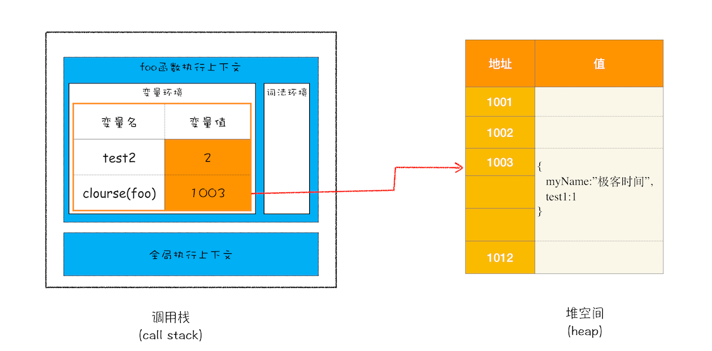
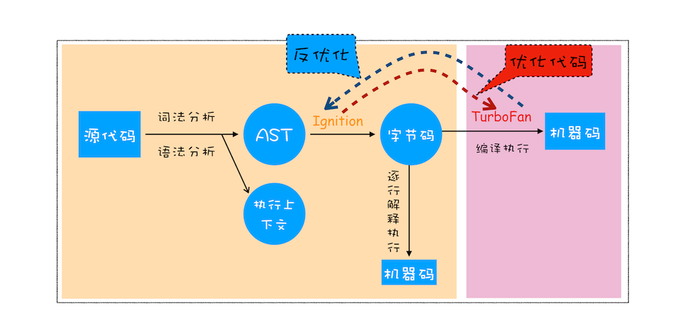

## 栈空间和堆空间：数据是如何存储的？

使用之前就需要确认其变量数据类型的称为**静态语言**
在运行过程中需要检查数据类型的语言称为**动态语言**
支持隐式类型转换的语言称为**弱类型语言**
不支持隐式类型转换的语言称为**强类型语言**（需要声明类型）

8种 JS 数据类型

原始类型：String, Number, Boolean, Null, Undefined, Symbol, BigInt

引用类型：Object

原始类型的赋值会完整复制变量值，而引用类型的赋值是复制引用地址

typeof null === 'object'

JS 的执行过程中， 主要有三种类型内存空间，分别是**代码空间**、**栈空间**和**堆空间**。

代码空间主要是存储可执行代码

栈空间就是调用栈，用来存储执行上下文

**原始类型的数据值都是直接保存在“栈”中的，引用类型的值是存放在“堆”中的。**

因为 JS 引擎需要用栈来维护程序执行期间上下文的状态，如果栈空间太大，那么会影响到上下文切换(通过指针切换)的效率，进而又影响到整个程序的执行效率。

引用类型的数据占用的空间都比较大，堆空间很大，能存放很多大的数据，不过缺点是分配内存和回收内存都会占用一定的时间。

```jsx
function foo() {
    var myName = "极客时间"
    let test1 = 1
    const test2 = 2
    var innerBar = { 
        setName:function(newName){
            myName = newName
        },
        getName:function(){
            console.log(test1)
            return myName
        }
    }
    return innerBar
}
var bar = foo()
bar.setName("极客邦")
bar.getName()
console.log(bar.getName())
```

1. 当 JS 引擎执行到 foo 函数时，首先会编译，并创建一个空执行上下文。
2. 在编译过程中，遇到内部函数 setName，JS 引擎还要**对内部函数做一次快速的词法扫描**，发现该内部函数引用了 foo 函数中的 myName 变量，JS 引擎判断这是一个闭包，于是在**堆空间**创建一个**“closure(foo)”**的对象（这是一个内部对象，JavaScript 是无法访问的），用来保存 myName 变量。
3. 接着继续扫描到 getName 方法时，发现该函数内部还引用变量 test1，于是 JavaScript 引擎又将 test1 添加到“closure(foo)”对象中。这时候堆中的“closure(foo)”对象中就包含了 myName 和 test1 两个变量了。



1. 由于 test2 并没有被内部函数引用，所以 test2 依然保存在调用栈中。

从上图可以清晰地看出，当执行到 foo 函数时，闭包就产生了；当 foo 函数执行结束之后，返回的 getName 和 setName 方法都引用“clourse(foo)”对象，所以即使 foo 函数退出了，“clourse(foo)”依然被其内部的 getName 和 setName 方法引用。

## 垃圾回收：垃圾数据是如何自动回收的？

手动回收(C, C++) **自动回收**(JS、Java、Python)

调用栈中的数据是如何回收的

JS 引擎通过向下移动 **ESP**(记录当前执行状态的指针) 来销毁该函数保存在栈中的执行上下文

**代际假说**（适用于大多数的动态语言）

- 大部分对象在内存中存在的时间很短
- 不死的对象，会活得更久

堆中的数据是如何回收的

根据代际假说，V8 会把堆分为**新生代**和**老生代**两个区域，新生代中存放的是生存时间短的对象，老生代中存放的生存时间久的对象。

- **副垃圾回收器**，主要负责新生代的垃圾回收
- **主垃圾回收器**，主要负责老生代的垃圾回收

不论什么类型的垃圾回收器，它们都有一套共同的执行流程：

1. 标记空间中活动对象和非活动对象
2. 回收非活动对象所占据的内存
3. 内存整理（整理**内存碎片**—不连续的内存空间），防止大对象无法分配到足够的连续内存

副垃圾回收器

根据 **Scavenge 算法**，把新生代空间对半划分为两个区域，一半是对象区域，一半是空闲区域：


新加入的对象都会存放到对象区域，当对象区域快被写满时，就需要执行一次垃圾清理操作。

流程：

1. 首先要对对象区域中的垃圾做标记；
2. 副垃圾回收器会把这些存活的对象复制到空闲区域中，同时它还会把这些对象有序地排列起来(内存整理)
3. 对象区域与空闲区域进行角色翻转

注意事项：

- 复制操作需要时间成本，所以为了执行效率，一般新生区的空间会被设置得比较小。
- 因为新生区的空间不大，很容易被存活的对象装满整个区域，所以 JS 引擎采用**对象晋升策略**(经过两次垃圾回收依然还存活的对象，会被移动到老生区中)。

主垃圾回收器

除了新生区中晋升的对象，一些大的对象会直接被分配到老生区。因此老生区中的对象有两个特点，一个是**对象占用空间大**，另一个是**对象存活时间长**。

**标记 - 清除（Mark-Sweep）算法**

1. 标记阶段，从一组根元素开始，递归遍历这组根元素(**调用栈的地址引用**)，在这个遍历过程中，能到达的元素称为**活动对象**，没有到达的元素就可以判断为**垃圾数据**。
2. 垃圾清除，直接对可回收对象进行清理。


**标记 - 整理（Mark-Compact）算法**

1. 标记阶段同上
2. 让所有存活的对象都向一端移动，然后直接清理掉端边界以外的内存。


由于 JS 是运行在主线程之上的，一旦执行垃圾回收算法，需要将正在执行的 JS 脚本暂停下来，待垃圾回收完毕后再恢复脚本执行。我们把这种行为叫做**全停顿（Stop-The-World）**。


新生代的垃圾回收中，因其空间较小，且存活对象较少，所以全停顿的影响不大。

为了降低老生代的垃圾回收而造成的卡顿，V8 将标记过程分为一个个的**子标记过程**，同时让垃圾回收标记和 JS 应用逻辑交替进行，直到标记阶段完成，我们把这个算法称为**增量标记（Incremental Marking）算法**。


## 编译器和解释器：V8是如何执行一段JavaScript代码的？

**编译型语言**在程序执行之前，需要经过**编译器**的编译过程，并且编译之后会直接保留机器能读懂的二进制文件，这样每次运行程序时，都可以直接运行该二进制文件，而不需要再次重新编译了。如果编译过程发生了语法或者其他的错误，那么编译器就会抛出异常，最后的二进制文件也不会生成成功。

而由**解释型语言**编写的程序，在每次运行时都需要通过**解释器**对程序进行动态解释和执行。

V8 执行一段代码流程图



1. **生成抽象语法树（AST）和执行上下文**
    - 对于编译器或者解释器来说，它们无法理解高级语言，只能理解 AST。
    - Babel、ESLint 都是通过识别 AST 实现的。

    生成 AST 第一阶段**分词**（tokenize），又称为**词法分析**：将一行行的源码拆解成一个个 **token** (语法上不可能再分的、最小的单个字符或字符串)

    生成 AST 第二阶段是**解析**（parse），又称为**语法分析**：将 token 根据语法规则转为 AST。如果源码符合语法规则，这一步就会顺利完成。但如果源码存在语法错误，这一步就会终止，并抛出一个“语法错误”。

2. **生成字节码**
    - 若将 AST 直接转换成机器码，执行机器码的效率是非常高效的，但是非常占内存，所以引入字节码。
    - 字节码是介于 AST 和机器码之间的一种代码，需要通过解释器将其转换为机器码后才能执行。

    

3. **执行代码**
    - 解释器 Ignition 除了负责生成字节码之外，还需要解释执行字节码。
    - Ignition 执行字节码的过程中，如果发现有热点代码（一段代码被重复执行多次），那么后台的编译器 TurboFan 就会把该段热点的字节码编译为高效的机器码，然后当再次执行这段被优化的代码时，只需要执行编译后的机器码就可以了，这样就大大提升了代码的执行效率。
    - 字节码配合解释器和编译器的技术实现称为**即时编译（JIT）**。

    

JS 的性能优化

1. 提升单次脚本的执行速度，避免 JS 的长任务霸占主线程，这样可以使得页面快速响应交互；
2. 避免大的内联脚本，因为在解析 HTML 的过程中，解析和编译也会占用主线程；
3. 减少 JS 文件的容量，因为更小的文件会提升下载速度，并且占用更低的内存。