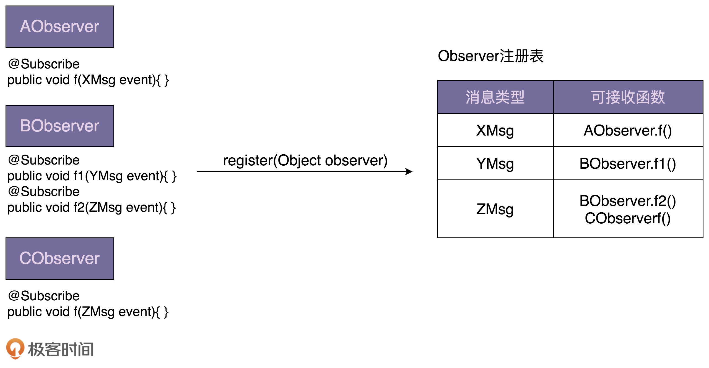
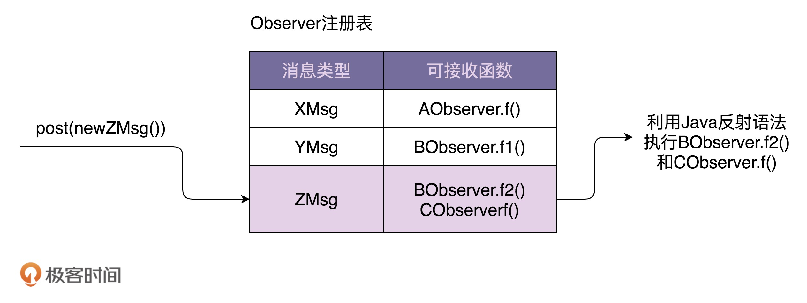

## 56 | 观察者模式（上）：详解各种应用场景下观察者模式的不同实现方式

设计模式要干的事情就是解耦

- 创建型模式是将创建和使用代码解耦
- 结构型模式是将不同功能代码解耦
- 行为型模式是将不同的行为代码解耦

具体到观察者模式，它将观察者和被观察者代码解耦。

观察者模式（Observer Design Pattern）也被称为发布订阅模式（Publish-Subscribe Design Pattern）：在对象之间定义一个一对多的依赖，当一个对象状态改变的时候，所有依赖的对象都会自动收到通知。

有同步阻塞的实现方式，也有异步非阻塞的实现方式；有进程内的实现方式，也有跨进程的实现方式。

基于消息队列的实现方式，被观察者和观察者解耦更加彻底，两部分的耦合更小。被观察者完全不感知观察者，同理，观察者也完全不感知被观察者。被观察者只管发送消息到消息队列，观察者只管从消息队列中读取消息来执行相应的逻辑。

```jsx
public interface Subject {
  void registerObserver(Observer observer);
  void removeObserver(Observer observer);
  void notifyObservers(Message message);
}

public interface Observer {
  void update(Message message);
}

public class ConcreteSubject implements Subject {
  private List<Observer> observers = new ArrayList<Observer>();

  @Override
  public void registerObserver(Observer observer) {
    observers.add(observer);
  }

  @Override
  public void removeObserver(Observer observer) {
    observers.remove(observer);
  }

  @Override
  public void notifyObservers(Message message) {
    for (Observer observer : observers) {
      observer.update(message);
    }
  }

}

public class ConcreteObserverOne implements Observer {
  @Override
  public void update(Message message) {
    //TODO: 获取消息通知，执行自己的逻辑...
    System.out.println("ConcreteObserverOne is notified.");
  }
}

public class ConcreteObserverTwo implements Observer {
  @Override
  public void update(Message message) {
    //TODO: 获取消息通知，执行自己的逻辑...
    System.out.println("ConcreteObserverTwo is notified.");
  }
}

public class Demo {
  public static void main(String[] args) {
    ConcreteSubject subject = new ConcreteSubject();
    subject.registerObserver(new ConcreteObserverOne());
    subject.registerObserver(new ConcreteObserverTwo());
    subject.notifyObservers(new Message());
  }
}
```

## 57 | 观察者模式（下）：如何实现一个异步非阻塞的EventBus框架？

```jsx
public class UserController {
  private UserService userService; // 依赖注入

  private EventBus eventBus;
  private static final int DEFAULT_EVENTBUS_THREAD_POOL_SIZE = 20;

  public UserController() {
    //eventBus = new EventBus(); // 同步阻塞模式
    eventBus = new AsyncEventBus(Executors.newFixedThreadPool(DEFAULT_EVENTBUS_THREAD_POOL_SIZE)); // 异步非阻塞模式
  }

  public void setRegObservers(List<Object> observers) {
    for (Object observer : observers) {
      eventBus.register(observer);
    }
  }

  public Long register(String telephone, String password) {
    //省略输入参数的校验代码
    //省略userService.register()异常的try-catch代码
    long userId = userService.register(telephone, password);

    eventBus.post(userId);

    return userId;
  }
}

public class RegPromotionObserver {
  private PromotionService promotionService; // 依赖注入

  @Subscribe
  public void handleRegSuccess(long userId) {
    promotionService.issueNewUserExperienceCash(userId);
  }
}

public class RegNotificationObserver {
  private NotificationService notificationService;

  @Subscribe
  public void handleRegSuccess(long userId) {
    notificationService.sendInboxMessage(userId, "...");
  }
}
```

- 不需要定义 Observer 接口
- 通过 @Subscribe 注解来标明类中哪个函数可以接收被观察者发送的消息





## 58 | 模板模式（上）：剖析模板模式在JDK、Servlet、JUnit等中的应用

模板方法模式在一个方法中定义一个算法骨架，并将某些步骤推迟到子类中实现。

模板方法模式可以让子类在不改变算法整体结构的情况下，重新定义算法中的某些步骤。这里的“算法”，我们可以理解为广义上的“业务逻辑”，并不特指数据结构和算法中的“算法”。这里的算法骨架就是“模板”，包含算法骨架的方法就是“模板方法”，这也是模板方法模式名字的由来。

在模板模式经典的实现中，模板方法定义为 final，可以避免被子类重写。需要子类重写的方法定义为 abstract，可以强迫子类去实现。不过，在实际项目开发中，模板模式的实现比较灵活，以上两点都不是必须的。

模板模式有两大作用：**复用和扩展**。

其中，复用指的是，所有的子类可以复用父类中提供的模板方法的代码。扩展指的是，框架通过模板模式提供功能扩展点，让框架用户可以在不修改框架源码的情况下，基于扩展点定制化框架的功能。

```jsx
public abstract class AbstractClass {
  public final void templateMethod() {
    //...
    method1();
    //...
    method2();
    //...
  }
  
  protected abstract void method1();
  protected abstract void method2();
}

public class ConcreteClass1 extends AbstractClass {
  @Override
  protected void method1() {
    //...
  }
  
  @Override
  protected void method2() {
    //...
  }
}

public class ConcreteClass2 extends AbstractClass {
  @Override
  protected void method1() {
    //...
  }
  
  @Override
  protected void method2() {
    //...
  }
}

AbstractClass demo = ConcreteClass1();
demo.templateMethod();
```

## 59 | 模板模式（下）：模板模式与Callback回调函数有何区别和联系？

回调跟模板模式具有相同的作用：代码复用和扩展。在一些框架、类库、组件等的设计中经常会用到。

相对于普通的函数调用，回调是一种双向调用关系。A 类事先注册某个函数 F 到 B 类，A 类在调用 B 类的 P 函数的时候，B 类反过来调用 A 类注册给它的 F 函数。这里的 F 函数就是“回调函数”。A 调用 B，B 反过来又调用 A，这种调用机制就叫作“回调”。

```jsx
public interface ICallback {
  void methodToCallback();
}

public class BClass {
  public void process(ICallback callback) {
    //...
    callback.methodToCallback();
    //...
  }
}

public class AClass {
  public static void main(String[] args) {
    BClass b = new BClass();
    b.process(new ICallback() { //回调对象
      @Override
      public void methodToCallback() {
        System.out.println("Call back me.");
      }
    });
  }
}
```

回调可以细分为同步回调和异步回调：同步回调指在函数返回之前执行回调函数；异步回调指的是在函数返回之后执行回调函数。

从应用场景上来看，同步回调看起来更像模板模式，异步回调看起来更像观察者模式。

回调跟模板模式的区别，更多的是在代码实现上，而非应用场景上。回调基于组合关系来实现，模板模式基于继承关系来实现，回调比模板模式更加灵活。

## 60 | 策略模式（上）：如何避免冗长的if-else/switch分支判断代码？

策略模式定义一族算法类，将每个算法分别封装起来，让它们可以互相替换。策略模式可以使算法的变化独立于使用它们的客户端（这里的客户端代指使用算法的代码）。

策略模式用来解耦策略的定义、创建、使用。实际上，一个完整的策略模式就是由这三个部分组成的。

- 策略类的定义比较简单，包含一个策略接口和一组实现这个接口的策略类。
- 策略的创建由工厂类来完成，封装策略创建的细节。
- 策略模式包含一组策略可选，客户端代码如何选择使用哪个策略，有两种确定方法：编译时静态确定和运行时动态确定。其中，“运行时动态确定”才是策略模式最典型的应用场景。

除此之外，还可以通过策略模式来移除 if-else 分支判断。实际上，这得益于策略工厂类，更本质上点讲，是借助“**查表法**”，根据 type 查表替代根据 type 分支判断。

策略的定义

```jsx
public interface Strategy {
  void algorithmInterface();
}

public class ConcreteStrategyA implements Strategy {
  @Override
  public void  algorithmInterface() {
    //具体的算法...
  }
}

public class ConcreteStrategyB implements Strategy {
  @Override
  public void  algorithmInterface() {
    //具体的算法...
  }
}
```

策略的创建

```jsx
public class StrategyFactory {
  private static final Map<String, Strategy> strategies = new HashMap<>();

  static {
    strategies.put("A", new ConcreteStrategyA());
    strategies.put("B", new ConcreteStrategyB());
  }

  public static Strategy getStrategy(String type) {
    if (type == null || type.isEmpty()) {
      throw new IllegalArgumentException("type should not be empty.");
    }
    return strategies.get(type);
  }
}
```

```jsx
public class StrategyFactory {
  public static Strategy getStrategy(String type) {
    if (type == null || type.isEmpty()) {
      throw new IllegalArgumentException("type should not be empty.");
    }

    if (type.equals("A")) {
      return new ConcreteStrategyA();
    } else if (type.equals("B")) {
      return new ConcreteStrategyB();
    }

    return null;
  }
}
```

策略的使用

```jsx
// 策略接口：EvictionStrategy
// 策略类：LruEvictionStrategy、FifoEvictionStrategy、LfuEvictionStrategy...
// 策略工厂：EvictionStrategyFactory

public class UserCache {
  private Map<String, User> cacheData = new HashMap<>();
  private EvictionStrategy eviction;

  public UserCache(EvictionStrategy eviction) {
    this.eviction = eviction;
  }

  //...
}

// 运行时动态确定，根据配置文件的配置决定使用哪种策略
public class Application {
  public static void main(String[] args) throws Exception {
    EvictionStrategy evictionStrategy = null;
    Properties props = new Properties();
    props.load(new FileInputStream("./config.properties"));
    String type = props.getProperty("eviction_type");
    evictionStrategy = EvictionStrategyFactory.getEvictionStrategy(type);
    UserCache userCache = new UserCache(evictionStrategy);
    //...
  }
}

// 非运行时动态确定，在代码中指定使用哪种策略
public class Application {
  public static void main(String[] args) {
    //...
    EvictionStrategy evictionStrategy = new LruEvictionStrategy();
    UserCache userCache = new UserCache(evictionStrategy);
    //...
  }
}
```

## 61 | 策略模式（下）：如何实现一个支持给不同大小文件排序的小程序？

一提到策略模式，有人就觉得，它的作用是避免 if-else 分支判断逻辑。实际上，这种认识是很片面的。

策略模式主要的作用还是解耦策略的定义、创建和使用，控制代码的复杂度，让每个部分都不至于过于复杂、代码量过多。

除此之外，对于复杂代码来说，策略模式还能让其满足开闭原则，添加新策略的时候，最小化、集中化代码改动，减少引入 bug 的风险。

```jsx
public interface ISortAlg {
  void sort(String filePath);
}

public class QuickSort implements ISortAlg {
  @Override
  public void sort(String filePath) {
    //...
  }
}

public class ExternalSort implements ISortAlg {
  @Override
  public void sort(String filePath) {
    //...
  }
}

public class ConcurrentExternalSort implements ISortAlg {
  @Override
  public void sort(String filePath) {
    //...
  }
}

public class MapReduceSort implements ISortAlg {
  @Override
  public void sort(String filePath) {
    //...
  }
}

public class SortAlgFactory {
  private static final Map<String, ISortAlg> algs = new HashMap<>();

  static {
    algs.put("QuickSort", new QuickSort());
    algs.put("ExternalSort", new ExternalSort());
    algs.put("ConcurrentExternalSort", new ConcurrentExternalSort());
    algs.put("MapReduceSort", new MapReduceSort());
  }

  public static ISortAlg getSortAlg(String type) {
    if (type == null || type.isEmpty()) {
      throw new IllegalArgumentException("type should not be empty.");
    }
    return algs.get(type);
  }
}

public class Sorter {
  private static final long GB = 1000 * 1000 * 1000;

  public void sortFile(String filePath) {
    // 省略校验逻辑
    File file = new File(filePath);
    long fileSize = file.length();
    ISortAlg sortAlg;
    if (fileSize < 6 * GB) { // [0, 6GB)
      sortAlg = SortAlgFactory.getSortAlg("QuickSort");
    } else if (fileSize < 10 * GB) { // [6GB, 10GB)
      sortAlg = SortAlgFactory.getSortAlg("ExternalSort");
    } else if (fileSize < 100 * GB) { // [10GB, 100GB)
      sortAlg = SortAlgFactory.getSortAlg("ConcurrentExternalSort");
    } else { // [100GB, ~)
      sortAlg = SortAlgFactory.getSortAlg("MapReduceSort");
    }
    sortAlg.sort(filePath);
  }
}
```

将 if-else 分支判断移除 (查表法)

```jsx
public class Sorter {
  private static final long GB = 1000 * 1000 * 1000;
  private static final List<AlgRange> algs = new ArrayList<>();
  static {
    algs.add(new AlgRange(0, 6*GB, SortAlgFactory.getSortAlg("QuickSort")));
    algs.add(new AlgRange(6*GB, 10*GB, SortAlgFactory.getSortAlg("ExternalSort")));
    algs.add(new AlgRange(10*GB, 100*GB, SortAlgFactory.getSortAlg("ConcurrentExternalSort")));
    algs.add(new AlgRange(100*GB, Long.MAX_VALUE, SortAlgFactory.getSortAlg("MapReduceSort")));
  }

  public void sortFile(String filePath) {
    // 省略校验逻辑
    File file = new File(filePath);
    long fileSize = file.length();
    ISortAlg sortAlg = null;
    for (AlgRange algRange : algs) {
      if (algRange.inRange(fileSize)) {
        sortAlg = algRange.getAlg();
        break;
      }
    }
    sortAlg.sort(filePath);
  }

  private static class AlgRange {
    private long start;
    private long end;
    private ISortAlg alg;

    public AlgRange(long start, long end, ISortAlg alg) {
      this.start = start;
      this.end = end;
      this.alg = alg;
    }

    public ISortAlg getAlg() {
      return alg;
    }

    public boolean inRange(long size) {
      return size >= start && size < end;
    }
  }
}
```

## 62 | 职责链模式（上）：如何实现可灵活扩展算法的敏感信息过滤框架？

在职责链模式中，多个处理器依次处理同一个请求。一个请求先经过 A 处理器处理，然后再把请求传递给 B 处理器，B 处理器处理完后再传递给 C 处理器，以此类推，形成一个链条。链条上的每个处理器各自承担各自的处理职责，所以叫作职责链模式。

在 GoF 的定义中，一旦某个处理器能处理这个请求，就不会继续将请求传递给后续的处理器了。当然，在实际的开发中，也存在对这个模式的变体，那就是请求不会中途终止传递，而是会被所有的处理器都处理一遍。

职责链模式有两种常用的实现。一种是使用链表来存储处理器，另一种是使用数组来存储处理器，后面一种实现方式更加简单。

作用：（以敏感词过滤为例）

- 降低代码复杂性

    应用职责链模式，我们把各个敏感词过滤函数继续拆分出来，设计成独立的类，进一步简化了 SensitiveWordFilter 类，让 SensitiveWordFilter 类的代码不会过多，过复杂。

- 满足开闭原则，提高代码的扩展性

    只需要新添加一个 Filter 类，并且通过 addFilter() 函数将它添加到 FilterChain 中即可，其他代码完全不需要修改。

```jsx
public abstract class Handler {
  protected Handler successor = null;

  public void setSuccessor(Handler successor) {
    this.successor = successor;
  }

  public final void handle() {
    boolean handled = doHandle();
    if (successor != null && !handled) {
      successor.handle();
    }
  }

  protected abstract boolean doHandle();
}

public class HandlerA extends Handler {
  @Override
  protected boolean doHandle() {
    boolean handled = false;
    //...
    return handled;
  }
}

public class HandlerB extends Handler {
  @Override
  protected boolean doHandle() {
    boolean handled = false;
    //...
    return handled;
  }
}

public class HandlerChain {
  private Handler head = null;
  private Handler tail = null;

  public void addHandler(Handler handler) {
    handler.setSuccessor(null);

    if (head == null) {
      head = handler;
      tail = handler;
      return;
    }

    tail.setSuccessor(handler);
    tail = handler;
  }

  public void handle() {
    if (head != null) {
      head.handle();
    }
  }
}

// 使用举例
public class Application {
  public static void main(String[] args) {
    HandlerChain chain = new HandlerChain();
    chain.addHandler(new HandlerA());
    chain.addHandler(new HandlerB());
    chain.handle();
  }
}
```

使用数组来存储处理器

```jsx
public interface IHandler {
  boolean handle();
}

public class HandlerA implements IHandler {
  @Override
  public boolean handle() {
    boolean handled = false;
    //...
    return handled;
  }
}

public class HandlerB implements IHandler {
  @Override
  public boolean handle() {
    boolean handled = false;
    //...
    return handled;
  }
}

public class HandlerChain {
  private List<IHandler> handlers = new ArrayList<>();

  public void addHandler(IHandler handler) {
    this.handlers.add(handler);
  }

  public void handle() {
    for (IHandler handler : handlers) {
      boolean handled = handler.handle();
      if (handled) {
        break;
      }
    }
  }
}

// 使用举例
public class Application {
  public static void main(String[] args) {
    HandlerChain chain = new HandlerChain();
    chain.addHandler(new HandlerA());
    chain.addHandler(new HandlerB());
    chain.handle();
  }
}
```

职责链模式变体：请求会被所有的处理器都处理一遍，不存在中途终止的情况

```jsx
public abstract class Handler {
  protected Handler successor = null;

  public void setSuccessor(Handler successor) {
    this.successor = successor;
  }

  public final void handle() {
    doHandle();
    if (successor != null) {
      successor.handle();
    }
  }

  protected abstract void doHandle();
}

public class HandlerA extends Handler {
  @Override
  protected void doHandle() {
    //...
  }
}

public class HandlerB extends Handler {
  @Override
  protected void doHandle() {
    //...
  }
}

public class HandlerChain {
  private Handler head = null;
  private Handler tail = null;

  public void addHandler(Handler handler) {
    handler.setSuccessor(null);

    if (head == null) {
      head = handler;
      tail = handler;
      return;
    }

    tail.setSuccessor(handler);
    tail = handler;
  }

  public void handle() {
    if (head != null) {
      head.handle();
    }
  }
}

// 使用举例
public class Application {
  public static void main(String[] args) {
    HandlerChain chain = new HandlerChain();
    chain.addHandler(new HandlerA());
    chain.addHandler(new HandlerB());
    chain.handle();
  }
}
```

## 63 | 职责链模式（下）：框架中常用的过滤器、拦截器是如何实现的？

职责链模式常用在框架开发中，用来实现框架的过滤器、拦截器功能，让框架的使用者在不需要修改框架源码的情况下，添加新的过滤拦截功能。这也体现了对扩展开放、对修改关闭的设计原则。

```jsx
public class LogFilter implements Filter {
  @Override
  public void init(FilterConfig filterConfig) throws ServletException {
    // 在创建Filter时自动调用，
    // 其中filterConfig包含这个Filter的配置参数，比如name之类的（从配置文件中读取的）
  }

  @Override
  public void doFilter(ServletRequest request, ServletResponse response, FilterChain chain) throws IOException, ServletException {
    System.out.println("拦截客户端发送来的请求.");
    chain.doFilter(request, response);
    System.out.println("拦截发送给客户端的响应.");
  }

  @Override
  public void destroy() {
    // 在销毁Filter时自动调用
  }
}

// 在web.xml配置文件中如下配置：
<filter>
  <filter-name>logFilter</filter-name>
  <filter-class>com.xzg.cd.LogFilter</filter-class>
</filter>
<filter-mapping>
    <filter-name>logFilter</filter-name>
    <url-pattern>/*</url-pattern>
</filter-mapping>
```

```jsx
public final class ApplicationFilterChain implements FilterChain {
  private int pos = 0; //当前执行到了哪个filter
  private int n; //filter的个数
  private ApplicationFilterConfig[] filters;
  private Servlet servlet;
  
  @Override
  public void doFilter(ServletRequest request, ServletResponse response) {
    if (pos < n) {
      ApplicationFilterConfig filterConfig = filters[pos++];
      Filter filter = filterConfig.getFilter();
      filter.doFilter(request, response, this);
    } else {
      // filter都处理完毕后，执行servlet
      servlet.service(request, response);
    }
  }
  
  public void addFilter(ApplicationFilterConfig filterConfig) {
    for (ApplicationFilterConfig filter:filters)
      if (filter==filterConfig)
         return;

    if (n == filters.length) {//扩容
      ApplicationFilterConfig[] newFilters = new ApplicationFilterConfig[n + INCREMENT];
      System.arraycopy(filters, 0, newFilters, 0, n);
      filters = newFilters;
    }
    filters[n++] = filterConfig;
  }
}
```

```jsx
public class LogInterceptor implements HandlerInterceptor {

  @Override
  public boolean preHandle(HttpServletRequest request, HttpServletResponse response, Object handler) throws Exception {
    System.out.println("拦截客户端发送来的请求.");
    return true; // 继续后续的处理
  }

  @Override
  public void postHandle(HttpServletRequest request, HttpServletResponse response, Object handler, ModelAndView modelAndView) throws Exception {
    System.out.println("拦截发送给客户端的响应.");
  }

  @Override
  public void afterCompletion(HttpServletRequest request, HttpServletResponse response, Object handler, Exception ex) throws Exception {
    System.out.println("这里总是被执行.");
  }
}

//在Spring MVC配置文件中配置interceptors
<mvc:interceptors>
   <mvc:interceptor>
       <mvc:mapping path="/*"/>
       <bean class="com.xzg.cd.LogInterceptor" />
   </mvc:interceptor>
</mvc:interceptors>
```

```jsx
public class HandlerExecutionChain {
 private final Object handler;
 private HandlerInterceptor[] interceptors;
 
 public void addInterceptor(HandlerInterceptor interceptor) {
  initInterceptorList().add(interceptor);
 }

 boolean applyPreHandle(HttpServletRequest request, HttpServletResponse response) throws Exception {
  HandlerInterceptor[] interceptors = getInterceptors();
  if (!ObjectUtils.isEmpty(interceptors)) {
   for (int i = 0; i < interceptors.length; i++) {
    HandlerInterceptor interceptor = interceptors[i];
    if (!interceptor.preHandle(request, response, this.handler)) {
     triggerAfterCompletion(request, response, null);
     return false;
    }
   }
  }
  return true;
 }

 void applyPostHandle(HttpServletRequest request, HttpServletResponse response, ModelAndView mv) throws Exception {
  HandlerInterceptor[] interceptors = getInterceptors();
  if (!ObjectUtils.isEmpty(interceptors)) {
   for (int i = interceptors.length - 1; i >= 0; i--) {
    HandlerInterceptor interceptor = interceptors[i];
    interceptor.postHandle(request, response, this.handler, mv);
   }
  }
 }

 void triggerAfterCompletion(HttpServletRequest request, HttpServletResponse response, Exception ex)
   throws Exception {
  HandlerInterceptor[] interceptors = getInterceptors();
  if (!ObjectUtils.isEmpty(interceptors)) {
   for (int i = this.interceptorIndex; i >= 0; i--) {
    HandlerInterceptor interceptor = interceptors[i];
    try {
     interceptor.afterCompletion(request, response, this.handler, ex);
    } catch (Throwable ex2) {
     logger.error("HandlerInterceptor.afterCompletion threw exception", ex2);
    }
   }
  }
 }
}

```

## 64 | 状态模式：游戏、工作流引擎中常用的状态机是如何实现的？

状态模式是状态机的一种实现方式。

状态机又叫有限状态机，它有 3 个部分组成：状态、事件、动作。其中，事件也称为转移条件。事件触发状态的转移及动作的执行。不过，动作不是必须的，也可能只转移状态，不执行任何动作。

三种实现方式:

- 分支逻辑法。利用 if-else 或者 switch-case 分支逻辑，参照状态转移图，将每一个状态转移原模原样地直译成代码。对于简单的状态机来说，这种实现方式最简单、最直接，是首选。
- 查表法。对于状态很多、状态转移比较复杂的状态机来说，查表法比较合适。通过二维数组来表示状态转移图，能极大地提高代码的可读性和可维护性。
- 状态模式。对于状态并不多、状态转移也比较简单，但事件触发执行的动作包含的业务逻辑可能比较复杂的状态机来说，我们首选这种实现方式。

状态图


分支逻辑法

```jsx
public class MarioStateMachine {
  private int score;
  private State currentState;

  public MarioStateMachine() {
    this.score = 0;
    this.currentState = State.SMALL;
  }

  public void obtainMushRoom() {
    if (currentState.equals(State.SMALL)) {
      this.currentState = State.SUPER;
      this.score += 100;
    }
  }

  public void obtainCape() {
    if (currentState.equals(State.SMALL) || currentState.equals(State.SUPER) ) {
      this.currentState = State.CAPE;
      this.score += 200;
    }
  }

  public void obtainFireFlower() {
    if (currentState.equals(State.SMALL) || currentState.equals(State.SUPER) ) {
      this.currentState = State.FIRE;
      this.score += 300;
    }
  }

  public void meetMonster() {
    if (currentState.equals(State.SUPER)) {
      this.currentState = State.SMALL;
      this.score -= 100;
      return;
    }

    if (currentState.equals(State.CAPE)) {
      this.currentState = State.SMALL;
      this.score -= 200;
      return;
    }

    if (currentState.equals(State.FIRE)) {
      this.currentState = State.SMALL;
      this.score -= 300;
      return;
    }
  }

  public int getScore() {
    return this.score;
  }

  public State getCurrentState() {
    return this.currentState;
  }
}
```

查表法


```jsx
public enum Event {
  GOT_MUSHROOM(0),
  GOT_CAPE(1),
  GOT_FIRE(2),
  MET_MONSTER(3);

  private int value;

  private Event(int value) {
    this.value = value;
  }

  public int getValue() {
    return this.value;
  }
}

public class MarioStateMachine {
  private int score;
  private State currentState;

  private static final State[][] transitionTable = {
          {SUPER, CAPE, FIRE, SMALL},
          {SUPER, CAPE, FIRE, SMALL},
          {CAPE, CAPE, CAPE, SMALL},
          {FIRE, FIRE, FIRE, SMALL}
  };

  private static final int[][] actionTable = {
          {+100, +200, +300, +0},
          {+0, +200, +300, -100},
          {+0, +0, +0, -200},
          {+0, +0, +0, -300}
  };

  public MarioStateMachine() {
    this.score = 0;
    this.currentState = State.SMALL;
  }

  public void obtainMushRoom() {
    executeEvent(Event.GOT_MUSHROOM);
  }

  public void obtainCape() {
    executeEvent(Event.GOT_CAPE);
  }

  public void obtainFireFlower() {
    executeEvent(Event.GOT_FIRE);
  }

  public void meetMonster() {
    executeEvent(Event.MET_MONSTER);
  }

  private void executeEvent(Event event) {
    int stateValue = currentState.getValue();
    int eventValue = event.getValue();
    this.currentState = transitionTable[stateValue][eventValue];
    this.score = actionTable[stateValue][eventValue];
  }

  public int getScore() {
    return this.score;
  }

  public State getCurrentState() {
    return this.currentState;
  }

}
```

状态模式

```jsx
public interface IMario {
  State getName();
  void obtainMushRoom(MarioStateMachine stateMachine);
  void obtainCape(MarioStateMachine stateMachine);
  void obtainFireFlower(MarioStateMachine stateMachine);
  void meetMonster(MarioStateMachine stateMachine);
}

public class SmallMario implements IMario {
  private static final SmallMario instance = new SmallMario();
  private SmallMario() {}
  public static SmallMario getInstance() {
    return instance;
  }

  @Override
  public State getName() {
    return State.SMALL;
  }

  @Override
  public void obtainMushRoom(MarioStateMachine stateMachine) {
    stateMachine.setCurrentState(SuperMario.getInstance());
    stateMachine.setScore(stateMachine.getScore() + 100);
  }

  @Override
  public void obtainCape(MarioStateMachine stateMachine) {
    stateMachine.setCurrentState(CapeMario.getInstance());
    stateMachine.setScore(stateMachine.getScore() + 200);
  }

  @Override
  public void obtainFireFlower(MarioStateMachine stateMachine) {
    stateMachine.setCurrentState(FireMario.getInstance());
    stateMachine.setScore(stateMachine.getScore() + 300);
  }

  @Override
  public void meetMonster(MarioStateMachine stateMachine) {
    // do nothing...
  }
}

// 省略SuperMario、CapeMario、FireMario类...

public class MarioStateMachine {
  private int score;
  private IMario currentState;

  public MarioStateMachine() {
    this.score = 0;
    this.currentState = SmallMario.getInstance();
  }

  public void obtainMushRoom() {
    this.currentState.obtainMushRoom(this);
  }

  public void obtainCape() {
    this.currentState.obtainCape(this);
  }

  public void obtainFireFlower() {
    this.currentState.obtainFireFlower(this);
  }

  public void meetMonster() {
    this.currentState.meetMonster(this);
  }

  public int getScore() {
    return this.score;
  }

  public State getCurrentState() {
    return this.currentState.getName();
  }

  public void setScore(int score) {
    this.score = score;
  }

  public void setCurrentState(IMario currentState) {
    this.currentState = currentState;
  }
}
```

## 65 | 迭代器模式（上）：相比直接遍历集合数据，使用迭代器有哪些优势？

迭代器模式，也叫游标模式。它用来遍历集合对象。

这里说的“集合对象”，我们也可以叫“容器”“聚合对象”，实际上就是包含一组对象的对象，比如，数组、链表、树、图、跳表。

一个完整的迭代器模式，一般会涉及容器和容器迭代器两部分内容。为了达到基于接口而非实现编程的目的，容器又包含容器接口、容器实现类，迭代器又包含迭代器接口、迭代器实现类。

容器中需要定义 iterator() 方法，用来创建迭代器。迭代器接口中需要定义 hasNext()、currentItem()、next() 三个最基本的方法。容器对象通过依赖注入传递到迭代器类中。

遍历集合一般有三种方式：for 循环、foreach 循环、迭代器遍历。后两种本质上属于一种，都可以看作迭代器遍历。

相对于 for 循环遍历，利用迭代器来遍历有下面三个优势：

- 迭代器模式封装集合内部的复杂数据结构，开发者不需要了解如何遍历，直接使用容器提供的迭代器即可；
- 迭代器模式将集合对象的遍历操作从集合类中拆分出来，放到迭代器类中，让两者的职责更加单一；
- 迭代器模式让添加新的遍历算法更加容易，更符合开闭原则。除此之外，因为迭代器都实现自相同的接口，在开发中，基于接口而非实现编程，替换迭代器也变得更加容易。

```jsx
public class ArrayIterator<E> implements Iterator<E> {
  private int cursor;
  private ArrayList<E> arrayList;

  public ArrayIterator(ArrayList<E> arrayList) {
    this.cursor = 0;
    this.arrayList = arrayList;
  }

  @Override
  public boolean hasNext() {
    return cursor != arrayList.size(); //注意这里，cursor在指向最后一个元素的时候，hasNext()仍旧返回true。
  }

  @Override
  public void next() {
    cursor++;
  }

  @Override
  public E currentItem() {
    if (cursor >= arrayList.size()) {
      throw new NoSuchElementException();
    }
    return arrayList.get(cursor);
  }
}

public class Demo {
  public static void main(String[] args) {
    ArrayList<String> names = new ArrayList<>();
    names.add("xzg");
    names.add("wang");
    names.add("zheng");
    
    Iterator<String> iterator = new ArrayIterator(names);
    while (iterator.hasNext()) {
      System.out.println(iterator.currentItem());
      iterator.next();
    }
  }
}
```

```jsx
// 为了封装迭代器的创建细节，可以在容器中定义一个 iterator() 方法，来创建对应的迭代器

public interface List<E> {
  Iterator iterator();
  //...省略其他接口函数...
}

public class ArrayList<E> implements List<E> {
  //...
  public Iterator iterator() {
    return new ArrayIterator(this);
  }
  //...省略其他代码
}

public class Demo {
  public static void main(String[] args) {
    List<String> names = new ArrayList<>();
    names.add("xzg");
    names.add("wang");
    names.add("zheng");
    
    Iterator<String> iterator = names.iterator();
    while (iterator.hasNext()) {
      System.out.println(iterator.currentItem());
      iterator.next();
    }
  }
}
```


## 66 | 迭代器模式（中）：遍历集合的同时，为什么不能增删集合元素？

迭代器模式主要作用是解耦容器代码和遍历代码，这也印证了我们前面多次讲过的应用设计模式的主要目的是解耦。

在通过迭代器来遍历集合元素的同时，增加或者删除集合中的元素，有可能会导致某个元素被重复遍历或遍历不到。不过，并不是所有情况下都会遍历出错，有的时候也可以正常遍历，所以，这种行为称为结果不可预期行为或者未决行为。


有两种比较干脆利索的解决方案，来避免出现这种不可预期的运行结果。

- 一种是遍历的时候不允许增删元素，另一种是增删元素之后让遍历报错。
- 第一种解决方案比较难实现，因为很难确定迭代器使用结束的时间点。第二种解决方案更加合理。Java 语言就是采用的这种解决方案。

## 67 | 迭代器模式（下）：如何设计实现一个支持“快照”功能的iterator？

略

## 68 | 访问者模式（上）：手把手带你还原访问者模式诞生的思维过程

访问者模式允许一个或者多个操作应用到一组对象上，设计意图是解耦操作和对象本身，保持类职责单一、满足开闭原则以及应对代码的复杂性。

代码实现比较复杂的主要原因是，函数重载在大部分面向对象编程语言中是静态绑定的。也就是说，调用类的哪个重载函数，是在编译期间，由参数的声明类型决定的，而非运行时，根据参数的实际类型决定的。

## 69 | 访问者模式（下）：为什么支持双分派的语言不需要访问者模式？

在面向对象编程语言中，方法调用可以理解为一种消息传递（Dispatch）。一个对象调用另一个对象的方法，就相当于给它发送一条消息，这条消息起码要包含对象名、方法名和方法参数。

所谓 Single Dispatch，指的是执行哪个对象的方法，根据对象的运行时类型来决定；执行对象的哪个方法，根据方法参数的编译时类型来决定。

所谓 Double Dispatch，指的是执行哪个对象的方法，根据对象的运行时类型来决定；执行对象的哪个方法，根据方法参数的运行时类型来决定。

具体到编程语言的语法机制，Single Dispatch 和 Double Dispatch 跟多态和函数重载直接相关。当前主流的面向对象编程语言（比如，Java、C++、C#）都只支持 Single Dispatch，不支持 Double Dispatch。

## 70 | 备忘录模式：对于大对象的备份和恢复，如何优化内存和时间的消耗？

备忘录模式也叫快照模式，具体来说，就是在不违背封装原则的前提下，捕获一个对象的内部状态，并在该对象之外保存这个状态，以便之后恢复对象为先前的状态。

这个模式的定义表达了两部分内容：

- 存储副本以便后期恢复；
- 要在不违背封装原则的前提下，进行对象的备份和恢复。

## 71 | 命令模式：如何利用命令模式实现一个手游后端架构？

命令模式用到最核心的实现手段，就是将函数封装成对象。我们知道，在大部分编程语言中，函数是没法作为参数传递给其他函数的，也没法赋值给变量。借助命令模式，我们将函数封装成对象，这样就可以实现把函数像对象一样使用。

命令模式的主要作用和应用场景，是用来控制命令的执行，比如，异步、延迟、排队执行命令、撤销重做命令、存储命令、给命令记录日志等等，这才是命令模式能发挥独一无二作用的地方。

## 72 | 解释器模式：如何设计实现一个自定义接口告警规则功能？

解释器模式为某个语言定义它的语法（或者叫文法）表示，并定义一个解释器用来处理这个语法。

## 73 | 中介模式：什么时候用中介模式？什么时候用观察者模式？

中介模式的设计思想跟中间层很像，通过引入中介这个中间层，将一组对象之间的交互关系（或者依赖关系）从多对多（网状关系）转换为一对多（星状关系）。


观察者模式和中介模式都是为了实现参与者之间的解耦，简化交互关系。

两者的不同在于应用场景上。

在观察者模式的应用场景中，参与者之间的交互比较有条理，一般都是单向的，一个参与者只有一个身份，要么是观察者，要么是被观察者。

而在中介模式的应用场景中，参与者之间的交互关系错综复杂，既可以是消息的发送者、也可以同时是消息的接收者。