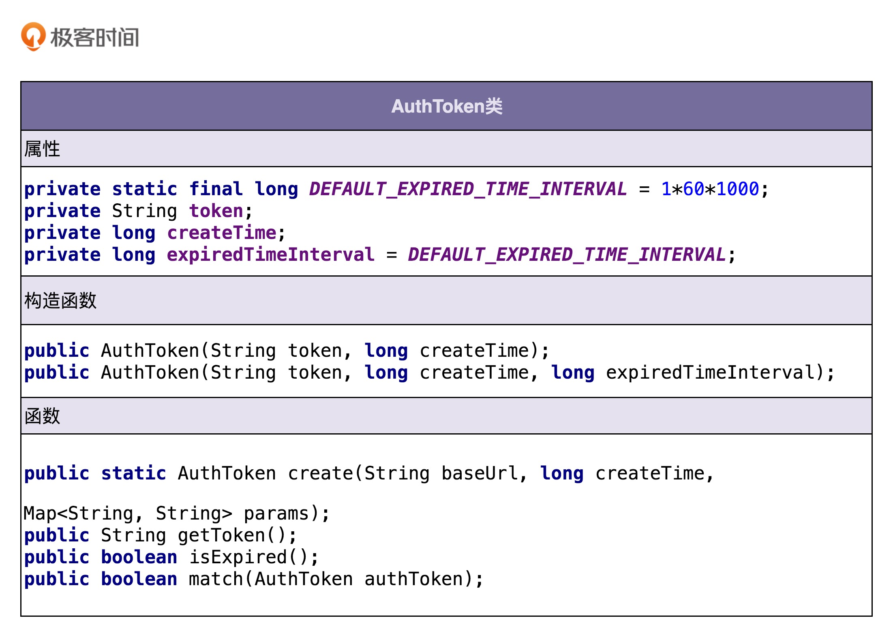

## 04 | 理论一：当谈论面向对象的时候，我们到底在谈论什么？

**什么是面向对象编程和面向对象编程语言？**

- 面向对象编程是一种编程范式或编程风格。它以类或对象作为组织代码的基本单元，并将封装、抽象、继承、多态四个特性，作为代码设计和实现的基石 。
- 面向对象编程语言是支持类或对象的语法机制，并有现成的语法机制，能方便地实现面向对象编程四大特性（封装、抽象、继承、多态）的编程语言。

**如何判定某编程语言是否是面向对象编程语言？**

只要某种编程语言支持类或对象的语法概念，并且以此作为组织代码的基本单元，那就可以被粗略地认为它就是面向对象编程语言了。至于是否有现成的语法机制，完全地支持了面向对象编程的四大特性、是否对四大特性有所取舍和优化，可以不作为判定的标准。

**什么是面向对象分析和面向对象设计？**

OOA、OOD、OOP 三个连在一起就是面向对象分析、设计、编程（实现），正好是面向对象软件开发要经历的三个阶段。

面向对象分析就是要搞清楚做什么，面向对象设计就是要搞清楚怎么做，面向对象编程就是将分析和设计的的结果翻译成代码的过程。

## 05 | 理论二：封装、抽象、继承、多态分别可以解决哪些编程问题？

**封装（Encapsulation）**

封装也叫作信息隐藏或者数据访问保护。类通过暴露有限的访问接口，授权外部仅能通过类提供的方式来访问内部信息或者数据。

封装需要编程语言提供权限访问控制语法来支持，例如 Java 中的 private、protected、public 关键字。

封装特性存在的意义，一方面是保护数据不被随意修改，提高代码的可维护性；另一方面是仅暴露有限的必要接口，提高类的易用性。

**抽象（Abstraction）**

抽象就是隐藏方法的具体实现，让使用者只需要关心方法提供了哪些功能，不需要知道这些功能是如何实现的。

抽象这个概念是一个非常通用的设计思想，并不单单用在面向对象编程中，也可以用来指导架构设计等。函数也是一种抽象，抽象有时候会被排除在面向对象的四大特性之外。

抽象可以通过接口类或者抽象类来实现，但也并不需要特殊的语法机制来支持。

抽象存在的意义，一方面是提高代码的可扩展性、维护性，修改实现不需要改变定义，减少代码的改动范围；另一方面，它也是处理复杂系统的有效手段，能有效地过滤掉不必要关注的信息。

**继承（Inheritance）**

继承是用来表示类之间的 is-a 关系，分为两种模式：单继承和多继承。

为了实现继承这个特性，编程语言需要提供特殊的语法机制来支持。

继承主要是用来解决代码复用的问题。

**多态（Polymorphism）**

多态是指子类可以替换父类，在实际的代码运行过程中，调用子类的方法实现。

多态这种特性也需要编程语言提供特殊的语法机制来实现，比如继承、接口类、duck-typing。

多态可以提高代码的扩展性和复用性，是很多设计模式、设计原则、编程技巧的代码实现基础。

- 利用多态的特性，仅用一个 print() 函数就可以实现遍历打印不同类型（Array、LinkedList）集合的数据。当再增加一种要遍历打印的类型的时候，比如 HashMap，我们只需让 HashMap 实现 Iterator 接口，重新实现自己的 hasNext()、next() 等方法就可以了，完全不需要改动 print() 函数的代码。所以说，多态提高了代码的可扩展性。
- 如果我们不使用多态特性，我们就无法将不同的集合类型（Array、LinkedList）传递给相同的函数（print(Iterator iterator) 函数）。我们需要针对每种要遍历打印的集合，分别实现不同的 print() 函数，比如针对 Array，我们要实现 print(Array array) 函数，针对 LinkedList，我们要实现 print(LinkedList linkedList) 函数。而利用多态特性，我们只需要实现一个 print() 函数的打印逻辑，就能应对各种集合数据的打印操作，这显然提高了代码的复用性。

```js
// 利用继承实现多态
public class DynamicArray {
  private static final int DEFAULT_CAPACITY = 10;
  protected int size = 0;
  protected int capacity = DEFAULT_CAPACITY;
  protected Integer[] elements = new Integer[DEFAULT_CAPACITY];
  
  public int size() { return this.size; }
  public Integer get(int index) { return elements[index];}
  //...省略n多方法...
  
  public void add(Integer e) {
    ensureCapacity();
    elements[size++] = e;
  }
  
  protected void ensureCapacity() {
    //...如果数组满了就扩容...代码省略...
  }
}

public class SortedDynamicArray extends DynamicArray {
  @Override
  public void add(Integer e) {
    ensureCapacity();
    int i;
    for (i = size-1; i>=0; --i) { //保证数组中的数据有序
      if (elements[i] > e) {
        elements[i+1] = elements[i];
      } else {
        break;
      }
    }
    elements[i+1] = e;
    ++size;
  }
}

public class Example {
  public static void test(DynamicArray dynamicArray) {
    dynamicArray.add(5);
    dynamicArray.add(1);
    dynamicArray.add(3);
    for (int i = 0; i < dynamicArray.size(); ++i) {
      System.out.println(dynamicArray.get(i));
    }
  }
  
  public static void main(String args[]) {
    DynamicArray dynamicArray = new SortedDynamicArray();
    test(dynamicArray); // 打印结果：1、3、5
  }
}
```

```js
// 利用接口实现多态
public interface Iterator {
  String hasNext();
  String next();
  String remove();
}

public class Array implements Iterator {
  private String[] data;
  
  public String hasNext() { ... }
  public String next() { ... }
  public String remove() { ... }
  //...省略其他方法...
}

public class LinkedList implements Iterator {
  private LinkedListNode head;
  
  public String hasNext() { ... }
  public String next() { ... }
  public String remove() { ... }
  //...省略其他方法... 
}

public class Demo {
  private static void print(Iterator iterator) {
    while (iterator.hasNext()) {
      System.out.println(iterator.next());
    }
  }
  
  public static void main(String[] args) {
    Iterator arrayIterator = new Array();
    print(arrayIterator);
    
    Iterator linkedListIterator = new LinkedList();
    print(linkedListIterator);
  }
}
```

```js
// 利用 duck-type 实现多态
class Logger:
    def record(self):
        print(“I write a log into file.”)
        
class DB:
    def record(self):
        print(“I insert data into db. ”)
        
def test(recorder):
    recorder.record()

def demo():
    logger = Logger()
    db = DB()
    test(logger)
    test(db)
```

## 06 | 理论三：面向对象相比面向过程有哪些优势？面向过程真的过时了吗？

**什么是面向过程编程？什么是面向过程编程语言？**

- 相较于面向对象编程以类为组织代码的基本单元，面向过程编程则是以过程（或方法）作为组织代码的基本单元。它最主要的特点就是数据和方法相分离。
- 相较于面向对象编程语言，面向过程编程语言最大的特点就是不支持丰富的面向对象编程特性，比如继承、多态、封装。

```js
// 面向过程 C语言
struct User {
  char name[64];
  int age;
  char gender[16];
};

struct User parse_to_user(char* text) {
  // 将text(“小王&28&男”)解析成结构体struct User
}

char* format_to_text(struct User user) {
  // 将结构体struct User格式化成文本（"小王\t28\t男"）
}

void sort_users_by_age(struct User users[]) {
  // 按照年龄从小到大排序users
}

void format_user_file(char* origin_file_path, char* new_file_path) {
  // open files...
  struct User users[1024]; // 假设最大1024个用户
  int count = 0;
  while(1) { // read until the file is empty
    struct User user = parse_to_user(line);
    users[count++] = user;
  }
  
  sort_users_by_age(users);
  
  for (int i = 0; i < count; ++i) {
    char* formatted_user_text = format_to_text(users[i]);
    // write to new file...
  }
  // close files...
}

int main(char** args, int argv) {
  format_user_file("/home/zheng/user.txt", "/home/zheng/formatted_users.txt");
}
```

```js
// 面向对象 JAVA
public class User {
  private String name;
  private int age;
  private String gender;
  
  public User(String name, int age, String gender) {
    this.name = name;
    this.age = age;
    this.gender = gender;
  }
  
  public static User praseFrom(String userInfoText) {
    // 将text(“小王&28&男”)解析成类User
  }
  
  public String formatToText() {
    // 将类User格式化成文本（"小王\t28\t男"）
  }
}

public class UserFileFormatter {
  public void format(String userFile, String formattedUserFile) {
    // Open files...
    List users = new ArrayList<>();
    while (1) { // read until file is empty 
      // read from file into userText...
      User user = User.parseFrom(userText);
      users.add(user);
    }
    // sort users by age...
    for (int i = 0; i < users.size(); ++i) {
      String formattedUserText = user.formatToText();
      // write to new file...
    }
    // close files...
  }
}

public class MainApplication {
  public static void main(String[] args) {
    UserFileFormatter userFileFormatter = new UserFileFormatter();
    userFileFormatter.format("/home/zheng/users.txt", "/home/zheng/formatted_users.txt");
  }
}
```

**面向对象编程相比面向过程编程有哪些优势？**

- 对于大规模复杂程序的开发，程序的处理流程并非单一的一条主线，而是错综复杂的网状结构。面向对象编程比起面向过程编程，更能应对这种复杂类型的程序开发。
- 面向对象编程相比面向过程编程，具有更加丰富的特性（封装、抽象、继承、多态）。利用这些特性编写出来的代码，更加易扩展、易复用、易维护。
- 从编程语言跟机器打交道的方式的演进规律中，我们可以总结出：面向对象编程语言比起面向过程编程语言，更加人性化、更加高级、更加智能。

## 07 | 理论四：哪些代码设计看似是面向对象，实际是面向过程的？

三种违反面向对象编程风格的典型代码设计：

- **滥用 getter、setter 方法**

    在设计实现类的时候，尽量不要给属性定义 setter 方法。除此之外，尽管 getter 方法相对 setter 方法要安全些，但是如果返回的是集合容器，那也要防范集合内部数据被修改的风险。

- **滥用全局变量和全局方法**

    Constants 类、Utils 类：静态方法将方法与数据分离，破坏了封装特性，是典型的面向过程风格；对于这两种类的设计，我们尽量能做到职责单一，定义一些细化的小类。

- **定义数据和方法分离的类**

    基于贫血模型的开发模式：数据和操作分开定义在 VO/BO/Entity 和 Controler/Service/Repository 中，是彻彻底底的面向过程编程风格。

在面向对象编程中，为什么容易写出面向过程风格的代码？

- 面向过程编程风格符合人的流程化思维方式。
- 面向对象编程风格正好相反。它是一种自底向上的思考方式。它不是先去按照执行流程来分解任务，而是将任务翻译成一个一个的小的模块（也就是类），设计类之间的交互，最后按照流程将类组装起来，完成整个任务。这样的思考路径比较适合复杂程序的开发，但并不是特别符合人类的思考习惯。

面向过程编程及面向过程编程语言就真的无用武之地了吗？

- 如果开发的是微小程序，或者是一个数据处理相关的代码，以算法为主，数据为辅，那脚本式的面向过程的编程风格就更适合一些。
- 面向过程编程是面向对象编程的基础，面向对象编程离不开基础的面向过程编程。类中每个方法的实现逻辑，就是面向过程风格的代码。

## 08 | 理论五：接口vs抽象类的区别？如何用普通的类模拟抽象类和接口？

**抽象类**

- 抽象类不允许被实例化，只能被继承。
- 抽象类可以包含属性和方法。方法既可以包含代码实现，也可以不包含代码实现。不包含代码实现的方法叫作抽象方法。
- 子类继承抽象类，必须实现抽象类中的所有抽象方法。

```js
// 抽象类
public abstract class Logger {
  private String name;
  private boolean enabled;
  private Level minPermittedLevel;

  public Logger(String name, boolean enabled, Level minPermittedLevel) {
    this.name = name;
    this.enabled = enabled;
    this.minPermittedLevel = minPermittedLevel;
  }
  
  public void log(Level level, String message) {
    boolean loggable = enabled && (minPermittedLevel.intValue() <= level.intValue());
    if (!loggable) return;
    doLog(level, message);
  }
  
  protected abstract void doLog(Level level, String message);
}
// 抽象类的子类：输出日志到文件
public class FileLogger extends Logger {
  private Writer fileWriter;

  public FileLogger(String name, boolean enabled,
    Level minPermittedLevel, String filepath) {
    super(name, enabled, minPermittedLevel);
    this.fileWriter = new FileWriter(filepath); 
  }
  
  @Override
  public void doLog(Level level, String mesage) {
    // 格式化level和message,输出到日志文件
    fileWriter.write(...);
  }
}
// 抽象类的子类: 输出日志到消息中间件(比如kafka)
public class MessageQueueLogger extends Logger {
  private MessageQueueClient msgQueueClient;
  
  public MessageQueueLogger(String name, boolean enabled,
    Level minPermittedLevel, MessageQueueClient msgQueueClient) {
    super(name, enabled, minPermittedLevel);
    this.msgQueueClient = msgQueueClient;
  }
  
  @Override
  protected void doLog(Level level, String mesage) {
    // 格式化level和message,输出到消息中间件
    msgQueueClient.send(...);
  }
}
```

```js
Logger logger = new FileLogger("access-log", true, Level.WARN, "/users/wangzheng/access.log");
logger.log(Level.ERROR, "This is a test log message.");

// 不在 Logger 中定义 log 方法的话，会报错
// 除非 FileLogger logger = new FileLogger(...)
```

如果在父类中定义一个空方法，只通过继承来实现代码复用，会有如下问题：

- 影响代码的可读性，让人感到疑惑。
- 当创建一个新的子类继承父类的时候，有可能会忘记重新实现该方法。
- 父类可以被实例化，并且调用空的方法。

**接口**

- 接口不能包含属性（也就是成员变量）。
- 接口只能声明方法，方法不能包含代码实现。
- 类实现接口的时候，必须实现接口中声明的所有方法。

```js
// 接口
public interface Filter {
  void doFilter(RpcRequest req) throws RpcException;
}
// 接口实现类：鉴权过滤器
public class AuthencationFilter implements Filter {
  @Override
  public void doFilter(RpcRequest req) throws RpcException {
    //...鉴权逻辑..
  }
}
// 接口实现类：限流过滤器
public class RateLimitFilter implements Filter {
  @Override
  public void doFilter(RpcRequest req) throws RpcException {
    //...限流逻辑...
  }
}
// 过滤器使用demo
public class Application {
  // filters.add(new AuthencationFilter());
  // filters.add(new RateLimitFilter());
  private List<Filter> filters = new ArrayList<>();
  
  public void handleRpcRequest(RpcRequest req) {
    try {
      for (Filter filter : fitlers) {
        filter.doFilter(req);
      }
    } catch(RpcException e) {
      // ...处理过滤结果...
    }
    // ...省略其他处理逻辑...
  }
}
```

**抽象类和接口能解决什么编程问题？**

- 抽象类是对成员变量和方法的抽象，是一种 **is-a** 关系，是为了解决代码复用问题。
- 接口仅仅是对方法的抽象，是一种 **has-a** 关系，表示具有某一组行为特性，是为了解决解耦问题，隔离接口和具体的实现，提高代码的扩展性。

从类的继承层次上来看，抽象类是一种自下而上的设计思路，先有子类的代码重复，然后再抽象成上层的父类（也就是抽象类）。而接口正好相反，它是一种自上而下的设计思路。我们在编程的时候，一般都是先设计接口，再去考虑具体的实现。

## 09 | 理论六：为什么基于接口而非实现编程？有必要为每个类都定义接口吗？

基于接口而非实现编程 = 基于抽象而非实现编程

在做软件开发的时候，一定要有抽象意识、封装意识、接口意识。越抽象、越顶层、越脱离具体某一实现的设计，越能提高代码的灵活性、扩展性、可维护性。

在定义接口的时候，一方面，命名要足够通用，不能包含跟具体实现相关的字眼；另一方面，与特定实现有关的方法不要定义在接口中。

```js
public class AliyunImageStore {
  //...省略属性、构造函数等...
  
  public void createBucketIfNotExisting(String bucketName) {
    // ...创建bucket代码逻辑...
    // ...失败会抛出异常..
  }
  
  public String generateAccessToken() {
    // ...根据accesskey/secrectkey等生成access token
  }
  
  public String uploadToAliyun(Image image, String bucketName, String accessToken) {
    //...上传图片到阿里云...
    //...返回图片存储在阿里云上的地址(url）...
  }
  
  public Image downloadFromAliyun(String url, String accessToken) {
    //...从阿里云下载图片...
  }
}

// AliyunImageStore类的使用举例
public class ImageProcessingJob {
  private static final String BUCKET_NAME = "ai_images_bucket";
  //...省略其他无关代码...
  
  public void process() {
    Image image = ...; //处理图片，并封装为Image对象
    AliyunImageStore imageStore = new AliyunImageStore(/*省略参数*/);
    imageStore.createBucketIfNotExisting(BUCKET_NAME);
    String accessToken = imageStore.generateAccessToken();
    imagestore.uploadToAliyun(image, BUCKET_NAME, accessToken);
  }
  
}
```

如果需要重新设计实现一个存储图片到私有云的 PrivateImageStore 类，并用它替换掉项目中所有的 AliyunImageStore 类对象。会有如下问题：

- 把这种包含“aliyun”字眼的方法，照抄到 PrivateImageStore 类中，显然是不合适的。如果在新类中重新命名 uploadToAliyun()、downloadFromAliyun() 这些方法，那就意味着要修改项目中所有使用到这两个方法的代码，代码修改量可能就会很大。
- 将图片存储到阿里云的流程，跟存储到私有云的流程，可能并不是完全一致的。比如，阿里云的图片上传和下载的过程中，需要生产 access token，而私有云不需要 access token。一方面，AliyunImageStore 中定义的 generateAccessToken() 方法不能照抄到 PrivateImageStore 中；另一方面，我们在使用 AliyunImageStore 上传、下载图片的时候，代码中用到了 generateAccessToken() 方法，如果要改为私有云的上传下载流程，这些代码都需要做调整。

使用接口解决以上问题：

```js
public interface ImageStore {
  String upload(Image image, String bucketName);
  Image download(String url);
}

public class AliyunImageStore implements ImageStore {
  //...省略属性、构造函数等...

  public String upload(Image image, String bucketName) {
    createBucketIfNotExisting(bucketName);
    String accessToken = generateAccessToken();
    //...上传图片到阿里云...
    //...返回图片在阿里云上的地址(url)...
  }

  public Image download(String url) {
    String accessToken = generateAccessToken();
    //...从阿里云下载图片...
  }

  private void createBucketIfNotExisting(String bucketName) {
    // ...创建bucket...
    // ...失败会抛出异常..
  }

  private String generateAccessToken() {
    // ...根据accesskey/secrectkey等生成access token
  }
}

// 上传下载流程改变：私有云不需要支持access token
public class PrivateImageStore implements ImageStore  {
  public String upload(Image image, String bucketName) {
    createBucketIfNotExisting(bucketName);
    //...上传图片到私有云...
    //...返回图片的url...
  }

  public Image download(String url) {
    //...从私有云下载图片...
  }

  private void createBucketIfNotExisting(String bucketName) {
    // ...创建bucket...
    // ...失败会抛出异常..
  }
}

// ImageStore的使用举例
public class ImageProcessingJob {
  private static final String BUCKET_NAME = "ai_images_bucket";
  //...省略其他无关代码...
  
  public void process() {
    Image image = ...;//处理图片，并封装为Image对象
    ImageStore imageStore = new PrivateImageStore(...);
    imagestore.upload(image, BUCKET_NAME);
  }
}
```

是否需要为每个类定义接口？

这条原则的设计初衷是，将接口和实现相分离，封装不稳定的实现，暴露稳定的接口。

上游系统面向接口而非实现编程，不依赖不稳定的实现细节，这样当实现发生变化的时候，上游系统的代码基本上不需要做改动，以此来降低代码间的耦合性，提高代码的扩展性。

- 如果在业务场景中，某个功能只有一种实现方式，未来也不可能被其他实现方式替换，那我们就没有必要为其设计接口，也没有必要基于接口编程，直接使用实现类就可以了。
- 越是不稳定的系统，越是要在代码的扩展性、维护性上下功夫。相反，如果某个系统特别稳定，在开发完之后，基本上不需要做维护，那我们就没有必要为其扩展性，投入不必要的开发时间。

## 10 | 理论七：为何说要多用组合少用继承？如何决定该用组合还是继承？

**为什么不推荐使用继承？**

继承层次过深、过复杂，会影响到代码的可维护性。


**组合相比继承有哪些优势？**

继承主要有三个作用：表示 is-a 关系，支持多态特性，代码复用。而这三个作用都可以通过组合、接口、委托三个技术手段来达成。除此之外，利用组合还能解决层次过深、过复杂的继承关系影响代码可维护性的问题。

```js
public interface Flyable { // 接口
  void fly()；
}
public class FlyAbility implements Flyable { // 实现类
  @Override
  public void fly() { //... }
}
//省略Tweetable/TweetAbility/EggLayable/EggLayAbility

public class Ostrich implements Tweetable, EggLayable {//鸵鸟
  private TweetAbility tweetAbility = new TweetAbility(); //组合
  private EggLayAbility eggLayAbility = new EggLayAbility(); //组合
  //... 省略其他属性和方法...
  @Override
  public void tweet() {
    tweetAbility.tweet(); // 委托
  }
  @Override
  public void layEgg() {
    eggLayAbility.layEgg(); // 委托
  }
}
```

**如何判断该用组合还是继承？**

- 如果类之间的继承结构稳定，层次比较浅，关系不复杂，就可以大胆地使用继承。
- 反之，就尽量使用组合来替代继承。

## 11 | 实战一（上）：业务开发常用的基于贫血模型的MVC架构违背OOP吗？

MVC 三层架构中的 M 表示 Model，V 表示 View，C 表示 Controller。它将整个项目分为三层：展示层、逻辑层、数据层。MVC 三层开发架构是一个比较笼统的分层方式，落实到具体的开发层面，很多项目也并不会 100% 遵从 MVC 固定的分层方式，而是会根据具体的项目需求，做适当的调整。

比如，现在很多 Web 或者 App 项目都是前后端分离的，后端负责暴露接口给前端调用。这种情况下，我们一般就将后端项目分为 Repository 层、Service 层、Controller 层。其中，Repository 层负责数据访问，Service 层负责业务逻辑，Controller 层负责暴露接口。

**什么是贫血模型**

```js
////////// Controller+VO(View Object) //////////
public class UserController {
  private UserService userService; //通过构造函数或者IOC框架注入
  
  public UserVo getUserById(Long userId) {
    UserBo userBo = userService.getUserById(userId);
    UserVo userVo = [...convert userBo to userVo...];
    return userVo;
  }
}

public class UserVo {//省略其他属性、get/set/construct方法
  private Long id;
  private String name;
  private String cellphone;
}

////////// Service+BO(Business Object) //////////
public class UserService {
  private UserRepository userRepository; //通过构造函数或者IOC框架注入
  
  public UserBo getUserById(Long userId) {
    UserEntity userEntity = userRepository.getUserById(userId);
    UserBo userBo = [...convert userEntity to userBo...];
    return userBo;
  }
}

public class UserBo {//省略其他属性、get/set/construct方法
  private Long id;
  private String name;
  private String cellphone;
}

////////// Repository+Entity //////////
public class UserRepository {
  public UserEntity getUserById(Long userId) { //... }
}

public class UserEntity {//省略其他属性、get/set/construct方法
  private Long id;
  private String name;
  private String cellphone;
}
```

UserEntity 和 UserRepository 组成了数据访问层，UserBo 和 UserService 组成了业务逻辑层，UserVo 和 UserController 在这里属于接口层。

UserBo 是一个纯粹的数据结构，只包含数据，不包含任何业务逻辑。业务逻辑集中在 UserService 中。我们通过 UserService 来操作 UserBo。换句话说，Service 层的数据和业务逻辑，被分割为 BO 和 Service 两个类中。像 UserBo 这样，只包含数据，不包含业务逻辑的类，就叫作贫血模型（Anemic Domain Model）。同理，UserEntity、UserVo 都是基于贫血模型设计的。这种贫血模型将数据与操作分离，破坏了面向对象的封装特性，是一种典型的面向过程的编程风格。

**什么是充血模型？**

数据和对应的业务逻辑被封装到同一个类中。

基于贫血模型的传统的开发模式，重 Service 轻 BO；基于充血模型的 DDD(Domain Driven Design) 开发模式，轻 Service 重 Domain。

**什么项目应该考虑使用基于充血模型的 DDD 开发模式？**

对于业务不复杂的系统开发来说，基于贫血模型的传统开发模式简单够用，基于充血模型的 DDD 开发模式有点大材小用，无法发挥作用。相反，对于业务复杂的系统开发来说，基于充血模型的 DDD 开发模式，因为前期需要在设计上投入更多时间和精力，来提高代码的复用性和可维护性，所以相比基于贫血模型的开发模式，更加有优势。

## 12 | 实战一（下）：如何利用基于充血模型的DDD开发一个虚拟钱包系统？

在基于充血模型的开发模式下，我们将部分原来在 Service 类中的业务逻辑移动到了一个充血的 Domain 领域模型中，让 Service 类的实现依赖这个 Domain 类。

在基于充血模型的 DDD 开发模式下，Service 类并不会完全移除，而是负责一些不适合放在 Domain 类中的功能。比如，负责与 Repository 层打交道、跨领域模型的业务聚合功能、幂等事务等非功能性的工作。

基于充血模型的 DDD 开发模式跟基于贫血模型的传统开发模式相比，Controller 层和 Repository 层的代码基本上相同。这是因为，Repository 层的 Entity 生命周期有限，Controller 层的 VO 只是单纯作为一种 DTO。两部分的业务逻辑都不会太复杂。业务逻辑主要集中在 Service 层。所以，Repository 层和 Controller 层继续沿用贫血模型的设计思路是没有问题的。

```js
public class VirtualWalletBo {//省略getter/setter/constructor方法
  private Long id;
  private Long createTime;
  private BigDecimal balance;
}

public class VirtualWalletService {
  // 通过构造函数或者IOC框架注入
  private VirtualWalletRepository walletRepo;
  private VirtualWalletTransactionRepository transactionRepo;
  
  public VirtualWalletBo getVirtualWallet(Long walletId) {
    VirtualWalletEntity walletEntity = walletRepo.getWalletEntity(walletId);
    VirtualWalletBo walletBo = convert(walletEntity);
    return walletBo;
  }
  
  public BigDecimal getBalance(Long walletId) {
    return walletRepo.getBalance(walletId);
  }
  
  public void debit(Long walletId, BigDecimal amount) {
    VirtualWalletEntity walletEntity = walletRepo.getWalletEntity(walletId);
    BigDecimal balance = walletEntity.getBalance();
    if (balance.compareTo(amount) < 0) {
      throw new NoSufficientBalanceException(...);
    }
    walletRepo.updateBalance(walletId, balance.subtract(amount));
  }
  
  public void credit(Long walletId, BigDecimal amount) {
    VirtualWalletEntity walletEntity = walletRepo.getWalletEntity(walletId);
    BigDecimal balance = walletEntity.getBalance();
    walletRepo.updateBalance(walletId, balance.add(amount));
  }
  
  public void transfer(Long fromWalletId, Long toWalletId, BigDecimal amount) {
    VirtualWalletTransactionEntity transactionEntity = new VirtualWalletTransactionEntity();
    transactionEntity.setAmount(amount);
    transactionEntity.setCreateTime(System.currentTimeMillis());
    transactionEntity.setFromWalletId(fromWalletId);
    transactionEntity.setToWalletId(toWalletId);
    transactionEntity.setStatus(Status.TO_BE_EXECUTED);
    Long transactionId = transactionRepo.saveTransaction(transactionEntity);
    try {
      debit(fromWalletId, amount);
      credit(toWalletId, amount);
    } catch (InsufficientBalanceException e) {
      transactionRepo.updateStatus(transactionId, Status.CLOSED);
      ...rethrow exception e...
    } catch (Exception e) {
      transactionRepo.updateStatus(transactionId, Status.FAILED);
      ...rethrow exception e...
    }
    transactionRepo.updateStatus(transactionId, Status.EXECUTED);
  }
}
```

```js
public class VirtualWallet { // Domain领域模型(充血模型)
  private Long id;
  private Long createTime = System.currentTimeMillis();;
  private BigDecimal balance = BigDecimal.ZERO;
  
  public VirtualWallet(Long preAllocatedId) {
    this.id = preAllocatedId;
  }
  
  public BigDecimal balance() {
    return this.balance;
  }
  
  public void debit(BigDecimal amount) {
    if (this.balance.compareTo(amount) < 0) {
      throw new InsufficientBalanceException(...);
    }
    this.balance.subtract(amount);
  }
  
  public void credit(BigDecimal amount) {
    if (amount.compareTo(BigDecimal.ZERO) < 0) {
      throw new InvalidAmountException(...);
    }
    this.balance.add(amount);
  }
}

public class VirtualWalletService {
  // 通过构造函数或者IOC框架注入
  private VirtualWalletRepository walletRepo;
  private VirtualWalletTransactionRepository transactionRepo;
  
  public VirtualWallet getVirtualWallet(Long walletId) {
    VirtualWalletEntity walletEntity = walletRepo.getWalletEntity(walletId);
    VirtualWallet wallet = convert(walletEntity);
    return wallet;
  }
  
  public BigDecimal getBalance(Long walletId) {
    return walletRepo.getBalance(walletId);
  }
  
  public void debit(Long walletId, BigDecimal amount) {
    VirtualWalletEntity walletEntity = walletRepo.getWalletEntity(walletId);
    VirtualWallet wallet = convert(walletEntity);
    wallet.debit(amount);
    walletRepo.updateBalance(walletId, wallet.balance());
  }
  
  public void credit(Long walletId, BigDecimal amount) {
    VirtualWalletEntity walletEntity = walletRepo.getWalletEntity(walletId);
    VirtualWallet wallet = convert(walletEntity);
    wallet.credit(amount);
    walletRepo.updateBalance(walletId, wallet.balance());
  }
  
  public void transfer(Long fromWalletId, Long toWalletId, BigDecimal amount) {
    //...跟基于贫血模型的传统开发模式的代码一样...
  }
}
```

## 13 | 实战二（上）：如何对接口鉴权这样一个功能开发做面向对象分析？

- 调用方进行接口请求的时候，将 URL、AppID、密码、时间戳拼接在一起，通过加密算法生成 token，并且将 token、AppID、时间戳拼接在 URL 中，一并发送到微服务端。
- 微服务端在接收到调用方的接口请求之后，从请求中拆解出 token、AppID、时间戳。
- 微服务端首先检查传递过来的时间戳跟当前时间，是否在 token 失效时间窗口内。如果已经超过失效时间，那就算接口调用鉴权失败，拒绝接口调用请求。
- 如果 token 验证没有过期失效，微服务端再从自己的存储中，取出 AppID 对应的密码，通过同样的 token 生成算法，生成另外一个 token，与调用方传递过来的 token 进行匹配；如果一致，则鉴权成功，允许接口调用，否则就拒绝接口调用。

## 14 | 实战二（下）：如何利用面向对象设计和编程开发接口鉴权功能？

面向对象分析的产出是详细的需求描述，那面向对象设计的产出就是类。

**一. 划分职责进而识别出有哪些类**

1. 把 URL、AppID、密码、时间戳拼接为一个字符串；
2. 对字符串通过加密算法加密生成 token；
3. 将 token、AppID、时间戳拼接到 URL 中，形成新的 URL；
4. 解析 URL，得到 token、AppID、时间戳等信息；
5. 从存储中取出 AppID 和对应的密码；
6. 根据时间戳判断 token 是否过期失效；
7. 验证两个 token 是否匹配；

AuthToken、Url、CredentialStorage。AuthToken 负责实现 1、2、6、7 这四个操作；Url 负责 3、4 两个操作；CredentialStorage 负责 5 这个操作。

针对复杂的需求开发，首先要做的是进行**模块划分**，将需求先简单划分成几个小的、独立的功能模块，然后再在模块内部，应用我们刚刚讲的方法，进行面向对象设计。而模块的划分和识别，跟类的划分和识别，是类似的套路。

**二. 定义类及其属性和方法**

识别出需求描述中的动词，作为候选的方法，再进一步过滤筛选。类比一下方法的识别，我们可以把功能点中涉及的名词，作为候选属性，然后同样进行过滤筛选。

- 从业务模型上来说，不应该属于这个类的属性和方法，不应该被放到这个类
- 在设计类具有哪些属性和方法的时候，不能单纯地依赖当下的需求，还要分析这个类从业务模型上来讲，理应具有哪些属性和方法。




**三. 定义类与类之间的交互关系**

UML 统一建模语言中定义了六种类之间的关系。它们分别是：泛化、实现、关联、聚合、组合、依赖。

**四. 将类组装起来并提供执行入口**

我们要将所有的类组装在一起，提供一个执行入口。这个入口可能是一个 main() 函数，也可能是一组给外部用的 API 接口。通过这个入口，我们能触发整个代码跑起来。

```js
public interface ApiAuthenticator {
  void auth(String url);
  void auth(ApiRequest apiRequest);
}

public class DefaultApiAuthenticatorImpl implements ApiAuthenticator {
  private CredentialStorage credentialStorage;
  
  public DefaultApiAuthenticator() {
    this.credentialStorage = new MysqlCredentialStorage();
  }
  
  public DefaultApiAuthenticator(CredentialStorage credentialStorage) {
    this.credentialStorage = credentialStorage;
  }

  @Override
  public void auth(String url) {
    ApiRequest apiRequest = ApiRequest.buildFromUrl(url);
    auth(apiRequest);
  }

  @Override
  public void auth(ApiRequest apiRequest) {
    String appId = apiRequest.getAppId();
    String token = apiRequest.getToken();
    long timestamp = apiRequest.getTimestamp();
    String originalUrl = apiRequest.getOriginalUrl();

    AuthToken clientAuthToken = new AuthToken(token, timestamp);
    if (clientAuthToken.isExpired()) {
      throw new RuntimeException("Token is expired.");
    }

    String password = credentialStorage.getPasswordByAppId(appId);
    AuthToken serverAuthToken = AuthToken.generate(originalUrl, appId, password, timestamp);
    if (!serverAuthToken.match(clientAuthToken)) {
      throw new RuntimeException("Token verfication failed.");
    }
  }
}
```