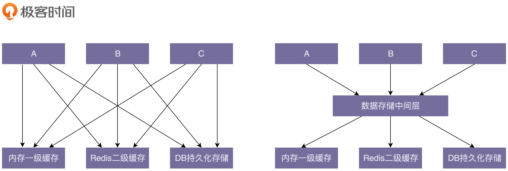

## 27 | 理论一：什么情况下要重构？到底重构什么？又该如何重构？

**重构的目的：为什么重构（why）？**

- 重构可以保持代码质量持续处于一个可控状态，不至于腐化到无可救药的地步。
- 是我们学习的经典设计思想、原则、模式、编程规范等理论知识的练兵场。

**重构的对象：重构什么（what）？**

- 大规模高层次重构包括对代码分层、模块化、解耦、梳理类之间的交互关系、抽象复用组件等等。这部分工作利用的更多的是比较抽象、比较顶层的设计思想、原则、模式。
- 小规模低层次的重构包括规范命名、注释、修正函数参数过多、消除超大类、提取重复代码等等编程细节问题，主要是针对类、函数级别的重构。小规模低层次的重构更多的是利用编码规范这一理论知识。

**重构的时机：什么时候重构（when）？**

建立**持续重构**意识，把重构作为开发必不可少的部分，融入到日常开发中，而不是等到代码出现很大问题的时候，再大刀阔斧地重构。

**重构的方法：如何重构（how）？**

- 大规模高层次的重构难度比较大，需要组织、有计划地进行，分阶段地小步快跑，时刻让代码处于一个可运行的状态。
- 而小规模低层次的重构，因为影响范围小，改动耗时短，随时随地都可以去做。

## 28 | 理论二：为了保证重构不出错，有哪些非常能落地的技术手段？

**什么是单元测试？**

单元测试是代码层面的测试，由研发自己来编写，用于测试“自己”编写的代码的逻辑的正确性。单元测试顾名思义是测试一个“单元”，有别于集成测试，这个“单元”一般是类或函数，而不是模块或者系统。

**为什么要写单元测试？**

写单元测试的过程本身就是代码 Code Review 和重构的过程，能有效地发现代码中的 bug 和代码设计上的问题。除此之外，单元测试还是对集成测试的有力补充，还能帮助我们快速熟悉代码，是 TDD 可落地执行的改进方案。

**如何编写单元测试？**

写单元测试就是针对代码设计各种测试用例，以覆盖各种输入、异常、边界情况，并将其翻译成代码。我们可以利用一些测试框架来简化单元测试的编写。除此之外，对于单元测试，我们需要建立以下正确的认知：

- 编写单元测试尽管繁琐，但并不是太耗时；
- 我们可以稍微放低对单元测试代码质量的要求；
- 覆盖率作为衡量单元测试质量的唯一标准是不合理的；
- 单元测试不要依赖被测代码的具体实现逻辑；
- 单元测试框架无法测试，多半是因为代码的可测试性不好。

## 29 | 理论三：什么是代码的可测试性？如何写出可测试性好的代码？

**什么是代码的可测试性？**

粗略地讲，所谓代码的可测试性，就是针对代码编写单元测试的难易程度。对于一段代码，如果很难为其编写单元测试，或者单元测试写起来很费劲，需要依靠单元测试框架中很高级的特性，那往往就意味着代码设计得不够合理，代码的可测试性不好。

**编写可测试性代码的最有效手段**

依赖注入是编写可测试性代码的最有效手段。通过依赖注入，我们在编写单元测试的时候，可以通过 mock 的方法解依赖外部服务，这也是我们在编写单元测试的过程中最有技术挑战的地方。

**常见的 Anti-Patterns**

- 代码中包含未决行为逻辑（跟时间、随机数有关的代码）
- 滥用可变全局变量
- 滥用静态方法
- 使用复杂的继承关系
- 高度耦合的代码

## 30 | 理论四：如何通过封装、抽象、模块化、中间层等解耦代码？

**如何给代码“解耦”？**

1. **封装与抽象**

    封装和抽象可以有效地隐藏实现的复杂性，隔离实现的易变性，给依赖的模块提供稳定且易用的抽象接口。

2. **中间层**

    引入中间层能简化模块或类之间的依赖关系。

    

3. **模块化**
4. **其他设计思想和原则**

    单一职责原则、基于接口而非实现编程、依赖注入、多用组合少用继承、迪米特法则

## 31 | 理论五：让你最快速地改善代码质量的20条编程规范（上）

**命名**

- 命名的关键是能准确达意。对于不同作用域的命名，我们可以适当地选择不同的长度。作用域小的变量（比如临时变量），可以适当地选择短一些的命名方式。除此之外，命名中也可以使用一些耳熟能详的缩写。
- 我们可以借助类的信息来简化属性、函数的命名，利用函数的信息来简化函数参数的命名。
- 命名要可读、可搜索。不要使用生僻的、不好读的英文单词来命名。除此之外，命名要符合项目的统一规范，不要用些反直觉的命名。
- 接口有两种命名方式：一种是在接口中带前缀“I”；另一种是在接口的实现类中带后缀“Impl”。对于抽象类的命名，也有两种方式，一种是带上前缀“Abstract”，一种是不带前缀。这两种命名方式都可以，关键是要在项目中统一。

**注释**

- 注释的目的就是让代码更容易看懂。只要符合这个要求的内容，你就可以将它写到注释里。总结一下，注释的内容主要包含这样三个方面：做什么、为什么、怎么做。对于一些复杂的类和接口，我们可能还需要写明“如何用”。
- 注释本身有一定的维护成本，所以并非越多越好。类和函数一定要写注释，而且要写得尽可能全面、详细，而函数内部的注释要相对少一些，一般都是靠好的命名、提炼函数、解释性变量、总结性注释来提高代码可读性。

## 32 | 理论五：让你最快速地改善代码质量的20条编程规范（中）

**代码风格**

**函数、类多大才合适？**

函数的代码行数不要超过一屏幕的大小，比如 50 行。类的大小限制比较难确定。

**一行代码多长最合适？**

最好不要超过 IDE 显示的宽度。当然，限制也不能太小，太小会导致很多稍微长点的语句被折成两行，也会影响到代码的整洁，不利于阅读。

**善用空行分割单元块**

对于比较长的函数，为了让逻辑更加清晰，可以使用空行来分割各个代码块。在类内部，成员变量与函数之间、静态成员变量与普通成员变量之间、函数之间，甚至成员变量之间，都可以通过添加空行的方式，让不同模块的代码之间的界限更加明确。

**四格缩进还是两格缩进？**

个人比较推荐使用两格缩进，这样可以节省空间，特别是在代码嵌套层次比较深的情况下。除此之外，值得强调的是，不管是用两格缩进还是四格缩进，一定不要用 tab 键缩进。

**大括号是否要另起一行？**

个人还是比较推荐将大括号放到跟上一条语句同一行的风格，这样可以节省代码行数。但是，将大括号另起一行，也有它的优势，那就是，左右括号可以垂直对齐，哪些代码属于哪一个代码块，更加一目了然。

**类中成员的排列顺序**

在 Google Java 编程规范中，依赖类按照字母序从小到大排列。类中先写成员变量后写函数。成员变量之间或函数之间，先写静态成员变量或函数，后写普通变量或函数，并且按照作用域大小依次排列（public > protected > private）。

## 33 | 理论五：让你最快速地改善代码质量的20条编程规范（下）

**编码技巧**

- 将复杂的逻辑提炼拆分成函数和类。
- 通过拆分成多个函数或将参数封装为对象的方式，来处理参数过多的情况。
- 函数中不要使用参数来做代码执行逻辑的控制。
- 函数设计要职责单一。
- 移除过深的嵌套层次，方法包括：去掉多余的 if 或 else 语句，使用 continue、break、return 关键字提前退出嵌套，调整执行顺序来减少嵌套，将部分嵌套逻辑抽象成函数。
- 用字面常量取代魔法数。
- 用解释性变量来解释复杂表达式，以此提高代码可读性。

**统一编码规范**

## 34 | 实战一（上）：通过一段ID生成器代码，学习如何发现代码质量问题

## 35 | 实战一（下）：手把手带你将ID生成器代码从“能用”重构为“好用”

- 第一轮重构：提高代码的可读性
- 第二轮重构：提高代码的可测试性
- 第三轮重构：编写完善的单元测试
- 第四轮重构：所有重构完成之后添加注释

## 36 | 实战二（上）：程序出错该返回啥？NULL、异常、错误码、空对象？

**返回错误码**

C 语言没有异常这样的语法机制，返回错误码便是最常用的出错处理方式。而 Java、Python 等比较新的编程语言中，大部分情况下，我们都用异常来处理函数出错的情况，极少会用到错误码。

**返回 NULL 值**

在多数编程语言中，我们用 NULL 来表示“不存在”这种语义。对于查找函数来说，数据不存在并非一种异常情况，是一种正常行为，所以返回表示不存在语义的 NULL 值比返回异常更加合理。

**返回空对象**

返回 NULL 值有各种弊端，对此有一个比较经典的应对策略，那就是应用空对象设计模式。当函数返回的数据是字符串类型或者集合类型的时候，我们可以用空字符串或空集合替代 NULL 值，来表示不存在的情况。这样，我们在使用函数的时候，就可以不用做 NULL 值判断。

**抛出异常对象**

函数抛出的异常有三种处理方法：直接吞掉、直接往上抛出、包裹成新的异常抛出。

最常用的函数出错处理方式是抛出异常。异常有两种类型：受检异常和非受检异常。

根据团队的开发习惯，在同一个项目中，制定统一的异常处理规范即可。

## 37 | 实战二（下）：重构ID生成器项目中各函数的异常处理代码

略...