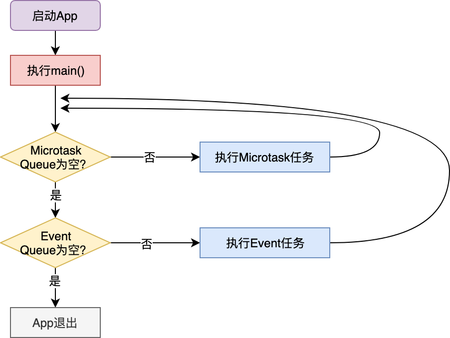
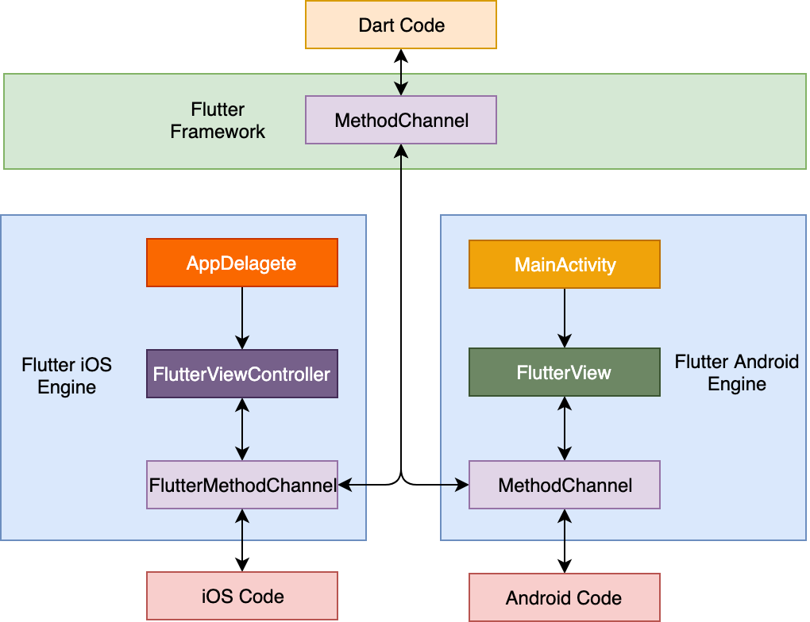
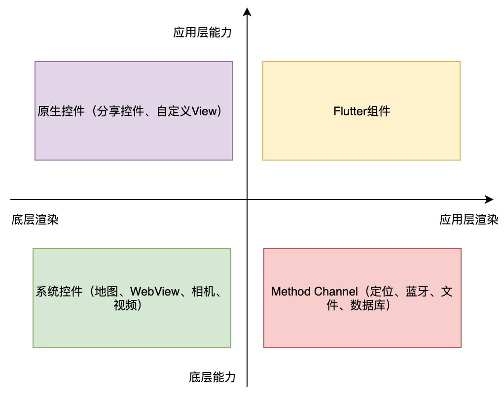
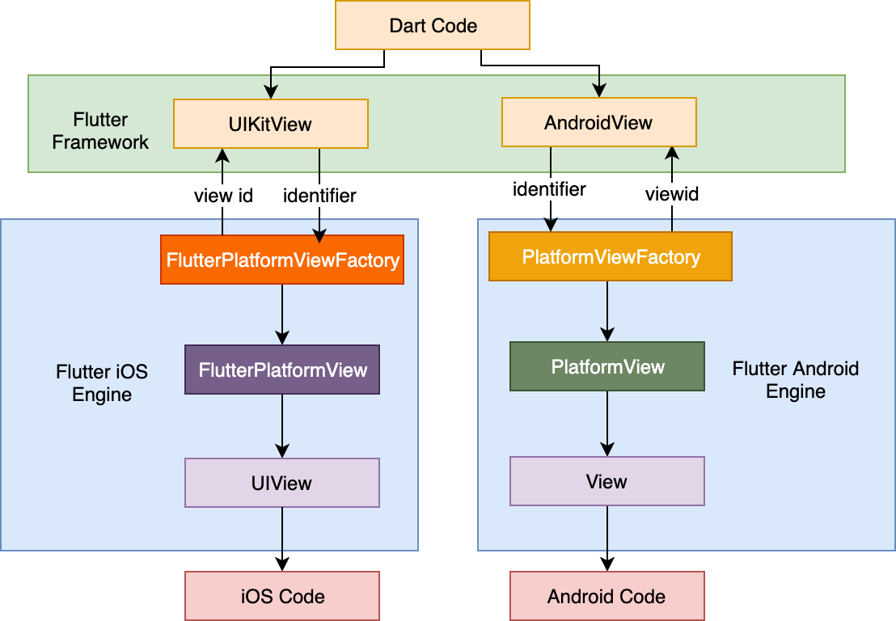
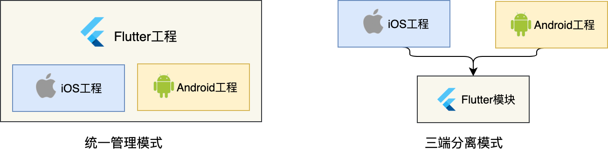
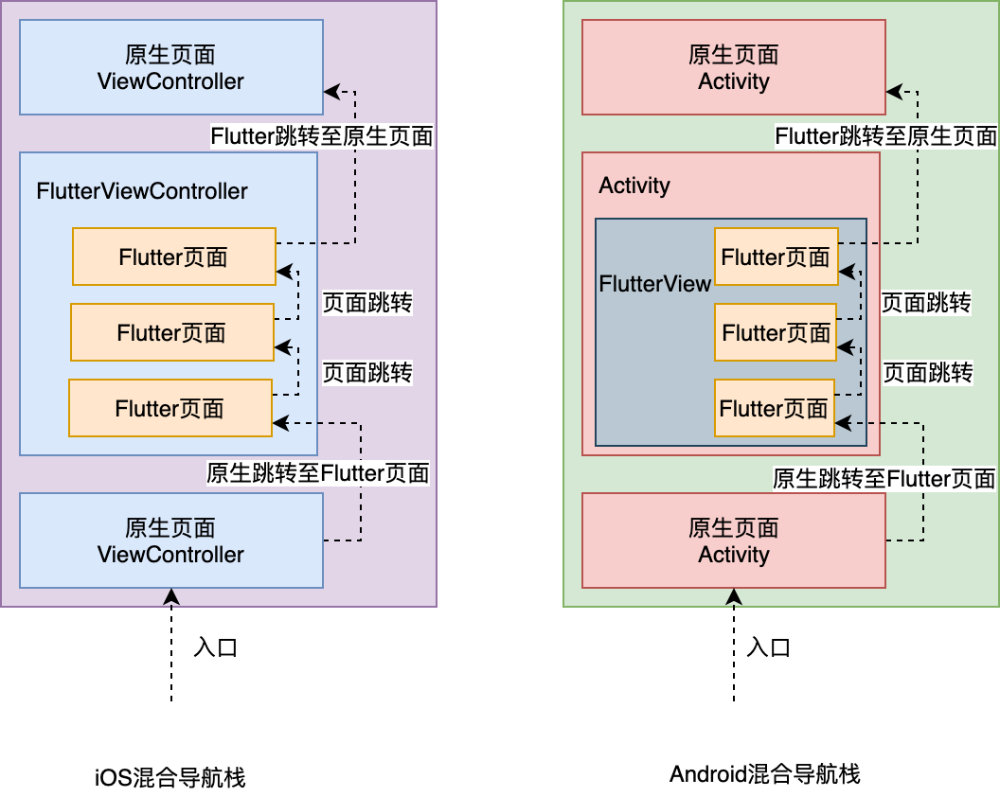
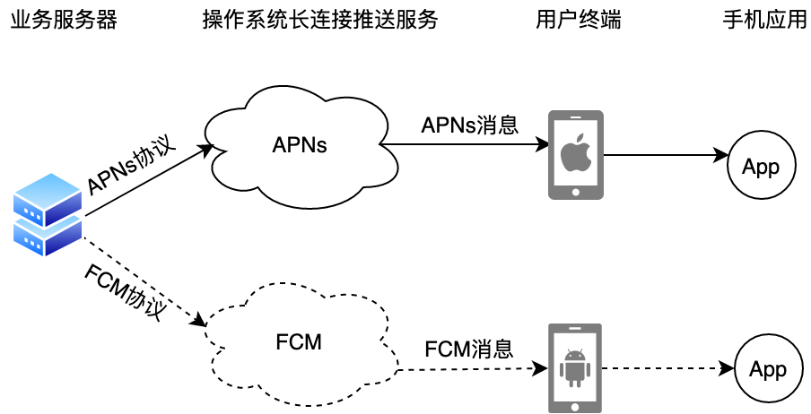
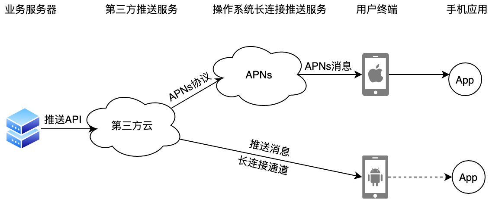
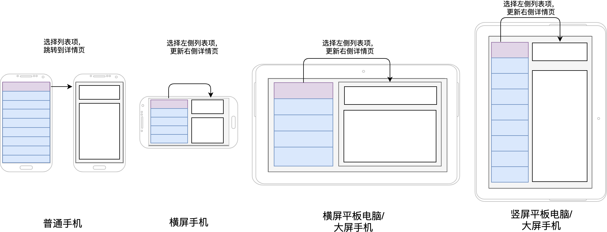

## 如何构造炫酷的动画效果？

- Animation 是 Flutter 动画库中的核心类，会根据预定规则，在单位时间内持续输出动画的当前状态。Animation 仅仅是用来提供动画数据，而不负责动画的渲染。
- AnimationController 用于管理 Animation，可以用来设置动画的时长、启动动画、暂停动画、反转动画等。
- Listener 是 Animation 的回调函数，用来监听动画的进度变化。

vsync：vsync 对象会把动画绑定到一个 Widget，当 Widget 不显示时，动画将会暂停，当 Widget 再次显示时，动画会重新恢复执行，这样就可以避免动画的组件不在当前屏幕时白白消耗资源。

```js
class _AnimateAppState extends State<AnimateApp> with SingleTickerProviderStateMixin {
  AnimationController controller;
  Animation<double> animation;
  @override
  void initState() {
    super.initState();
    //创建动画周期为1秒的AnimationController对象
    controller = AnimationController(
        vsync: this, duration: const Duration(milliseconds: 1000));
    // 创建从50到200线性变化的Animation对象
    animation = Tween(begin: 50.0, end: 200.0).animate(controller)
      ..addListener(() {
        setState(() {}); //刷新界面
      });
    controller.forward(); //启动动画
  }
	@override
	Widget build(BuildContext context) {
	  return MaterialApp(
	    home: Center(
	      child: Container(
	      width: animation.value, // 将动画的值赋给widget的宽高
	      height: animation.value,
	      child: FlutterLogo()
	    )));
	}
	@override
	void dispose() {
	  controller.dispose(); // 释放资源
	  super.dispose();
	}
}

//以下两段语句等价
//第一段
controller.repeat(reverse: true);//让动画重复执行

//第二段
animation.addStatusListener((status) {
    if (status == AnimationStatus.completed) {
      controller.reverse();//动画结束时反向执行
    } else if (status == AnimationStatus.dismissed) {
      controller.forward();//动画反向执行完毕时，重新执行
    }
});
controller.forward();//启动动画
```

**AnimatedWidget 与 AnimatedBuilder**

Animation 仅提供动画的数据，因此我们还需要监听动画执行进度，并在回调中使用 setState 强制刷新界面才能看到动画效果。考虑到这些步骤都是固定的，Flutter 提供了两个类来帮我们简化这一步骤，即 AnimatedWidget 与 AnimatedBuilder。

```js
class AnimatedLogo extends AnimatedWidget {
  //AnimatedWidget需要在初始化时传入animation对象
  AnimatedLogo({Key key, Animation<double> animation})
      : super(key: key, listenable: animation);

  Widget build(BuildContext context) {
    //取出动画对象
    final Animation<double> animation = listenable;
    return Center(
      child: Container(
        height: animation.value,//根据动画对象的当前状态更新宽高
        width: animation.value,
        child: FlutterLogo(),
    ));
  }
}

// 将动画和渲染职责分离
MaterialApp(
  home: Scaffold(
    body: Center(
      child: AnimatedBuilder(
        animation: animation,//传入动画对象
        child:FlutterLogo(),
        //动画构建回调
        builder: (context, child) => Container(
          width: animation.value,//使用动画的当前状态更新UI
          height: animation.value,
          child: child, //child参数即FlutterLogo()
        )
      )
    )
));
```

**hero 动画**

通过 Hero，我们可以在两个页面的共享元素之间，做出流畅的页面切换效果。

```js
class Page1 extends StatelessWidget {
  Widget build(BuildContext context) {
    return  Scaffold(
      body: GestureDetector(//手势监听点击
        child: Hero(
          tag: 'hero',//设置共享tag
          child: Container(
            width: 100, height: 100,
            child: FlutterLogo())),
        onTap: () {
          Navigator.of(context).push(MaterialPageRoute(builder: (_)=>Page2()));//点击后打开第二个页面
        },
      )
    );
  }
}

class Page2 extends StatelessWidget {
  @override
  Widget build(BuildContext context) {
    return  Scaffold(
      body: Hero(
        tag: 'hero',//设置共享tag
        child: Container(
          width: 300, height: 300,
          child: FlutterLogo()
        ))
    );
  }
}
```

## 单线程模型怎么保证UI运行流畅？



Dart 为 Event Queue 的任务建立提供了一层封装，叫作 **Future**

```js
//f1比f2先执行
Future(() => print('f1'));
Future(() => print('f2'));

//f3执行后会立刻同步执行then 3
Future(() => print('f3')).then((_) => print('then 3'));

//then 4会加入微任务队列，尽快执行
Future(() => null).then((_) => print('then 4'));
```

- 在第一个例子中，由于 f1 比 f2 先声明，因此会被先加入事件队列，所以 f1 比 f2 先执行；
- 在第二个例子中，由于 Future 函数体与 then 共用一个事件循环，因此 f3 执行后会立刻同步执行 then 3；
- 最后一个例子中，Future 函数体是 null，这意味着它不需要也没有事件循环，因此后续的 then 也无法与它共享。在这种场景下，Dart 会把后续的 then 放入微任务队列，在下一次事件循环中执行。

then 会在 Future 函数体执行完毕后立刻执行，无论是共用同一个事件循环还是进入下一个微任务。

```js
Future(() => print('f1'))
  .then((_) async => await Future(() => print('f2')))
  .then((_) => print('f3'));
Future(() => print('f4'));
```

- 按照任务的声明顺序，f1 和 f4 被先后加入事件队列。
- f1 被取出并打印；然后到了 then。then 的执行体是个 future f2，于是放入 Event Queue。然后把 await 也放到 Event Queue 里。
- 这个时候要注意了，Event Queue 里面还有一个 f4，我们的 await 并不能阻塞 f4 的执行。因此，Event Loop 先取出 f4，打印 f4；然后才能取出并打印 f2，最后把等待的 await 取出，开始执行后面的 f3。

尽管 Dart 是基于单线程模型的，但为了进一步利用多核 CPU，将 CPU 密集型运算进行隔离，Dart 也提供了多线程机制，即 **Isolate**。在 Isolate 中，资源隔离做得非常好，每个 Isolate 都有自己的 Event Loop 与 Queue，Isolate 之间不共享任何资源，只能依靠消息机制通信，因此也就没有资源抢占问题。

## HTTP网络编程与JSON解析

**HttpClient**

HttpClient 是 dart:io 库中提供的网络请求类，实现了基本的网络编程功能。

接口暴露了不少内部实现细节。比如，异步调用拆分得过细，链接需要调用方主动关闭，请求结果是字符串但却需要手动解码等。

**http**

相比于 HttpClient，易用性提升了不少

定制化能力都相对较弱，很多常用的功能都不支持（或者实现异常繁琐），比如取消请求、定制拦截器、Cookie 管理等。

**dio**

```js
void getRequest() async {
  //创建网络调用示例
  Dio dio = new Dio();
  
  //设置URI及请求user-agent后发起请求
  var response = await dio.get("https://flutter.dev", options:Options(headers: {"user-agent" : "Custom-UA"}));
  
 //打印请求结果
  if(response.statusCode == HttpStatus.ok) {
    print(response.data.toString());
  } else {
    print("Error: ${response.statusCode}");
  }
}
```

```js
//使用FormData表单构建待上传文件
FormData formData = FormData.from({
  "file1": UploadFileInfo(File("./file1.txt"), "file1.txt"),
  "file2": UploadFileInfo(File("./file2.txt"), "file1.txt"),
});
//通过post方法发送至服务端
var responseY = await dio.post("https://xxx.com/upload", data: formData);
print(responseY.toString());

//使用download方法下载文件
dio.download("https://xxx.com/file1", "xx1.zip");

//增加下载进度回调函数
dio.download("https://xxx.com/file1", "xx2.zip", onReceiveProgress: (count, total) {
  //do something      
});

//同时发起两个并行请求
List<Response> responseX= await Future.wait([dio.get("https://flutter.dev"),dio.get("https://pub.dev/packages/dio")]);

//打印请求1响应结果
print("Response1: ${responseX[0].toString()}");
//打印请求2响应结果
print("Response2: ${responseX[1].toString()}");

//增加拦截器...
//增加try catch，防止请求报错...
```

**JSON 解析**

由于 Flutter 不支持运行时反射，因此并没有提供像 Gson、Mantle 这样自动解析 JSON 的库来降低解析成本。

## 本地存储与数据库的使用和优化

**文件**

文件比较适合大量的、有序的数据持久化

- 临时目录是操作系统可以随时清除的目录，通常被用来存放一些不重要的临时缓存数据。
- 文档目录则是只有在删除应用程序时才会被清除的目录，通常被用来存放应用产生的重要数据文件。

**SharedPreferences**

如果我们只是需要缓存少量的键值对信息（比如记录用户是否阅读了公告，或是简单的计数），则可以使用 SharedPreferences 为简单的键值对数据提供持久化存储

**数据库**

如果我们需要持久化大量格式化后的数据，并且这些数据还会以较高的频率更新，为了考虑进一步的扩展性，我们通常会选用 sqlite 数据库来应对这样的场景。与文件和 SharedPreferences 相比，数据库在数据读写上可以提供更快、更灵活的解决方案。

## 如何在Dart层兼容Android/iOS平台特定实现？（一）

**方法通道**

一次典型的方法调用过程类似网络调用，由作为客户端的 Flutter，通过方法通道向作为服务端的原生代码宿主发送方法调用请求，原生代码宿主在监听到方法调用的消息后，调用平台相关的 API 来处理 Flutter 发起的请求，最后将处理完毕的结果通过方法通道回发至 Flutter



## 如何在Dart层兼容Android/iOS平台特定实现？（二）



Flutter 提供了一个**平台视图（Platform View）**的概念。它提供了一种方法，允许开发者在 Flutter 里面嵌入原生系统（Android 和 iOS）的视图，并加入到 Flutter 的渲染树中，实现与 Flutter 一致的交互体验。

一次典型的平台视图使用过程与方法通道类似：

- 首先，由作为客户端的 Flutter，通过向原生视图的 Flutter 封装类（在 iOS 和 Android 平台分别是 UIKitView 和 AndroidView）传入视图标识符，用于发起原生视图的创建请求；
- 然后，原生代码侧将对应原生视图的创建交给平台视图工厂（PlatformViewFactory）实现；
- 最后，在原生代码侧将视图标识符与平台视图工厂进行关联注册，让 Flutter 发起的视图创建请求可以直接找到对应的视图创建工厂。



## 如何在原生应用中混编Flutter工程？



原生工程对 Flutter 的依赖主要分为两部分：

- Flutter 库和引擎，也就是 Flutter 的 Framework 库和引擎库；
- Flutter 工程，也就是我们自己实现的 Flutter 模块功能，主要包括 Flutter 工程 lib 目录下的 Dart 代码实现的这部分功能。

在已经有原生工程的情况下，我们需要在同级目录创建 Flutter 模块，构建 iOS 和 Android 各自的 Flutter 依赖库。

- Flutter build apk --debug
- Flutter build ios --debug

## 混合开发，该用何种方案管理导航栈？



**从原生页面跳转至 Flutter 页面**

因为 Flutter 本身依托于原生提供的容器（iOS 为 FlutterViewController，Android 为 Activity 中的 FlutterView），所以我们通过初始化 Flutter 容器，为其设置初始路由页面之后，就可以以原生的方式跳转至 Flutter 页面了。

**从 Flutter 页面跳转至原生页面**

- 从 Flutter 页面打开新的原生页面；
- 从 Flutter 页面回退到旧的原生页面。

Flutter 并没有提供对原生页面操作的方法，所以不可以直接调用。我们需要通过方法通道在 Flutter 和原生两端各自初始化时，提供 Flutter 操作原生页面的方法，并注册方法通道，在原生端收到 Flutter 的方法调用时，打开新的原生页面。

与纯 Flutter 应用不同，原生应用混编 Flutter 由于涉及到原生页面与 Flutter 页面之间切换，因此导航栈内可能会出现多个 Flutter 容器的情况，即多个 Flutter 实例。

Flutter 实例的初始化成本非常高昂，每启动一个 Flutter 实例，就会创建一套新的渲染机制，即 Flutter Engine，以及底层的 Isolate。而这些实例之间的内存是不互相共享的，会带来较大的系统资源消耗。

**尽量避免 Flutter 页面又跳回到原生页面，原生页面又启动新的 Flutter 实例的情况。**

为了解决混编工程中 Flutter 多实例的问题，业界有两种解决方案（不够完美）：

- 以今日头条为代表的修改 Flutter Engine 源码，使多 FlutterView 实例对应的多 Flutter Engine 能够在底层共享 Isolate；
- 以闲鱼为代表的共享 FlutterView，即由原生层驱动 Flutter 层渲染内容的方案。

## 为什么需要做状态管理，怎么做？

**Provider**

滥用 Provider.of 方法也有副作用，那就是当数据更新时，页面中其他的子 Widget 也会跟着一起刷新。

用 **Consumer** 可以精确地控制 UI 刷新粒度，在数据资源发生变化时，只刷新对资源存在依赖关系的 Widget。

**多状态的资源封装**

MultiProvider、Provider.of Provider.of、Consumer2<A,B>

## 如何实现原生推送能力？

**消息推送流程**



第三方推送的服务流程



要想在 Flutter 中接收推送消息，我们需要把原生的推送能力暴露给 Flutter 应用，即在原生代码宿主实现推送能力（极光 SDK）的接入，并通过方法通道提供给 Dart 层感知推送消息的机制 — 插件

PS：极光有 flutter 的 SDK 插件

## 适配国际化，除了多语言我们还需要注意什么?

国际化包括语言、单位、图片等

使用官方提供的国际化方案来设计 App 架构，不仅工作量大、繁琐，而且极易出错。

**Flutter i18n 插件**

修改文件，Flutter i18n 可以自动生成 generated/i18n.dart

## 如何适配不同分辨率的手机屏幕？

不同尺寸手机同一组件大小适配

以 iPhone 6 切图为基准，算出当前设备的缩放系数，在布局的时候乘一下

pad、手机横竖屏



将屏幕空间划分为多个窗格，即采用与原生 Android、iOS 类似的 Fragment、ChildViewController 概念，来抽象独立区块的视觉功能。