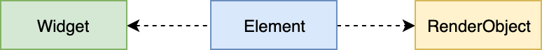
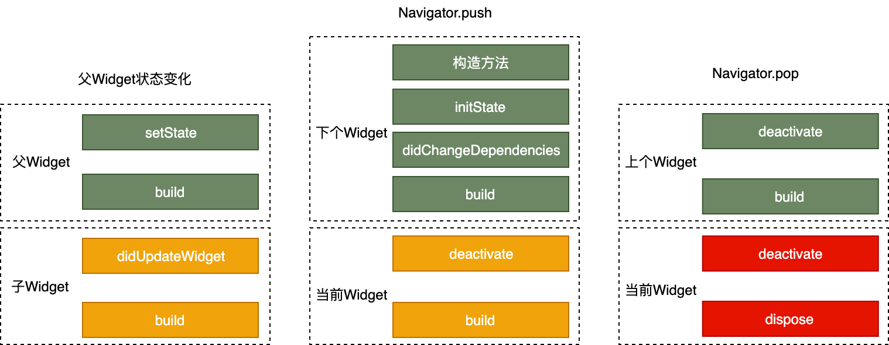
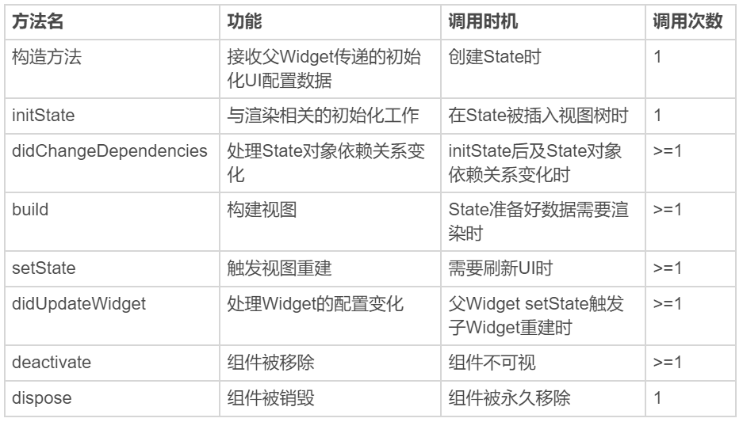
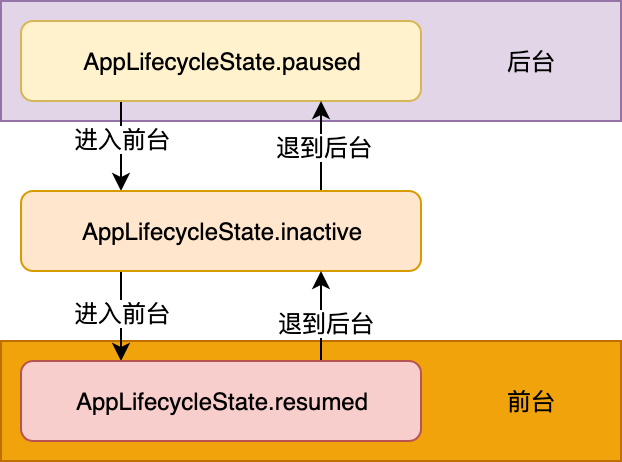
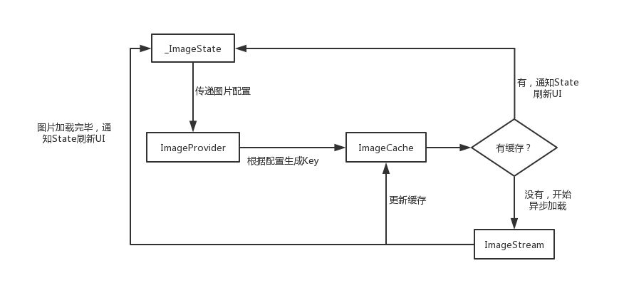
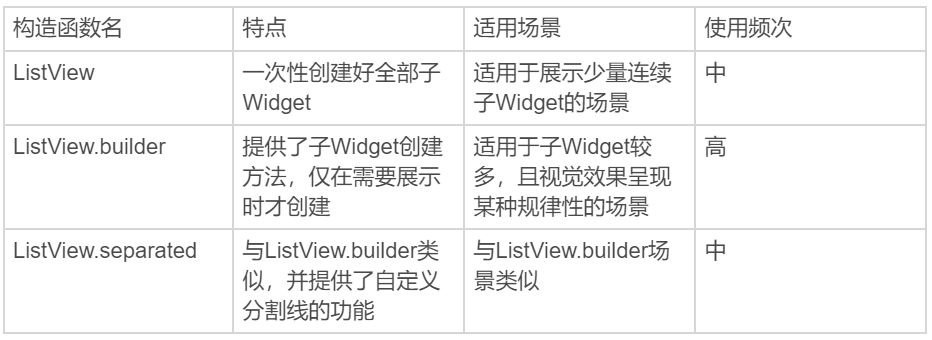
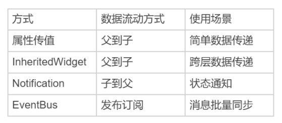

## Widget，构建Flutter界面的基石

Widget 是 Flutter **功能的抽象描述**，是**视图的配置信息**，同样也是**数据的映射**，是 Flutter 开发框架中最基本的概念。（类似‘组件’）

Flutter 的核心设计思想便是“**一切皆 Widget**”。



三者关系类似 React：JSX->虚拟DOM->浏览器DOM

Flutter 将 Widget 设计成**不可变**的，所以当视图渲染的配置信息发生变化时，Flutter 会选择重建 Widget 树的方式进行数据更新，以**数据驱动 UI** 构建的方式简单高效。

但这样做的缺点是，因为涉及到大量对象的销毁和重建，所以会对垃圾回收造成压力。不过，Widget 本身并不涉及实际渲染位图，所以它只是一份**轻量级的数据结构**，重建的成本很低。

另外，由于 Widget 的不可变性，可以以较低成本进行**渲染节点复用**，因此在一个真实的渲染树中可能存在不同的 Widget 对应同一个渲染节点的情况，这无疑又降低了重建 UI 的成本。

**Element** 是 Widget 的一个实例化对象，它承载了视图构建的上下文数据，是连接结构化的配置信息到完成最终渲染的桥梁。

Flutter 渲染过程，可以分为这么三步：

1. 通过 Widget 树生成对应的 Element 树；
2. 创建相应的 RenderObject 并关联到 Element.renderObject 属性上；
3. 构建成 RenderObject 树，以完成最终的渲染

Element 树这一层将 Widget 树的变化（类似 React 虚拟 DOM diff）做了抽象，可以只将真正需要修改的部分同步到真实的 RenderObject 树中，最大程度降低对真实渲染视图的修改，提高渲染效率，而不是销毁整个渲染视图树重建。

如果 Widget 的配置数据发生了改变，那么持有该 Widget 的 Element 节点也会被标记为 dirty。在下一个周期的绘制时，Flutter 就会触发 Element 树的更新，并使用最新的 Widget 数据更新自身以及关联的 RenderObject 对象，接下来便会进入 Layout 和 Paint 的流程。

Flutter 通过控件树（Widget 树）中的每个控件（Widget）创建不同类型的渲染对象，组成渲染对象树。而渲染对象树在 Flutter 的展示过程分为四个阶段，即布局、绘制、合成和渲染。

布局和绘制在 RenderObject 中完成，合成和渲染的工作则交给 Skia 搞定。

## Widget中的State到底是什么？

Flutter 的视图开发是**声明式**的，其核心设计思想就是将**视图和数据分离**，这与 React 的设计思路完全一致。命令式编程强调精确控制过程细节；而声明式编程强调通过意图输出结果整体。

Widget 是不可变的，更新则意味着销毁 + 重建（build）。StatelessWidget 是静态的，一旦创建则无需更新；而对于 StatefulWidget 来说，在 State 类中调用 setState 方法更新数据，会触发视图的销毁和重建，也将间接地触发其每个子 Widget 的销毁和重建。

如果某个子 Widget 的重建涉及到一些耗时操作，那页面的渲染性能将会急剧下降。所以需要避免滥用 StatefulWidget。

## 提到生命周期，我们是在说什么？

**State 生命周期**


**创建阶段**

构造方法 -> initState -> didChangeDependencies -> build，随后完成页面渲染。

- **构造方法**是 State 生命周期的起点，Flutter 会通过调用 StatefulWidget.createState() 来创建一个 State。我们可以通过构造方法，来接收父 Widget 传递的初始化 UI 配置数据。
- **initState**，会在 State 对象被**插入视图树**的时候调用。这个函数在 State 的生命周期中**只会被调用一次**，所以我们可以在这里做一些**初始化工作**，比如为状态变量设定默认值。
- **didChangeDependencies** 则用来专门处理 State 对象依赖关系变化，会在 initState() 调用结束后，被 Flutter 调用。
- **build**，作用是构建视图。

**更新阶段**

Widget 的状态更新，主要由 3 个方法触发：setState、didchangeDependencies、 didUpdateWidget

- **setState**：状态数据发生变化
- **didChangeDependencies**：State 对象的依赖关系发生变化后，Flutter 会回调这个方法，随后触发组件构建。比如系统语言 Locale 或应用主题改变时，系统会通知 State 执行 didChangeDependencies 回调方法
- **didUpdateWidget**：当 Widget 的配置发生变化时，比如父 Widget 触发重建（即父 Widget 的状态发生变化时），热重载时，系统会调用这个函数。

**销毁阶段**

组件被移除或是页面销毁的时候，系统会调用 deactivate 和 dispose 来移除或销毁组件。

- 当组件的可见状态发生变化时，**deactivate** 函数会被调用，这时 State 会被暂时从视图树中移除。页面切换时由于 State 对象在视图树中的位置发生了变化，需要先暂时移除后再重新添加，重新触发组件构建，因此这个函数也会被调用。
- 当 State 被永久地从视图树中移除时，Flutter 会调用 **dispose** 函数。我们可以在这里进行最终的资源释放、移除监听、清理环境，等等。





**App 生命周期**

而 App 的生命周期，定义了 App 从启动到退出的全过程。

监听 App 的生命周期：**WidgetsBindingObserver**；Activity(Android)、ViewController(iOS)

WidgetsBindingObserver 这个类提供的回调函数非常丰富，常见的屏幕旋转、屏幕亮度、语言变化、内存警告都可以通过这个实现进行回调。

**didChangeAppLifecycleState**

didChangeAppLifecycleState 回调函数中，有一个参数类型为 AppLifecycleState 的枚举类，这个枚举类是 Flutter 对 App 生命周期状态的封装。它的常用状态包括 resumed、inactive、paused 这三个。

- resumed：可见的，并能响应用户的输入。
- inactive：处在不活动状态，无法处理用户响应。
- paused：不可见并不能响应用户的输入，但是在后台继续活动中。



**帧绘制回调**

iOS: dispatch_async; Android: View.post()

WidgetsBinding 提供了单次 Frame 绘制回调，以及实时 Frame 绘制回调两种机制，来分别满足不同的需求：

- 单次 Frame 绘制回调，通过 addPostFrameCallback 实现。它会在当前 Frame 绘制完成后进行进行回调，并且只会回调一次，如果要再次监听则需要再设置一次。
- 实时 Frame 绘制回调，则通过 addPersistentFrameCallback 实现。这个函数会在每次绘制 Frame 结束后进行回调，可以用做 FPS 监测。

## 经典控件（一）：文本、图片和按钮在Flutter中怎么用？

**文本控件**

Flutter: Text; Android: TextView; iOS: UILabel

**单一样式的文本 Text**

- 控制整体文本布局的参数: textAlign、textDirection、maxLines...
- 控制文本展示样式的参数: fontFamily、fontSize、color... 这些参数被统一封装到了构造函数中的参数 style 中。

```js
Text(
  '文本是视图系统中的常见控件，用来显示一段特定样式的字符串，就比如Android里的TextView，或是iOS中的UILabel。',
  textAlign: TextAlign.center,//居中显示
  style: TextStyle(fontWeight: FontWeight.bold, fontSize: 20, color: Colors.red),//20号红色粗体展示
);
```

如何把一段字符串分为几个片段来管理

Flutter: **TextSpan**; Android: SpannableString; iOS: NSAttributedString

还需要支持多种混合样式的富文本 **Text.rich**

```js
TextStyle blackStyle = TextStyle(fontWeight: FontWeight.normal, fontSize: 20, color: Colors.black); //黑色样式
TextStyle redStyle = TextStyle(fontWeight: FontWeight.bold, fontSize: 20, color: Colors.red); //红色样式
Text.rich(
    TextSpan(
        children: <TextSpan>[
          TextSpan(text:'文本是视图系统中常见的控件，它用来显示一段特定样式的字符串，类似', style: redStyle), //第1个片段，红色样式 
          TextSpan(text:'Android', style: blackStyle), //第1个片段，黑色样式 
          TextSpan(text:'中的', style:redStyle), //第1个片段，红色样式 
          TextSpan(text:'TextView', style: blackStyle) //第1个片段，黑色样式 
        ]),
  textAlign: TextAlign.center,
);
```

**图片**

Android：ImageView；iOS：UIImageView

Flutter 中有多种方式，用来加载不同形式、支持不同格式的图片：

- 加载本地资源图片，如 Image.asset(‘images/logo.png’)；
- 加载本地（File 文件）图片，如 Image.file(new File(’/storage/xxx/xxx/test.jpg’))；
- 加载网络图片，如 Image.network('[http://xxx/xxx/test.gif](http://xxx/xxx/test.gif)')

**FadeInImage** 控件提供了图片占位的功能，并且支持在图片加载完成时淡入淡出的视觉效果。

```js
FadeInImage.assetNetwork(
  placeholder: 'assets/loading.gif', //gif占位
  image: 'https://xxx/xxx/xxx.jpg',
  fit: BoxFit.cover, //图片拉伸模式
  width: 200,
  height: 200,
)
```

Image 控件需要根据图片资源异步加载的情况，决定自身的显示效果，因此是一个 StatefulWidget。图片加载过程由 **ImageProvider** 触发，而 ImageProvider 表示异步获取图片数据的操作，可以从资源、文件和网络等不同的渠道获取图片。



**ImageCache** 使用 LRU（Least Recently Used，最近最少使用）算法进行缓存更新策略，并且默认最多存储 1000 张图片，最大缓存限制为 100MB，当限定的空间已存满数据时，把最久没有被访问到的图片清除。图片缓存只会在运行期间生效，也就是只**缓存在内存**中。如果想要支持缓存到文件系统，可以使用第三方的**CachedNetworkImage**控件。

```js
// 提供了比 FadeInImage 更为强大的加载过程占位与加载错误占位
CachedNetworkImage(
	  imageUrl: "http://xxx/xxx/jpg",
	  placeholder: (context, url) => CircularProgressIndicator(),
	  errorWidget: (context, url, error) => Icon(Icons.error),
)
```

**按钮**

- **FloatingActionButton**：一个圆形的按钮，一般出现在屏幕内容的前面
- **RaisedButton**：凸起的按钮，默认带有灰色背景，被点击后灰色背景会加深
- **FlatButton**：扁平化的按钮，默认透明背景，被点击后会呈现灰色背景

参数：

- onPressed 参数用于设置点击回调，如果 onPressed 参数为空，则按钮会处于禁用状态
- child 参数用于设置按钮的内容，可以接收任意的 Widget
- 按钮控件也提供了丰富的样式定制功能，比如背景颜色 color、按钮形状 shape、主题颜色 colorBrightness...

```js
FlatButton(
    color: Colors.yellow, //设置背景色为黄色
    shape:BeveledRectangleBorder(borderRadius: BorderRadius.circular(20.0)), //设置斜角矩形边框
    colorBrightness: Brightness.light, //确保文字按钮为深色
    onPressed: () => print('FlatButton pressed'), 
    child: Row(children: <Widget>[Icon(Icons.add), Text("Add")],)
)；
```

## 经典控件（二）：UITableView/ListView在Flutter中是什么？

**ListView 默认构造函数 ListView**

提前将所有子 Widget 一次性创建好，而不是等到它们真正在屏幕上需要显示时才创建，仅适用于列表中含有少量元素的场景。

```js
ListView(
    scrollDirection: Axis.horizontal,
    itemExtent: 140, //item延展尺寸(宽度)
    children: <Widget>[
      Container(color: Colors.black),
      Container(color: Colors.red),
      Container(color: Colors.blue),
    ]
);
```

**ListView.builder**

适用于子 Widget 比较多的场景，关键参数：

- itemBuilder，是列表项的创建方法。当列表滚动到相应位置时，ListView 会调用该方法创建对应的子 Widget。
- itemCount，表示列表项的数量，如果为空，则表示 ListView 为无限列表。
- itemExtent 并不是一个必填参数。但对于定高的列表项元素，建议提前设置好这个参数的值。

```js
ListView.builder(
    itemCount: 100, //元素个数
    itemExtent: 50.0, //列表项高度
    itemBuilder: (BuildContext context, int index) => ListTile(title: Text("title $index"), subtitle: Text("body $index"))
);
```

**ListView.separated 设置分割线**

```js
//使用ListView.separated设置分割线
ListView.separated(
    itemCount: 100,
    separatorBuilder: (BuildContext context, int index) => index %2 ==0? Divider(color: Colors.green) : Divider(color: Colors.red),//index为偶数，创建绿色分割线；index为奇数，则创建红色分割线
    itemBuilder: (BuildContext context, int index) => ListTile(title: Text("title $index"), subtitle: Text("body $index"))//创建子Widget
)
```



**CustomScrollView**

在 Flutter 中有一个专门的控件 CustomScrollView，用来处理多个需要自定义滚动效果的 Widget。在 CustomScrollView 中，这些彼此独立的、可滚动的 Widget 被统称为 Sliver。

比如，ListView 的 Sliver 实现为 SliverList，AppBar 的 Sliver 实现为 SliverAppBar。这些 Sliver 不再维护各自的滚动状态，而是交由 CustomScrollView 统一管理，最终实现滑动效果的一致性。

**视差滚动**

```js
CustomScrollView(
  slivers: <Widget>[
    SliverAppBar(//SliverAppBar作为头图控件
      title: Text('CustomScrollView Demo'),//标题
      floating: true,//设置悬浮样式
      flexibleSpace: Image.network("https://xx.jpg",fit:BoxFit.cover),//设置悬浮头图背景
      expandedHeight: 300,//头图控件高度
    ),
    SliverList(//SliverList作为列表控件
      delegate: SliverChildBuilderDelegate(
            (context, index) => ListTile(title: Text('Item #$index')),//列表项创建方法
        childCount: 100,//列表元素个数
      ),
    ),
  ]);
```

**ScrollController 与 ScrollNotification**

因为 Widget 并不是渲染到屏幕的最终视觉元素（RenderObject 才是），所以无法像原生的 Android 或 iOS 系统那样，向持有的 Widget 对象获取或设置最终渲染相关的视觉信息，而必须通过对应的组件控制器才能实现。

ListView 的组件控制器则是 **ScrollControler**，我们可以通过它来获取视图的滚动信息，更新视图的滚动位置。

```js
class MyAPPState extends State<MyApp> {
  ScrollController _controller;//ListView控制器
  bool isToTop = false;//标示目前是否需要启用"Top"按钮
  @override
  void initState() {
    _controller = ScrollController();
    _controller.addListener(() {//为控制器注册滚动监听方法
      if(_controller.offset > 1000) {//如果ListView已经向下滚动了1000，则启用Top按钮
        setState(() {isToTop = true;});
      } else if(_controller.offset < 300) {//如果ListView向下滚动距离不足300，则禁用Top按钮
        setState(() {isToTop = false;});
      }
    });
    super.initState();
  }

  Widget build(BuildContext context) {
    return MaterialApp(
        ...
        //顶部Top按钮，根据isToTop变量判断是否需要注册滚动到顶部的方法
        RaisedButton(onPressed: (isToTop ? () {
                  if(isToTop) {
                    _controller.animateTo(.0,
                        duration: Duration(milliseconds: 200),
                        curve: Curves.ease
                    );//做一个滚动到顶部的动画
                  }
                }:null),child: Text("Top"),)
        ...
        ListView.builder(
                controller: _controller,//初始化传入控制器
                itemCount: 100,//列表元素总数
                itemBuilder: (context, index) => ListTile(title: Text("Index : $index")),//列表项构造方法
               )      
        ...   
    );

  @override
  void dispose() {
    _controller.dispose(); //销毁控制器
    super.dispose();
  }
}
```

**NotificationListener** 是一个 Widget，为了监听滚动类型的事件，我们需要将 NotificationListener 添加为 ListView 的父容器，从而捕获 ListView 中的通知。

相比于 ScrollController 只能和具体的 ListView 关联后才可以监听到滚动信息；通过 NotificationListener 则可以监听其子 Widget 中的任意 ListView，不仅可以得到这些 ListView 的当前滚动位置信息，还可以获取当前的滚动事件信息 。

```js
Widget build(BuildContext context) {
  return MaterialApp(
    title: 'ScrollController Demo',
    home: Scaffold(
      appBar: AppBar(title: Text('ScrollController Demo')),
      body: NotificationListener<ScrollNotification>(//添加NotificationListener作为父容器
        onNotification: (scrollNotification) {//注册通知回调
          if (scrollNotification is ScrollStartNotification) {//滚动开始
            print('Scroll Start');
          } else if (scrollNotification is ScrollUpdateNotification) {//滚动位置更新
            print('Scroll Update');
          } else if (scrollNotification is ScrollEndNotification) {//滚动结束
            print('Scroll End');
          }
        },
        child: ListView.builder(
          itemCount: 30,//列表元素个数
          itemBuilder: (context, index) => ListTile(title: Text("Index : $index")),//列表项创建方法
        ),
      )
    )
  );
}
// 偏移量 offsetY = scrollNotification.metrics.pixels;
```

## 经典布局：如何定义子控件在父容器中排版的位置？

Flutter 提供了 31 种布局方式：[https://flutter.dev/docs/development/ui/widgets/layout](https://flutter.dev/docs/development/ui/widgets/layout)

**单子 Widget 布局：Container、Padding 与 Center**

Flutter 的 Container 仅能包含一个子 Widget，对于多个子 Widget 的布局场景，可以用一个根 Widget 去包装这些子 Widget，然后把这个根 Widget 放到 Container 中，再由 Container 设置它的对齐 alignment、边距 padding 等基础属性和样式属性。

```js
Container(
  child: Text('Container（容器）在UI框架中是一个很常见的概念，Flutter也不例外。'),
  padding: EdgeInsets.all(18.0), // 内边距
  margin: EdgeInsets.all(44.0), // 外边距
  width: 180.0,
  height:240,
  alignment: Alignment.center, // 子Widget居中对齐
  decoration: BoxDecoration( //Container样式
    color: Colors.red, // 背景色
    borderRadius: BorderRadius.circular(10.0), // 圆角边框
  ),
)
```

如果只需要将子 Widget 设定间距，则可以使用另一个单子容器控件 Padding 进行内容填充：

```js
Padding(
  padding: EdgeInsets.all(44.0),
  child: Text('Container（容器）在UI框架中是一个很常见的概念，Flutter也不例外。'),
);
```

Center 容器实现了 Container 容器中 alignment: Alignment.center 的效果

```js
Container(
  child: Center(child: Text('Container（容器）在UI框架中是一个很常见的概念，Flutter也不例外。')),
  padding: EdgeInsets.all(18.0), // 内边距
  margin: EdgeInsets.all(44.0), // 外边距
  width: 180.0,
  height:240,
  decoration: BoxDecoration( //Container样式
    color: Colors.red, // 背景色
    borderRadius: BorderRadius.circular(10.0), // 圆角边框
  ),
);
```

**多子 Widget 布局：Row、Column 与 Expanded**

单纯使用 Row 和 Column 控件，在子 Widget 的尺寸较小时，无法将容器填满。可以通过 Expanded 控件，来制定分配规则填满容器的剩余空间。

```js
Row(
  children: <Widget>[
    Expanded(flex: 1, child: Container(color: Colors.yellow, height: 60)), //设置了flex=1，因此宽度由Expanded来分配
    Container(color: Colors.red, width: 100, height: 180,),
    Container(color: Colors.black, width: 60, height: 80,),
    Expanded(flex: 1, child: Container(color: Colors.green,height: 60),)/设置了flex=1，因此宽度由Expanded来分配
  ],
);
```

可以根据主轴与纵轴，设置子 Widget 在这两个方向上的对齐规则 mainAxisAlignment 与 crossAxisAlignment：start、center、end、spaceEvenly

如果想让容器与子 Widget 在主轴上完全匹配，我们可以通过设置 Row 的 mainAxisSize 参数为 MainAxisSize.min，由所有子 Widget 来决定主轴方向的容器长度，即主轴方向的长度尽可能小

**层叠 Widget 布局：Stack 与 Positioned**

Stack 提供了层叠布局的容器，而 Positioned 则提供了设置子 Widget 位置的能力。

```js
Stack(
  children: <Widget>[
    Container(color: Colors.yellow, width: 300, height: 300),//黄色容器
    Positioned(
      left: 18.0,
      top: 18.0,
      child: Container(color: Colors.green, width: 50, height: 50),//叠加在黄色容器之上的绿色控件
    ),
    Positioned(
      left: 18.0,
      top:70.0,
      child: Text("Stack提供了层叠布局的容器"),//叠加在黄色容器之上的文本
    )
  ],
)
```

## 组合与自绘，我该选用何种方式自定义Widget？

在实现视觉需求上，自绘需要自己亲自处理绘制逻辑，而组合则是通过子 Widget 的拼接来实现绘制意图。

**组合**

```js
class UpdateItemModel {
  String appIcon;//App图标
  String appName;//App名称
  String appSize;//App大小
  String appDate;//App更新日期
  String appDescription;//App更新文案
  String appVersion;//App版本
  //构造函数语法糖，为属性赋值
  UpdateItemModel({this.appIcon, this.appName, this.appSize, this.appDate, this.appDescription, this.appVersion});
}

Widget buildTopRow(BuildContext context) {
  return Row(//Row控件，用来水平摆放子Widget
    children: <Widget>[
      Padding(//Paddng控件，用来设置Image控件边距
        padding: EdgeInsets.all(10),//上下左右边距均为10
        child: ClipRRect(//圆角矩形裁剪控件
          borderRadius: BorderRadius.circular(8.0),//圆角半径为8
          child: Image.asset(model.appIcon, width: 80,height:80)图片控件//
        )
      ),
      Expanded(//Expanded控件，用来拉伸中间区域
        child: Column(//Column控件，用来垂直摆放子Widget
          mainAxisAlignment: MainAxisAlignment.center,//垂直方向居中对齐
          crossAxisAlignment: CrossAxisAlignment.start,//水平方向居左对齐
          children: <Widget>[
            Text(model.appName,maxLines: 1),//App名字
            Text(model.appDate,maxLines: 1),//App更新日期
          ],
        ),
      ),
      Padding(//Paddng控件，用来设置Widget间边距
        padding: EdgeInsets.fromLTRB(0,0,10,0),//右边距为10，其余均为0
        child: FlatButton(//按钮控件
          child: Text("OPEN"),
          onPressed: onPressed,//点击回调
        )
      )
  ]);
}

Widget buildBottomRow(BuildContext context) {
  return Padding(//Padding控件用来设置整体边距
    padding: EdgeInsets.fromLTRB(15,0,15,0),//左边距和右边距为15
    child: Column(//Column控件用来垂直摆放子Widget
      crossAxisAlignment: CrossAxisAlignment.start,//水平方向距左对齐
      children: <Widget>[
        Text(model.appDescription),//更新文案
        Padding(//Padding控件用来设置边距
          padding: EdgeInsets.fromLTRB(0,10,0,0),//上边距为10
          child: Text("${model.appVersion} • ${model.appSize} MB")
        )
      ]
  ));
}

class UpdatedItem extends StatelessWidget {
  final UpdatedItemModel model;//数据模型
  //构造函数语法糖，用来给model赋值
  UpdatedItem({Key key,this.model, this.onPressed}) : super(key: key);
  final VoidCallback onPressed;

  @override
  Widget build(BuildContext context) {
    return Column(//用Column将上下两部分合体
        children: <Widget>[
          buildTopRow(context),//上半部分
          buildBottomRow(context)//下半部分
        ]);
  }
  Widget buildBottomRow(BuildContext context) {...}
  Widget buildTopRow(BuildContext context) {...}
}
```

**自绘**

在 Flutter 中，画布是 Canvas，画笔则是 Paint，而画成什么样子，则由定义了绘制逻辑的 CustomPainter 来控制。

CustomPaint 是用以承接自绘控件的容器，并不负责真正的绘制。

```js
class WheelPainter extends CustomPainter {
 // 设置画笔颜色 
  Paint getColoredPaint(Color color) {//根据颜色返回不同的画笔
    Paint paint = Paint();//生成画笔
    paint.color = color;//设置画笔颜色
    return paint;
  }

  @override
  void paint(Canvas canvas, Size size) {//绘制逻辑
    double wheelSize = min(size.width,size.height)/2;//饼图的尺寸
    double nbElem = 6;//分成6份
    double radius = (2 * pi) / nbElem;//1/6圆
    //包裹饼图这个圆形的矩形框
    Rect boundingRect = Rect.fromCircle(center: Offset(wheelSize, wheelSize), radius: wheelSize);
    // 每次画1/6个圆弧
    canvas.drawArc(boundingRect, 0, radius, true, getColoredPaint(Colors.orange));
    canvas.drawArc(boundingRect, radius, radius, true, getColoredPaint(Colors.black38));
    canvas.drawArc(boundingRect, radius * 2, radius, true, getColoredPaint(Colors.green));
    canvas.drawArc(boundingRect, radius * 3, radius, true, getColoredPaint(Colors.red));
    canvas.drawArc(boundingRect, radius * 4, radius, true, getColoredPaint(Colors.blue));
    canvas.drawArc(boundingRect, radius * 5, radius, true, getColoredPaint(Colors.pink));
  }
  // 判断是否需要重绘，这里我们简单的做下比较即可
  @override
  bool shouldRepaint(CustomPainter oldDelegate) => oldDelegate != this;
}
//将饼图包装成一个新的控件
class Cake extends StatelessWidget {
  @override
  Widget build(BuildContext context) {
    return CustomPaint(
        size: Size(200, 200),
        painter: WheelPainter(),
      );
  }
}
```

## 从夜间模式说起，如何定制不同风格的App主题？

Flutter 由 ThemeData 来统一管理主题的配置信息。

- 如果不想继承任何 App 全局的颜色或字体样式，可以直接新建一个 ThemeData 实例，依次设置对应的样式
- 如果不想在局部重写所有的样式，则可以继承 App 的主题，使用 copyWith 方法，只更新部分样式

```js
// 新建主题
Theme(
    data: ThemeData(iconTheme: IconThemeData(color: Colors.red)),
    child: Icon(Icons.favorite)
);

// 继承主题
Theme(
    data: Theme.of(context).copyWith(iconTheme: IconThemeData(color: Colors.green)),
    child: Icon(Icons.feedback)
);
```

Theme.of(context) 方法将向上查找 Widget 树，并返回 Widget 树中最近的主题 Theme。

```js
Container(
    color: Theme.of(context).primaryColor,//容器背景色复用应用主题色
    child: Text(
      'Text with a background color',
      style: Theme.of(context).textTheme.title,//Text组件文本样式复用应用文本样式
    ));
```

**分平台主题定制**

```js
// iOS浅色主题
final ThemeData kIOSTheme = ThemeData(
    brightness: Brightness.light,//亮色主题
    accentColor: Colors.white,//(按钮)Widget前景色为白色
    primaryColor: Colors.blue,//主题色为蓝色
    iconTheme:IconThemeData(color: Colors.grey),//icon主题为灰色
    textTheme: TextTheme(body1: TextStyle(color: Colors.black))//文本主题为黑色
);
// Android深色主题
final ThemeData kAndroidTheme = ThemeData(
    brightness: Brightness.dark,//深色主题
    accentColor: Colors.black,//(按钮)Widget前景色为黑色
    primaryColor: Colors.cyan,//主题色Wie青色
    iconTheme:IconThemeData(color: Colors.blue),//icon主题色为蓝色
    textTheme: TextTheme(body1: TextStyle(color: Colors.red))//文本主题色为红色
);
// 应用初始化
MaterialApp(
  title: 'Flutter Demo',
  theme: defaultTargetPlatform == TargetPlatform.iOS ? kIOSTheme : kAndroidTheme,//根据平台选择不同主题
  home: MyHomePage(title: 'Flutter Demo Home Page'),
);
```

除了主题之外，也可以用 defaultTargetPlatform 这个变量去实现一些其他需要判断平台的逻辑

## 依赖管理（一）：图片、配置和字体在Flutter中怎么用？

**资源管理**

在 Flutter 中，资源（assets）可以是任意类型的文件，比如 JSON 配置文件或是字体文件等，而不仅仅是图片。

```js
// pubspec.yaml 声明
flutter:
  assets:
    - assets/background.jpg   #挨个指定资源路径
    - assets/loading.gif  #挨个指定资源路径
    - assets/result.json  #挨个指定资源路径
    - assets/icons/    #子目录批量指定
    - assets/ #根目录也是可以批量指定的
```

目录批量指定并不递归，只有在该目录下的文件才可以被包括，如果下面还有子目录的话，需要单独声明子目录下的文件

**资源访问**

通过 Flutter 应用的主资源 Bundle 对象 rootBundle，来直接访问

```js
rootBundle.loadString('assets/result.json').then((msg)=>print(msg));
```

Flutter 遵循基于像素密度的管理方式，如 1.0x、2.0x、3.0x 或其他任意倍数，Flutter 可以根据当前设备分辨率加载最接近设备像素比例的图片资源。

字体声明

```js
// pubspec.yaml 声明
fonts:
  - family: RobotoCondensed  #字体名字
    fonts:
      - asset: assets/fonts/RobotoCondensed-Regular.ttf #普通字体
      - asset: assets/fonts/RobotoCondensed-Italic.ttf 
        style: italic  #斜体
      - asset: assets/fonts/RobotoCondensed-Bold.ttf 
        weight: 700  #粗体

Text("This is RobotoCondensed", style: TextStyle(
    fontFamily: 'RobotoCondensed',//普通字体
));
Text("This is RobotoCondensed", style: TextStyle(
    fontFamily: 'RobotoCondensed',
    fontWeight: FontWeight.w700, //粗体
));
Text("This is RobotoCondensed italic", style: TextStyle(
  fontFamily: 'RobotoCondensed',
  fontStyle: FontStyle.italic, //斜体
));
```

上面介绍的资源管理机制其实都是在 Flutter 应用内的，而在 Flutter 框架运行之前，我们是没有办法访问这些资源的。Flutter 需要原生环境才能运行，但是有些资源我们需要在 Flutter 框架运行之前提前使用。需要在对应的原生工程中完成相应的配置

- 更换 App 启动图标
- 更换启动图

## 依赖管理（二）：第三方组件库在Flutter中要如何管理？

Dart 提供了包管理工具 Pub，类似 npm。

```js
dependencies:
  package1:
    path: ../package1/  #路径依赖
  date_format:
    git:
      url: https://github.com/xxx/package2.git #git依赖
```

## 用户交互事件该如何响应？

```js
Listener(
  child: Container(
    color: Colors.red,//背景色红色
    width: 300,
    height: 300,
  ),
  onPointerDown: (event) => print("down $event"),//手势按下回调
  onPointerMove:  (event) => print("move $event"),//手势移动回调
  onPointerUp:  (event) => print("up $event"),//手势抬起回调
);
```

```js
//红色container坐标
double _top = 0.0;
double _left = 0.0;
Stack(//使用Stack组件去叠加视图，便于直接控制视图坐标
  children: <Widget>[
    Positioned(
      top: _top,
      left: _left,
      child: GestureDetector(//手势识别
        child: Container(color: Colors.red,width: 50,height: 50),//红色子视图
        onTap: ()=>print("Tap"),//点击回调
        onDoubleTap: ()=>print("Double Tap"),//双击回调
        onLongPress: ()=>print("Long Press"),//长按回调
        onPanUpdate: (e) {//拖动回调
          setState(() {
            //更新位置
            _left += e.delta.dx;
            _top += e.delta.dy;
          });
        },
      ),
    )
  ],
);
```

尽管对一个 Widget 同时监听了多个手势事件，但最终只会有一个手势能够得到本次事件的处理权。对于多个手势的识别，Flutter 引入了手势竞技场（Arena）的概念，用来识别究竟哪个手势可以响应用户事件。

对一个父组件和一个子组件同时监听点击事件，最后只会触发子组件的点击事件。

如何让父组件也触发

```js
// 定义一个继承自点击手势识别器 TapGestureRecognizer 的类，
// 并重写了其 rejectGesture 方法，手动地把自己复活
class MultipleTapGestureRecognizer extends TapGestureRecognizer {
  @override
  void rejectGesture(int pointer) {
    acceptGesture(pointer);
  }
}

RawGestureDetector(//自己构造父Widget的手势识别映射关系
  gestures: {
    //建立多手势识别器与手势识别工厂类的映射关系，从而返回可以响应该手势的recognizer
    MultipleTapGestureRecognizer: GestureRecognizerFactoryWithHandlers<
        MultipleTapGestureRecognizer>(
          () => MultipleTapGestureRecognizer(),
          (MultipleTapGestureRecognizer instance) {
        instance.onTap = () => print('parent tapped ');//点击回调
      },
    )
  },
  child: Container(
    color: Colors.pinkAccent,
    child: Center(
      child: GestureDetector(//子视图可以继续使用GestureDetector
        onTap: () => print('Child tapped'),
        child: Container(...),
      ),
    ),
  ),
);
```

## 关于跨组件传递数据，你只需要记住这三招



## 路由与导航，Flutter是这样实现页面切换的

**基本路由**

要导航到一个新的页面，我们需要创建一个 MaterialPageRoute 的实例，调用 Navigator.push 方法将新页面压到堆栈的顶部。

```js
class FirstScreen extends StatelessWidget {
  @override
  Widget build(BuildContext context) {
    return RaisedButton(
      //打开页面
      onPressed: ()=> Navigator.push(context, MaterialPageRoute(builder: (context) => SecondScreen()));
    );
  }
}

class SecondPage extends StatelessWidget {
  @override
  Widget build(BuildContext context) {
    return RaisedButton(
      // 回退页面
      onPressed: ()=> Navigator.pop(context)
    );
  }
}
```

**命名路由**

```js
MaterialApp(
    ...
    //注册路由
    routes:{
      "second_page":(context)=>SecondPage(),
    },
    //错误路由处理，统一返回UnknownPage
    onUnknownRoute: (RouteSettings setting) => MaterialPageRoute(builder: (context) => UnknownPage()),
);

//使用错误名字打开页面
Navigator.pushNamed(context,"unknown_page");
```

**页面参数**

```js
class SecondPage extends StatelessWidget {
  @override
  Widget build(BuildContext context) {
    return Scaffold(
      body: Column(
        children: <Widget>[
          Text('Message from first screen: $msg'),
          RaisedButton(
            child: Text('back'),
            //页面关闭时传递参数
            onPressed: ()=> Navigator.pop(context,"Hi")
          )
        ]
      ));
  }
}

class _FirstPageState extends State<FirstPage> {
  String _msg='';
  @override
  Widget build(BuildContext context) {
    return new Scaffold(
      body: Column(children: <Widget>[
        RaisedButton(
            child: Text('命名路由（参数&回调）'),
            //打开页面，并监听页面关闭时传递的参数
            onPressed: ()=> Navigator.pushNamed(context, "third_page",arguments: "Hey").then((msg)=>setState(()=>_msg=msg)),
        ),
        Text('Message from Second screen: $_msg'),

      ],),
    );
  }
}
```