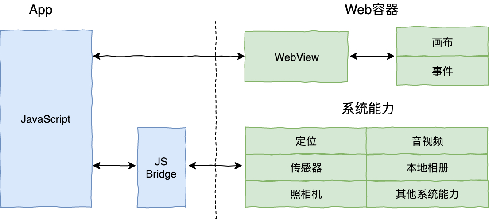
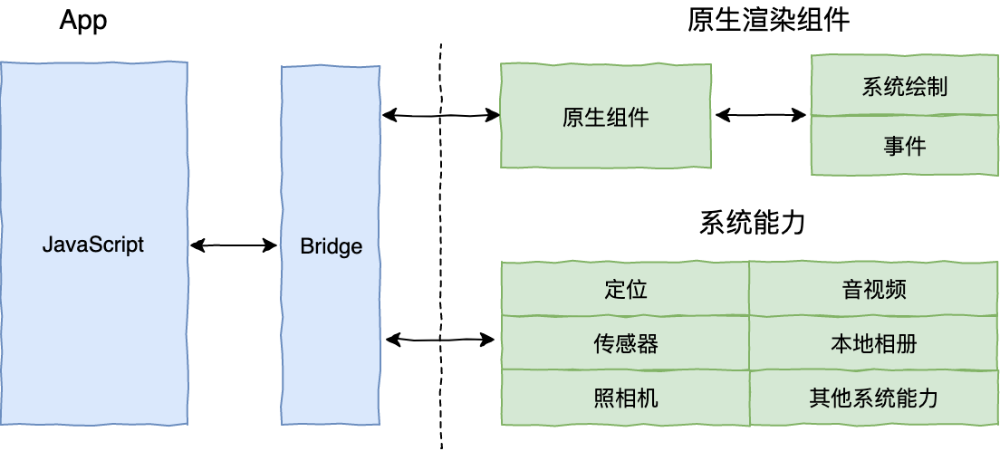
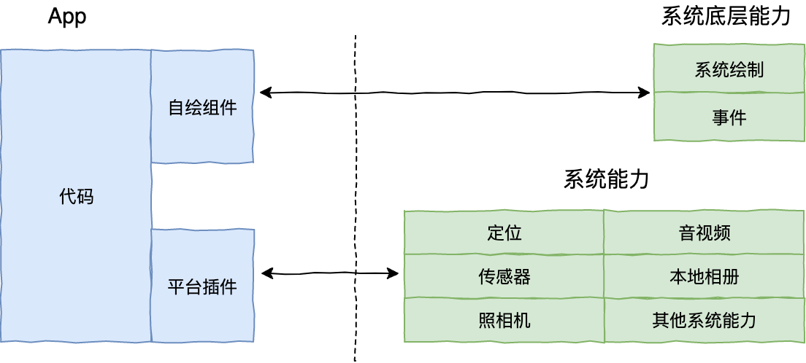
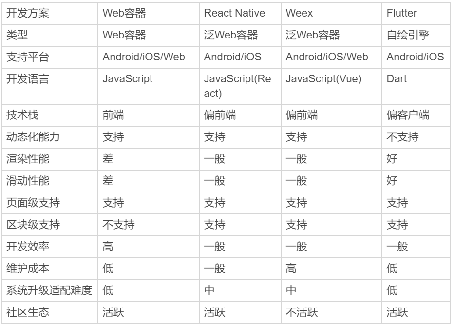
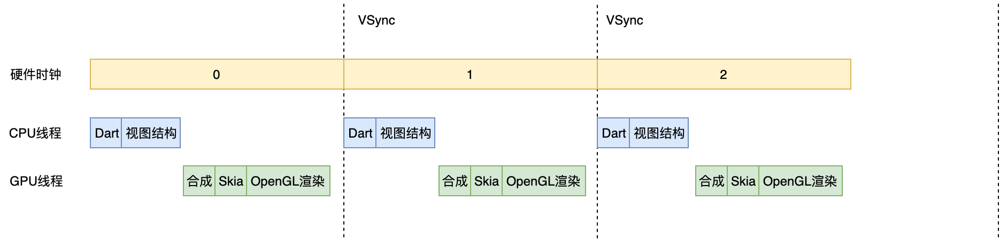

## 深入理解跨平台方案的历史发展逻辑

跨平台开发方案的三个时代

- Web 容器时代：基于 Web 相关技术通过浏览器组件来实现界面及功能，典型的框架包括 Cordova(PhoneGap)、Ionic 和微信小程序。
- 泛 Web 容器时代：采用类 Web 标准进行开发，但在运行时把绘制和渲染交由原生系统接管的技术，代表框架有 React Native、Weex 和快应用，广义的还包括天猫的 Virtual View 等。
- 自绘引擎时代：自带渲染引擎，客户端仅提供一块画布即可获得从业务逻辑到功能呈现的多端高度一致的渲染体验。Flutter，是为数不多的代表。

**Web 容器时代**

Hybrid 开发模式采用原生应用内嵌浏览器控件 WebView 的方式进行 H5 页面渲染，并定义 H5 与原生代码交互协议(JS Bridge)，将部分原生系统能力暴露给 H5，从而扩展 H5 的边界。

优点：生态繁荣、开发体验友好、生产效率高、跨平台兼容性强

缺陷：一个完整 H5 页面的展示要经历**浏览器控件的加载、解析和渲染**三大过程，性能消耗要比原生开发增加 N 个数量级。此外，承载着大量 Web 标准的 **Web 容器过于笨重**，以至于性能和体验都达不到与原生同样的水准，在复杂交互和动画上较难实现出优良的用户体验。



**泛 Web 容器时代**

把 Web 标准进行了裁剪，以相对简单的方式支持了构建移动端页面必要的 Web 标准（如 Flexbox 等）；有些轻量级的跨平台方案甚至会完全抛弃 Web 标准、放弃 JS 的动态执行能力而自创一套原生 DSL，如天猫的VirtualView框架。

在泛 Web 容器时代仍然采用前端友好的 JS 进行开发，整体加载、渲染机制大大简化，并且由原生接管绘制，即将原生系统作为渲染的后端，为依托于 JS 虚拟机的 JS 代码提供所需要的 UI 控件的实体。

缺陷：抛开框架本身需要处理大量平台相关的逻辑外，随着系统版本变化和 API 的变化，我们还需要处理不同平台的原生控件渲染能力差异，修复各类奇奇怪怪的 Bug。始终需要 Follow Native 的思维方式，就使得泛 Web 容器框架的跨平台特性被大打折扣。



**自绘引擎时代**

Flutter 优势：

- 渲染引擎依靠跨平台的 Skia 图形库来实现，Skia 引擎会将使用 Dart 构建的抽象的视图结构数据加工成 GPU 数据，交由 OpenGL 最终提供给 GPU 渲染，至此完成渲染闭环，因此可以在最大程度上保证一款应用在不同平台、不同设备上的体验一致性。
- 而开发语言选用的是同时支持 JIT（Just-in-Time，即时编译）和 AOT（Ahead-of-Time，预编译）的 Dart，不仅保证了开发效率，更提升了执行效率（比使用 JS 开发的泛 Web 容器方案要高得多）。



**跨平台方案对比**



## Flutter区别于其他方案的关键技术是什么？

操作系统呈现图像的机制：

CPU 把计算好的、需要显示的内容交给 GPU，由 GPU 完成渲染后放入帧缓冲区，随后视频控制器根据垂直同步信号（VSync）以每秒 60 次的速度，从帧缓冲区读取帧数据交由显示器完成图像显示。

RN 之类的框架，只是通过 JS 虚拟机扩展调用系统组件，由 Android 和 iOS 系统进行组件的渲染；Flutter 则自己完成了**组件渲染的闭环。**



UI 线程使用 Dart 来构建视图结构数据，这些数据会在 GPU 线程进行图层合成，随后交给 Skia 引擎加工成 GPU 数据，而这些数据会通过 OpenGL 最终提供给 GPU 渲染。

Dart 优势：

- JIT、AOT
- 拥有其他优秀编程语言的诸多特性，学习成本并不高。
- 避免了抢占式调度和共享内存，可以在没有锁的情况下进行对象分配和垃圾回收，在性能方面表现相当不错。

Flutter 的原理


界面渲染过程

页面中的各界面元素（Widget）以树的形式组织，即**控件树**。Flutter 通过控件树中的每个控件创建不同类型的渲染对象，组成**渲染对象树**。而渲染对象树在 Flutter 的展示过程分为四个阶段：**布局、绘制、合成和渲染。**

1. 布局
Flutter 采用**深度优先**机制遍历渲染对象树，决定渲染对象树中各渲染对象在屏幕上的位置和尺寸。
为了防止因子节点发生变化而导致整个控件树重新布局，Flutter 加入了一个机制——**布局边界**（Relayout Boundary）。
2. 绘制
布局完成后，Flutter 会把所有的渲染对象绘制到不同的图层上。
绘制过程也是**深度优先**遍历，而且总是先绘制自身，再绘制子节点。
在**重绘边界**内，Flutter 会强制切换新的图层，避免无关内容置于同一图层引起不必要的重绘。
3. 合成和渲染
合成：将所有的图层根据大小、层级、透明度等规则计算出最终的显示效果，将相同的图层归类合并，简化渲染树，提高渲染效率。
合并完成后，Flutter 会将几何图层数据交由 Skia 引擎加工成二维图像数据，最终交由 GPU 进行渲染，完成界面的展示。

## 从标准模板入手，体会Flutter代码是如何运行在原生系统上的

Flutter 工程实际上就是一个同时内嵌了 Android 和 iOS 原生子工程的父工程

Flutter 的核心设计思想是**一切皆 Widget**

```js
import 'package:flutter/material.dart';

void main() => runApp(MyApp());

class MyApp extends StatelessWidget {
  @override
  Widget build(BuildContext context) => MaterialApp(home: MyHomePage(title: 'Flutter Demo Home Page'));
}

class MyHomePage extends StatefulWidget {
  MyHomePage({Key key, this.title}) : super(key: key);
  final String title;
  @override
  _MyHomePageState createState() => _MyHomePageState();
}

class _MyHomePageState extends State<MyHomePage> {
  int _counter = 0;
  void _incrementCounter() => setState(() {_counter++;});

  @override
  Widget build(BuildContext context) {
    return Scaffold(
      appBar: AppBar(title: Text(Widget.title)),
      body: Text('You have pushed the button this many times:$_counter')),
      floatingActionButton: FloatingActionButton(onPressed: _incrementCounter) 
    );
  }
}
```