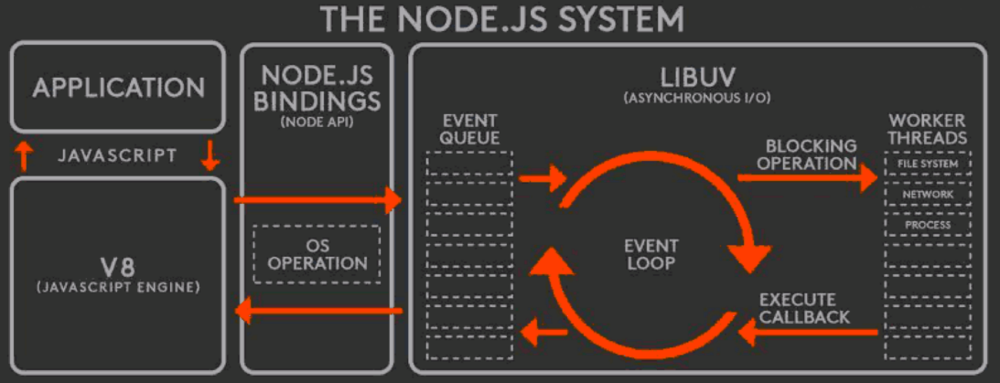
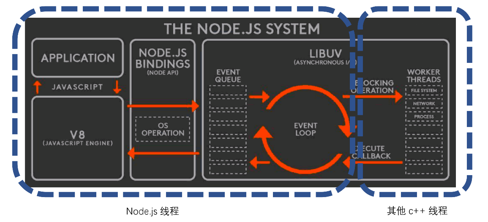
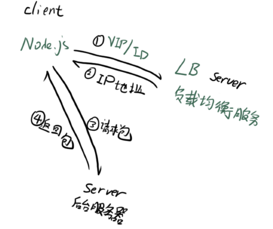
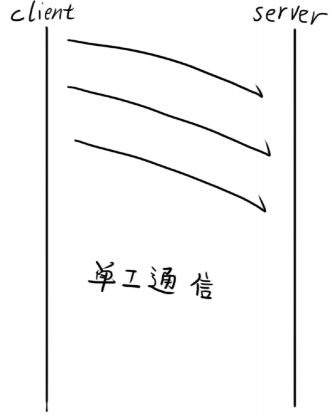
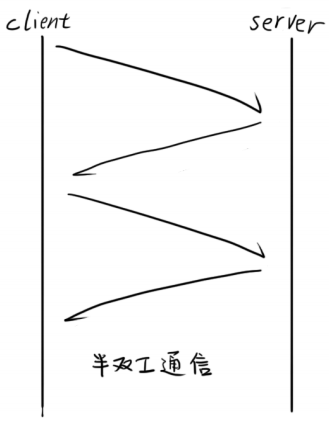
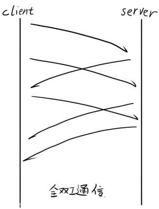
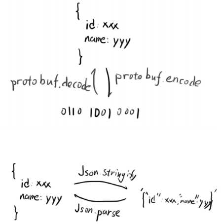

## 石头剪刀布游戏

node index.js rock

在 node 中同通过 process.argv[process.argv.length - 1] 获取输入

或者通过 process.stdin.on 监听输入

通过 process.exit() 退出 node 进程

## 模块：CommonJS规范

使用 <script /> 加载/运行 JS 的缺陷：

- 脚本变多时，需要手动管理加载顺序
- 不同脚本之间逻辑调用，需要通过全局变量的方式
- 运行环境没有 html 无法执行

CommonJS 模块规范

- JavaScript 社区发起，在 Node.js 上应用并推广
- 后续也影响到了浏览器端 JavaScript，比如 webpack 也支持 CommonJS

exports 与多次 require 为**同一个引用**

```jsx
// 输出 { foo: 'foo', bar: 'bar' }
exports.foo = 'foo';
exports.bar = 'bar';

// 另一个文件
// 输出 function
exports.foo = 'foo';
exports.bar = 'bar';
module.exports = function() {};
```

node 还不支持 es6 module

## Node.js 内置模块



**OS 模块**

V8 引擎将调用 OS 能力封装为 V8 变量，使得 JS 代码可访问 OS 底层

**EventEmitter**

观察者模式（对象之间通信）

- addEventListener
- removeEventListener

观察者模式 调用 vs 抛事件

抛事件

- 不知道被通知者存在
- 没有人听还能继续下去

## 异步：非阻塞I/O

异步一般指的是编程的方式；非阻塞 IO 是底层机制的名字。

- I/O 即 Input/Output，一个系统的输入和输出。
- 阻塞 I/O 和非阻塞 I/O 的区别就在于系统接收输入再到输出期间，能不能接收其他输入。



## 异步：异步编程之callback

回调函数格式规范：error-first callback = node-style callback

在异步任务里 throw Error 不能被外层 catch 到，因为是全新的调用栈，所以需要 callback 传递。

callback 问题：回调地狱；不能很好处理异步并发

## 异步：异步编程之Promise、async/await

**Promise**

状态机：pending、fulfilled / resolved、rejected

- resolved 状态的 Promise 会回调后面的第一个 .then
- rejected 状态的 Promise 会回调后面的第一个 .catch
- 任何一个 rejected 状态且后面没有 .catch 的 Promise，都会造成浏览器 /node 环境的全局错误

执行 then 和 catch 会返回一个新 Promise，该 Promise 最终状态根据 **then 和 catch 的回调函数的执行结果**决定

- 如果回调函数最终是 throw，该 Promise 是 rejected 状态
- 如果回调函数最终是 return，该 Promise 是 resolved 状态
- 但如果回调函数最终 return 了一个 Promise ，该 Promise 会和回调函数 return 的 Promise 状态保持一致

**async/await**

- async function 是 Promise 的语法糖封装
- 异步编程的终极方案 – 以同步的方式写异步
- try-catch 可以获取 await 所得到的错误

这里抓到错误的其实不是try catch，而是await语法被编译后，实际上由Promise的catch抓到。

## HTTP：简单实现一个HTTP服务器

利用 http 模块 http.createServer

npm httpserver 模块可以快速实现本地 http 服务

利用 url 模块识别 url

querystring 解析出 query 参数

## HTTP：express

核心功能：

- 路由 (把请求包分发到不同的单元处理)
- request/response 简化

    request: pathname、query 等

    response: send()、json()、jsonp() 等

- 中间件

    更好地组织流程代码

    **异步会打破 Express 的洋葱模型**
    next() 里执行异步函数后不等返回结果就马上执行next()下面的代码

## HTTP：koa

核心功能：

- Express 更极致的 request/response 简化
- 使用 async function 实现的中间件

    有“暂停执行”的能力；在异步的情况下也符合洋葱模型

- 精简内核，所有额外功能都移到中间件里实现（基础：完全实现🧅模型）

Express 门槛更低，Koa 更强大优雅

Express 封装更多东西，开发更快速，Koa 可定制型更高

## RPC 调用：什么是RPC调用？

Remote Procedure Call（远程过程调用）

和 Ajax 有什么相同点：

- 都是两个计算机之间的网络通信
- 需要双方约定一个数据格式

和 Ajax 有什么不同点：

- 不一定使用 DNS 作为寻址服务
- 应用层协议一般不使用 HTTP
- 基于 TCP 或 UDP 协议

    

TCP 通信方式







二进制协议

- 更小的数据包体积
- 更快的编解码速率

    

## RPC调用：Node.js Buffer编解码二进制数据包

Protocol Buffer 

- Google 研发的二进制协议编解码库
- 通过协议文件控制 Buffer 的格式

## RPC 调用：Node.js net建立多路复用的RPC通道

利用 net 模块 创建 socket，在 client 和 serve 分别连接 socket

单工/半双工的通信通道搭建

全双工的通信通道搭建

- 关键在于应用层协议需要有标记包号的字段（seq）
- 处理以下情况，需要有标记包长的字段：

    粘包、不完整包

- 错误处理