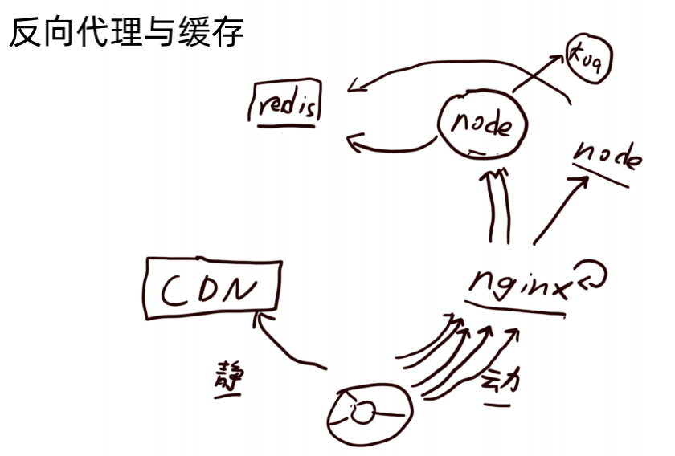

## 性能工具：HTTP 服务的性能测试

压力测试工具

- ab
- webbench

服务器性能指标

- QPS
- 吞吐量

找到性能瓶颈

- top (cpu 内存)
- iostat (硬盘)

## 性能工具：Node.js性能分析工具

工具

- Node.js 自带 profile
- Chrome devtool
- npm - clinic

性能优化的准则

- 减少不必要的计算
- 空间换时间
- 提前计算

## 内存优化管理

新生代

- 容量小，垃圾回收更快

老生代

- 容量大，垃圾回收更慢

减少内存使用，也是提高服务性能的手段

如果有内存泄漏(没有被垃圾回收)，会导致服务性能大大降低

压力测试时使用 Chrome devtool 查看内存快照

Node.js Buffer 的内存分配策略 类似“池”

节省内存的最好方式就是 使用“**池**”

## Node.js C++ 插件

将计算量转移到 C++ 进行

- 收益：C++ 运算比 JavaScript 更快的部分
- 成本：C++ 变量和 v8 变量的转换

## Node.js 子进程与线程

进程

- 操作系统挂载运行程序的单元
- 拥有一些独立的资源，如内存等

线程

- 进行运算调度的单元
- 进程内的线程共享进程内的资源

Node.js 的事件循环

- 主线程运行 v8 与 JavaScript
- 多个子线程通过事件循环被调度

使用子进程或线程利用更多 CPU 资源

require('child_process')；通信

## Node.js cluster 模块

主进程启动多个子进程，由主进程轮流分发请求，子进程代为处理

os.cpu().length 获取 cpu 数量 （一般一个 cpu 运行一个进程 留余量）

## Node.js 进程守护与管理

```js
/**
 * 简单的进程守护器
 */
const cluster = require('cluster');

if (cluster.isMaster) {
    // console.log(require('os').cpus())
    for (let i = 0; i < require('os').cpus().length / 2; i++) {
        createWorker();
    }

    cluster.on('exit', function () {
        setTimeout(() => {
            createWorker()
        }, 5000)
    })

    function createWorker() {
        // 创建子进程并进行心跳监控
        var worker = cluster.fork();

        var missed = 0;// 没有回应的ping次数

        // 心跳
        var timer = setInterval(function () {

            // 三次没回应，杀之
            if (missed == 3) {
                clearInterval(timer);
                console.log(worker.process.pid + ' has become a zombie!');
                process.kill(worker.process.pid);
                return;
            }
            // 开始心跳
            missed++;
            worker.send('ping#' + worker.process.pid);
        }, 10000);

        worker.on('message', function (msg) {
            // 确认心跳回应。
            if (msg == 'pong#' + worker.process.pid) {
                missed--;
            }
        });

        // 挂了就没必要再进行心跳了
        worker.on('exit', function () {
            clearInterval(timer);
        });
    }

} else {
    // 当进程出现会崩溃的错误
    process.on('uncaughtException', function (err) {
        // 这里可以做写日志的操作
        console.log(err);
        // 退出进程
        process.exit(1);
    });

    // 回应心跳信息
    process.on('message', function (msg) {
        if (msg == 'ping#' + process.pid) {
            process.send('pong#' + process.pid);
        }
    });

    // 内存使用过多，自杀
    if (process.memoryUsage().rss > 734003200) {
        process.exit(1);
    }

    require('./app')
}
```

## 动静分离

******静态内容

- 基本不会变动，也不会因为请求参数不同而变化
- -> CDN 分发，HTTP 缓存等

动态内容

- 各种因为请求参数不同而变动，且变种的数量几乎不可枚举
- -> 用大量的源站机器承载，结合反向代理进行负载均衡

