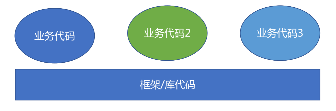
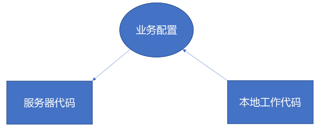
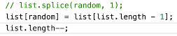

## 设计模式

观察者模式

- EventEmitter
- DOM addEventListener

外观模式

- jQuery

设计模式六大法则：

- 单一职责原则
- 里氏替换原则
- 依赖倒转原则
- 接口隔离
- 最小知晓原则
- 开闭原则

## serverless

云函数

- 不用再因为运维、架构的事情操心
- 缩短业务上线周期
- 减少出错的概率
- 业务开发的上手难度更低
- 渐进式

serverless => 屏蔽服务器细节

把能在多个业务复用的东西下沉，屏蔽细节。



vue / react => domless 屏蔽 DOM 操作细节

- 缩短功能上线周期
- 减少出错可能性
- 开发前端业务的上手难度更低

jQuery => compatless 屏蔽浏览器兼容细节

Node.js => threadless

JavaScript => typeless

Java/C# => 内存管理 less

可视化开发 => 编程 less

通过屏蔽细节（less），让业务开发更容易。（渐进式）

Node.js BFF 层应用到大部分的业务

- 快速扩展 Node.js 业务页面
- 新人能不理会底层细节快速上手

## 服务端框架搭建：koaless

```js
// app.js
module.exports = {
	'detail': async function () {
		// rpc
		// render
		return 'detail page';
	},
	'/list': async function () {
		return 'list page';
	},
	...
}

// run.js
const mount = require('koa-mount')
const requestFactory = require('./request-factory')
const createTemplate = require('./create-template');

requestFactory.registerProtocol('geek-rpc',
    require('./requestors/geek-rpc')
);
requestFactory.registerProtocol('http',
    require('./requestors/http')
);

module.exports = function (app) {
    const koa = new (require('koa'))

    koa.use(async (ctx, next) => {
        if (ctx.url == '/favicon.ico') {
            return;
        }
        await next();
    })

    Object.keys(app).forEach(routepath => {

        const dataConfig = eval(app[routepath].data);
        
        const requests = Object.keys(dataConfig)
            .reduce((ret, key) => {
                ret[key] = requestFactory(dataConfig[key]);
                return ret;
            }, {});
        const template = createTemplate(app[routepath].template);

        koa.use(
            mount(routepath, async (ctx) => {
                ctx.status = 200;
                const result = {};
                await Promise.all(
                    Object.keys(requests).map(key => {
                        return requests[key](ctx.query)
                            .then(res => {
                                result[key] = res.result;
                                return res.result;
                            })
                    })
                )

                try {
                    ctx.body = template(result);
                } catch(e) {
                    ctx.status = 500;
                    ctx.body = e.stack;
                }
            })
        );
    });

    koa.listen(3000);
}
```

## 屏蔽请求细节

## 云函数式工程实现

服务端：读取文件 运行代码（eval 或 ...）



## 彩蛋

