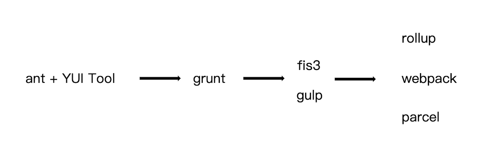

## 为什么需要构建工具

- 转换es6语法
- 转换JSX
- CSS前缀补全/预处理器
- 代码压缩混淆
- 图片压缩
- ...

## 前端构建演变之路



## 为什么选择webpack

- 社区生态丰富
- 配置灵活和插件化扩展
- 官方更新迭代速度快

## webpack配置

默认配置文件 webpack.config.js。也可以通过 webpack --config指定配置文件。

```jsx
// 零配置不需要指定entry和output，默认为以下值
module.export = {
	entry: './src/index.js',                   // 1.打包的入口文件
	output: './dist/main.js',                  // 2.打包的输出
	mode: 'production',                        // 3.环境
	module: {
		rules: [                                 // 4.Loader配置
			{ test: /\.txt$/, use: 'raw-loader' },
		],
	},
	plugins: [                                 // 5.插件配置
		new HtmlwebpackPlugin({
			template: './src/index.html',
		}),
	],
};
```