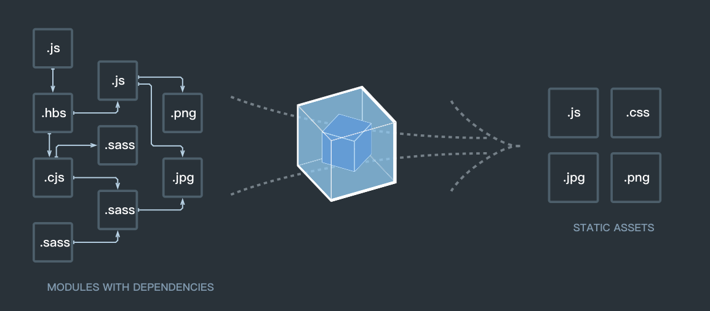
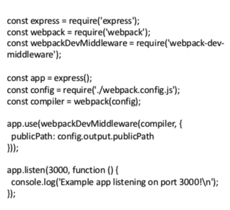
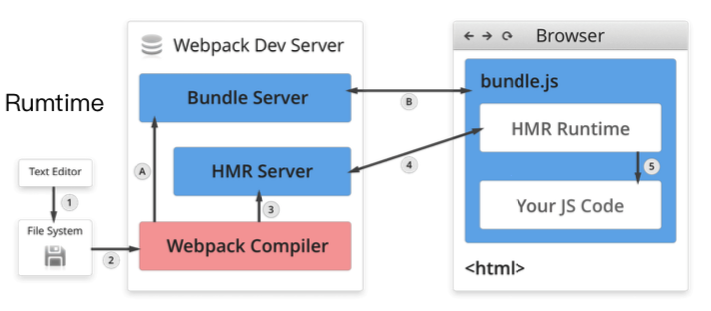

## Entry

entry是依赖图的入口，对于非代码比如图片、字体依赖也会不断加入到依赖图中。



- 单入口

    ```jsx
    // 单页面、单页应用
    // entry为字符串
    module.export = {
    	entry: './path/to/my/entry/file.js',
    };
    ```

- 多入口

    ```jsx
    // 多页面、多页应用
    // entry为对象
    module.export = {
    	entry: {
    		app: './src/app.js',
    		adminApp: './src/adminApp.js',
    	},
    };
    ```

## Output

- 单入口配置

    ```jsx
    module.exports = {
    	entry: './path/to/my/entry/file.js',
    	output: {
    		filename: 'bundle.js',
    		path: __dirname + '/dist',
    	},
    };
    ```

- 多入口配置

    ```jsx
    module.exports = {
    	entry: {
    		app: './src/app.js',
    		adminApp: './src/adminApp.js',
    	},
    	output: {
    		filename: '[name].js',  // 通过占位符确保文件名称的唯一
    		path: __dirname + '/dist',
    	},
    };
    ```

## Loaders

webpack开箱即用只支持JS和JSON两种文件类型，通过Loaders去支持其他文件类型并且把它们转化成有效的模块，并且可以添加到依赖图中。
Loaders本身是一个函数，接受源文件作为参数，返回转换的结果。

[常见的Loaders](https://www.notion.so/dc83141a18f048e686f380ccb44dcfcd)

- 用法

    ```jsx
    module.exports = {
    	module: {
    		rules: [
    			// test 指定匹配规则
    			// use 指定使用的loader名称
    			{ test: /\.txt/, use: 'raw-loader' },
    		],
    	},
    };
    ```

## Plugins

插件用于bundle文件的优化，资源管理和环境变量注入。（以及其他loaders无法做到的事情）
作用于整个构建过程。

[常见的Plugins](https://www.notion.so/601c7c42c05b4f868ca31e2116ef2269)

- 用法

    ```jsx
    module.exports = {
    	// plugins数组
    	plugins: [
    		new HtmlwebpackPlugin({
    			template: './src/index.html',
    		}),
    	],
    };
    ```

## Mode

Mode用来指定当前的构建环境是：production、development还是none。

设置mode可以使用webpack内置的函数，默认值为production。

[Mode的内置函数功能](https://www.notion.so/92fe483defc64f5b926a749e4d783179)

## 解析ES6、React JSX

```jsx
const path = require('path');

module.exports = {
	entry: './src/index.js',
	output: {
		filename: 'bundle.js',
		path: path.resolve(__dirname, 'dist'),
	},
	module: {
		rules: [
			{ test: /\.js$/, use: 'babel-loader' },
		],
	},
};

// .babelrc
{
	"presets": [  // 一个preset是一些功能的集合
		"@babel/preset-env",  // es6
		"@babel/preset-react"  // react
	],
	"plugins": [  // 一个plugin指对应某个功能
		"@babel/proposal-class-properties"
	],
}
```

## 解析css、less

```jsx
// use相当于compose，从右到左以此执行函数
// less-loader将less转换成css
// css-loader用于解析css文件，并且转换成commonjs对象（模块），插入到js里面去
// style-loader向<head>里插入<style>标签，并且将样式插入进去
module.exports = {
	module: {
		rules: [
			{ test: /\.css$/, use: ['style-loader', 'css-loader'] },
			{ test: /\.less$/, use: ['style-loader', 'css-loader', 'less-loader'] },
		],
	},
};
```

## 解析图片和字体

```jsx
module.exports = {
	module: {
		rules: [
			{ test: /\.(png|svg|jpg|gif)$/, use: ['file-loader'] },
			{ 
				test: /\.(png|svg|jpg|gif)$/,
			  use: [{
				  loader: 'url-loader',
					options: {
						limit: 10240
					}
				}]
		  },
			{ test: /\.(woff|woff2|eot|ttf|otf)$/, use: ['file-loader'] },
		],
	},
};

// url-loader也可以处理图片和字体，可以设置较小资源自动base64
// file-loader打包后资源文件名会被转换成hash值
// url-loader打包base64后资源文件不再存在，被作为字符串整合到js文件内，可以减少请求数
// 不支持html中img标签的src和link标签引入css里的url资源打包，需编写额外loader
// 目前webpack只支持以js文件作为入口

// js文件
import imgSrc from './images/logo.png';
import './style.css';


// css文件
@font-face {
	font-family: 'ThomasHeadline';
	src: url('./images/ThomasHeadline.otf');
}
.text {
	font-family: 'ThomasHeadline';
}
```

## 文件监听

文件监听是在发现源码发生变化时，自动重新构建出新的输出文件

开启监听的两种方式

- 启动webpack命令时，带上 --watch 参数
- webpack.config.js 中设置 watch 为 true

缺陷：需要手动刷新浏览器

原理

- 调用Node.js的文件读取API fs模块来判断文件内容是否变化

```jsx
module.export = {
	watch: true,  // 默认为false
	watchOptions: {
		ignored: /node_modules/,  // 默认为空 支持正则
		// 监听到变化后不会立刻告诉监听者，而是先缓存起来，等aggregateTimeout(默认300ms)后再执行
		// 若该时间段内有其他文件发生变化，则可以一次构建
		aggregateTimeout: 300,
		// 轮询文件是否发生变化，默认每秒1000次
		poll: 1000
	},
};
```

## 热更新

webpack-dev-server

- WDS不需要刷新浏览器
- WDS不输出文件，而是放在内存中，没有磁盘I/O，速度更快
- 配合HotModuleReplacementPlugin插件使用（将HMR runtime注入到bundle.js，使得bundle.js可以和HMR server建立websocket的通信连接）

```jsx
{
	"script": {
		"build": "webpack",
		"dev": "webpack-dev-server --open",  // open自动打开浏览器
	},
}
```

webpack-dev-middleware

- WDM 将 webpack 输出的文件传输给服务器（一般结合express、koa）
- 适用于灵活的定制场景

    

原理

- Webpack Compiler: 将JS编译成Bundle
- HMR Server: 将热更新的文件输出给HMR Runtime
- Bundle Server: 提供文件在浏览器的访问
- HRM Runtime: 会被注入到浏览器，更新文件的变化
- bundle.js: 构建输出的文件

第一次构建：Bundle Server → bundle.js  |  1 → 2 → A → B

文件变化：HMR Server → WebSocket → HMR Runtime  |  1 → 2 → 3 → 4 → 5



## 文件指纹

什么是文件指纹：打包后输出的文件名的后缀，例如 index_51727db.js

优点

- 方便版本管理，只需发布修改的文件
- 未修改的文件可以使用浏览器缓存

如何生成

- Hash：和整个项目的构建相关，只要项目文件有修改，整个项目构建的hash值就会更改。（不建议使用）
- Chunkhash：和webpack打包的chunk有关，不同的entry会生成不同的chunkhash值。（文件变化不会影响其他chunk，建议使用。无法和热更新一起使用，一般用于生产环境）
- Contenthash：根据文件内容来定义hash，文件内容不变，则contenthash不变。（一般用于css文件，避免js改变引起chunk变化而重新打包css，不适用于js文件）

图片文件指纹

设置file-loader的name，使用[hash]。此处hash与js、css的hash不太一样，是文件内容的hash，变化不会影响其他hash值。

[占位符](https://www.notion.so/59cd80a5439441829bd63dc0627a4b02)

指纹设置

```jsx
module.exports = {
	entry: {
		app: './src/app.js',
		search: './src/search.js'
	},
	output: {
		filename: '[name]_[chunkhash:8].js',  // 使用chunkhash
		path: __dirname + '/dist'
	},
	module: {
		rules: [{
			test: /\.(png|svg|jpg|gif)$/,  // 也可以对其他类型文件设置指纹
			use: [{
				loader: 'file-loader',  // 也可使用url-loader
				options: {
					name: 'img/[name]_[hash:8].[ext]'  // 使用hash，md5生成32位取前8位
				},
			}],	
		}],
	},
	plugins: [
		// 使用style loader动态插入style标签时不存在css文件
		// 需要使用MiniCssExtractPlugin插件生成css文件
		//（需删除style-loader，使用MiniCssExtractPlugin.loader）
		new MiniCssExtractPlugin({
			filename: '[name]_[contenthash:8].css'  // 使用contenthash
		});
	]
};
```

## HTML、CSS和JS代码压缩

内置了uglifyjs-webpack-plugin

css文件压缩

```jsx
// 使用optimize-css-assets-webpack-plugin 同时使用cssnano
module.exports = {
	entry: {
		app: './src/app.js',
		search: './src/search.js'
	},
	output: {
		filename: '[name][chunkhash:8].js',
		path: __dirname + '/dist'
	},
	plugins: [
		new OptimizeCSSAssetsPlugin({
			assetNameRegExp: /\.css$/g,
			cssProcessor: require('cssnano’)
		})
	]
};
```

html文件压缩

```jsx
// 修改 html-webpack-plugin，设置压缩参数
module.exports = {
	entry: {
		app: './src/app.js',
		search: './src/search.js'
	},
	output: {
		filename: '[name][chunkhash:8].js',
		path: __dirname + '/dist'
	},
	plugins: [
		new HtmlWebpackPlugin({
			template: path.join(__dirname, 'src/search.html’),
			filename: 'search.html’,
			chunks: ['search’],
			inject: true,
			minify: {
				html5: true,
				collapseWhitespace: true,
				preserveLineBreaks: false,
				minifyCSS: true,  // 压缩html内联的css，不是打包的css
				minifyJS: true,  // 压缩html内联的js，不是打包的js
				removeComments: false
			}
		})
	]
};
```

bundle：打包最终生成的文件

chunk：每个chunk是由多个module组成，可以通过代码分割成多个chunk

module：webpack中的模块（js、css、图片等）