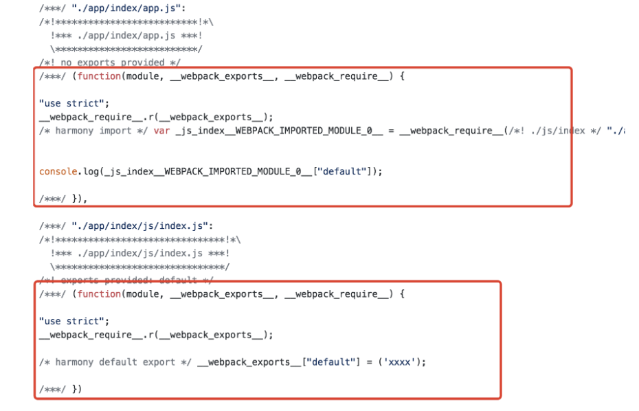
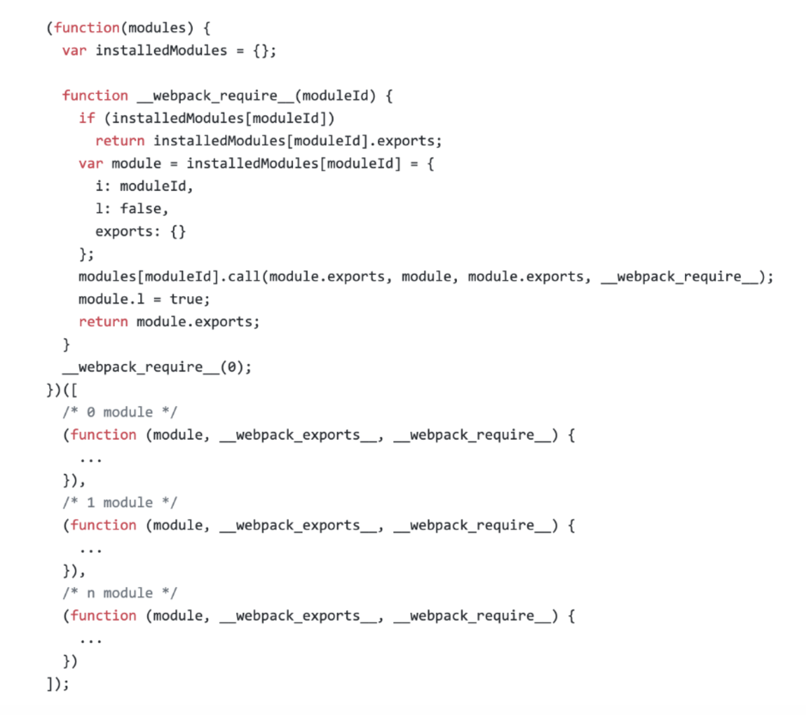
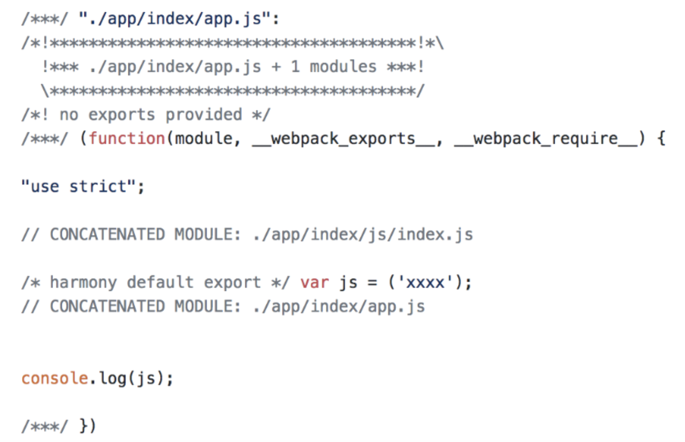
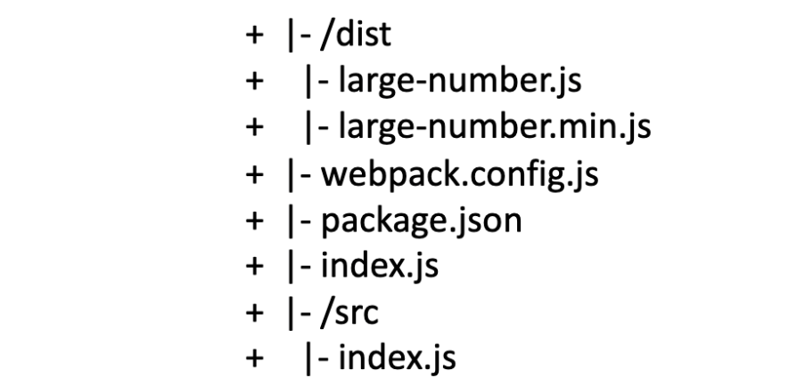
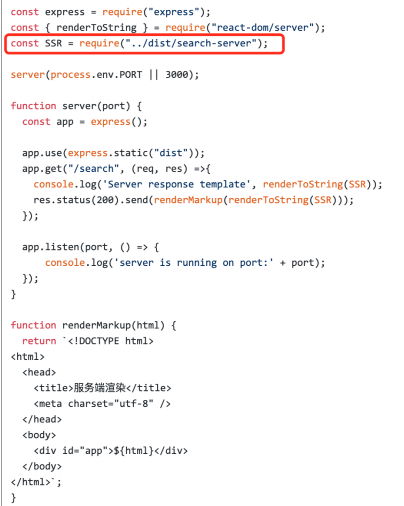
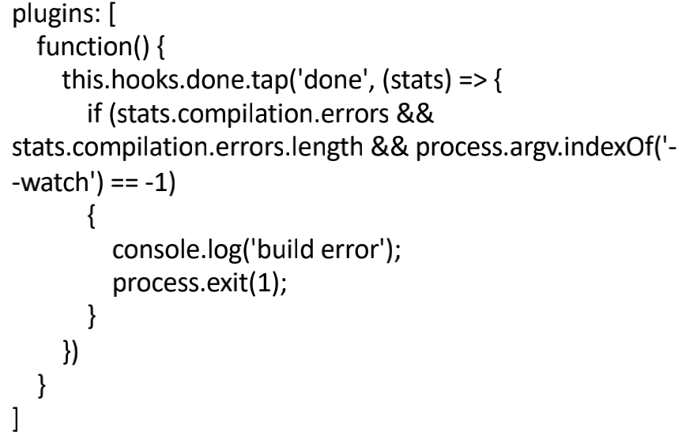

## 自动清理构建目录产物

手动清理：rm -rf ./dist && webpack

自动清理（使⽤clean-webpack-plugin）

```jsx
{
	plugins: [
		new CleanWebpackPlugin()
	]
}
```

## 自动补齐css3前缀

PostCSS 插件 autoprefixer 自动补齐 （规则：[https://caniuse.com/](https://caniuse.com/)）

```jsx
{
	module: {
		rules: [
			{
				test: /\.less$/,
				use: [
					'style-loader',
					'css-loader',
					'less-loader',
					{
						loader: 'postcss-loader',
						options: {
							plugins: () => {
								require('autoprefixer')({
									browsers: ["last 2 version", "> 1%", "iOS 7"]
								})
							}
						}
					}
				]
			}
		]
	}
}
```

## 移动端 px自动转化为rem

rem 的定义: font-size of the root element

使⽤ px2rem-loader

页面渲染时计算根元素的 font-size 值，可以使用⼿淘的lib-flexible库(比较方便的解决手机端的1px问题)；也可以 html:{font-size:calc(100vw / 固定分辨率 * 12);}

rem兼容性更好，支持android2.2以上的机型。但是vm只支持android4.4和ios8以上的。另外rem需要的计算需要在头部内联一个脚本，vm是纯css去实现的。如果不考虑兼容性，vm完全没问题

## 静态资源内联

意义

- 页面框架的初始化脚本
- 上报相关打点
- css内联避免页面闪动
- 小图片或者字体内联(url-loader) 减少http请求

raw-loader 内联 html：<script>${require(' raw-loader!babel-loader!. /meta.html')}</script>

raw-loader 内联 JS：<script>${require('raw-loader!babel-loader!../node_modules/lib-flexible')}</script>

CSS内联

- 方案一：借助style-loader
- 方案二：html-inline-css-webpack-plugin

## 多页面应用打包通用方案

基本思路：每个页面对应⼀个 entry，一个 html-webpack-plugin

缺点：每次新增或删除页面需要改 webpack 配置

通用方案：利用 glob.sync 动态获取 entry 和设置 html-webpack-plugin 数量

entry: glob.sync(path.join(__dirname, './src/*/index.js')),

## 使用source map

作⽤：通过 source map 定位到源代码

[http://www.ruanyifeng.com/blog/2013/01/javascript_source_map.html](http://www.ruanyifeng.com/blog/2013/01/javascript_source_map.html)

开发环境开启，线上环境关闭：线上排查问题的时候可以将 sourcemap 上传到错误监控系统

## 提取页面公共资源

基础库分离

- 思路：将 react、react-dom 基础包通过 cdn 引入，不打入 bundle 中（耗时间）。
- 方法：使用 html-webpack-externals-plugin，在 html 中添加 script 标签引入。

利用 **SplitChunksPlugin** 进行公共脚本分离（webpack4内置，替代CommonChunkPlugin）

chunks 参数说明：

- async 异步引入的库进行分离（默认）
- initial 同步引入的库进行分离
- all 所有引入的库进行分离（推荐）

使用 SplitChunksPlugin 也可以分离基础包：
cacheGroups —> commons —> test 匹配出需要分离的基础包

利用 SplitChunksPlugin 分离页面公共文件(需要在 HtmlWebpackPlugin 里设置 chunks 引用)：
splitChunks —> minSize 分离的包的最小体积
splitChunks —> cacheGroups —> minChunks 设置最小引用次数
...

## Tree Shaking

概念：一个模块可能有多种方法，只要其中一个方法使用到了，则整个文件都会被打到 bundle 里去，tree shaking 就是只把用到的方法打入 bundle，没用到的方法会在 uglify 阶段被擦除掉。

使用：webpack 默认支持，在 .babelrc 里设置 modules: false 即可。（production mode 情况下默认开启）

要求：必须是 ES6 语法，CJS(commonJs)方式不支持。
引用的代码有副作用的话，tree shaking 会失效。

DCE (dead code elimination)

- 代码不会被执行，不可到达
- 代码执行的结果不会被用到
- 代码只会影响死变量（只写不读）

原理：利用 ES6 模块的特点：

- 只能作为模块顶层的语句出现
- import 的模块名只能是字符串常量
- import binding 是 immutable 的（不像 require 一样能动态变化）

代码擦除：uglify 阶段删除被标记的无用代码

## Scope Hoisting 使用和原理分析

模块转换分析

- 被 webpack 转换后的模块会带上一层包裹
- import 会被转换成 __webpack_require___



进一步分析 webpack 的模块机制

- bundle.js 打包出来的是一个 IIFE 和 一群模块初始化包裹函数
- IIFE 的参数 modules 是一个数组，每一项是一个模块初始化函数
- __webpack_require___ 用来加载模块，返回 module.exports
- 通过 __webpack_require__(0) 启动程序



导致的问题

- 大量作用域包裹代码，导致体积增大（模块越多越明显）
- 运行代码时创建的函数作用域变多，内存开销变大

scope hoisting

原理：将所有模块的代码按照引用顺序放在一个函数作用域里(按引用关系嵌套)，然后适当地重命名一些变量以防止变量冲突。

作用：可以减少函数声明代码和运行内存开销。

注意：如果一个模块引用次数大于1次，那么这个模块的代码会被内联多次，从而增加了打包出来的js bundle的体积。所以 scope hoisting 对模块的**引用次数大于1**次是不产生效果的。



使用

- production mode 时默认开启
- 非 production 时可使用 ModuleConcatenationPlugin
- 必须是 ES6 语法，CJS不支持

## 代码分割和动态import

webpack 能将代码库分割成 chunks，当代码运行到需要它们的时候再进行加载。

适用场景：

- 抽离相同代码到一个共享块
- 脚本懒加载，使得初始下载的代码更小

懒加载 JS 脚本的方式

- commonJS: require.ensure
- ES6: 动态 import（目前还没有原生支持，需要 babel 转换）

如何使用动态 import

安装 babel 插件 @babel/plugin-syntax-dynamic-import

代码分割的效果

动态引入的模块会单独打包成一个js文件，在触发时使用 jsonp 的方式通过动态创建 script 标签加载脚本。

## 在webpack中使用ESLint

- "pre-commit": "lint:staged" 在提交代码时检查
- 使用 eslint-loader 构建时检查 JS 规范

## webpack打包组件和基础库

打包要求

- 压缩版 非压缩版
- 支持 AMD / CJS / ESM 模块引入

目录结构



设置入口文件 package.json 的 main 字段为 index.js

```jsx
if (process.env.NODE_ENV === "production") {
	module.exports = require("./dist/large-number.min.js");
} else {
	module.exports = require("./dist/large-number.js");
}
```

```jsx
module.exports = {
	mode: "none",
	entry: {
		"large-number": "./src/index.js",
		"large-number.min": "./src/index.js"
	},
	output: {
		filename: "[name].js",
		library: "largeNumber",
		libraryExport: "default",
		libraryTarget: "umd" // 支持 AMD / CJS / ESM 模块引入
	},
	optimization: {
		minimize: true,
		minimizer: [
			new TerserPlugin({
				include: /\.min\.js$/,  // 设置只压缩 min.js 结尾的⽂件
			}),
		],
	}
};
```

打包完成后可通过 npm 发布

## webpack实现SSR打包

[github-demo](https://github.com/geektime-geekbang/geektime-webpack-course/tree/master/code/chapter03/my-project)

server/index.js



dist/search-server 为打包出的针对服务端的组件

- webpack.ssr.js / npm run build:ssr
- entry —> search/index-server.js
- output —> [name]-server.js

index-server.js

- ReactDom.render ⇒ module.export = <Comp />
- Node.js 中没有 document 和 window 对象，hack: window = { }
- 将 fetch 或者 ajax 发送请求的写法改成 isomorphic-fetch 或者 axios (自动判断宿主环境适配)
- Node.js ⽆法解析 CSS 。方案：
    1. 服务端打包通过 ignore-loader 忽略掉 CSS 的解析
    2. 将 style-loader 替换成 isomorphic-style-loader (需要写CSS in JS：style={ paddingLeft: 0 }) 不推荐

解决样式不显示问题

```jsx
// search.html 为打包出的 html 文件，含有 css (内联/外联)，需添加占位符
const template = fs.readFileSync(path.join(__dirname, '../dist/search.html'), 'utf-8')
const renderMarkup = (str) => {
	return template.replace('<!--HTML_PLACEHOLDER-->', str)
}
```

初始数据

```jsx
const renderMarkup = (str) => {
	return template.replace('<!--HTML_PLACEHOLDER-->', str)
	.replace('<!--INITIAL_DATA_PLACEHOLDER-->', `<script>window.__initial_data = data</script>`)
}
// data 为从其他接口获取的数据
```

## 优化构建时命令行的显示日志

使⽤ friendly-errors-webpack-plugin；success、warning、error 时显示颜色图块

stats 设置成 errors-only；只有发生错误时输出

```jsx
plugins: [
	new FriendlyErrorsWebpackPlugin()
],
stats: 'errors-only'
```

## 构建异常和中断处理

如何判断构建是否成功？

- 每次构建完成后输⼊ echo $? 获取错误码
- webpack4 之前的版本构建失败不会抛出错误码 (error code)

Node.js 中的 process.exit 规范

- 0 表示成功完成，回调函数中，err 为 null
- ⾮ 0 表示执⾏失败，回调函数中，err 不为 null，err.code 就是传给 exit 的数字

如何主动捕获并处理构建错误？

