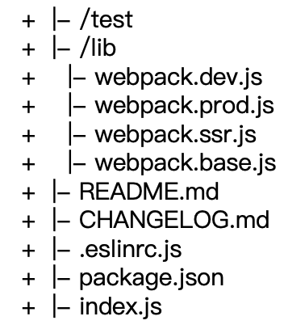
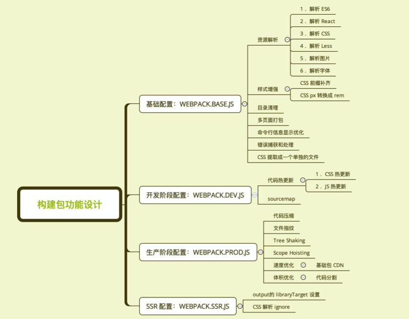
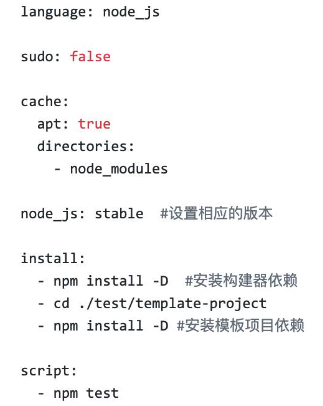

## 构建配置包设计

构建配置抽离成 npm 包的意义：通用型、可维护性、质量(测试)

可选方案：

- 通过多个配置文件(base/dev/prod/ssr)管理不同环境的构建，webpack --config 参数进行控制
- 将构建配置设计成一个库，比如:hjs-webpack、Neutrino、webpack-blocks
- 抽成一个工具进行管理，比如:create-react-app, kyt, nwb
- 将所有的配置放在一个文件，通过 --env 参数控制分支选择

通过 webpack-merge 组合配置 module.exports = merge(baseConfig, devConfig);

## 功能模块设计和目录结构





## 使用 ESLint 规范构建脚本

使用 eslint-config-airbnb-base

eslint --fix 可以自动处理空格

```jsx
// eslintrc.js
module.exports = {
	"parser": "babel-eslint",
	"extends": "airbnb-base",
	"env": {
		"browser": true,
		"node": true
	}
};
```

## 冒烟测试介绍和实际运用

[github](https://github.com/geektime-geekbang/geektime-webpack-course/tree/master/code)

冒烟测试是指对提交测试的软件在进行详细深入的测试之前而进行的**预测试**，这种预测试的主要目的是暴露导致软件需重新发布的**基本功能失效**等严重问题。

冒烟测试执行

- 构建是否成功

    在示例项目里面运行构建(webpack函数)，看看是否有报错

- 判断基本功能是否正常 / build 目录是否有内容输出

    编写 mocha 测试用例 (glob.sync)

    - 是否有 JS、CSS 等静态资源文件
    - 是否有 HTML 文件

## 单元测试与测试覆盖率

技术选型: Mocha + Chai

测试覆盖率：istanbul

测试代码: describe(描述测试文件), it(测试用例), except(断言)

测试命令: mocha add.test.js

```jsx
// entry 测试
it('entry', () => {
	assert.equal(baseConfig.entry.index, '/User/.../index.js')
})

// package.json
"scripts": {
	"test": "node_modules/mocha/bin/_mocha”
},
```

## 持续集成和Travis CI

Continuous Integration 持续集成的作用：

- 快速发现错误
- 防止分支大幅偏离主干

核心措施：代码集成到主干之前(提交代码/merge request)，必须通过自动化测试。只要有一个测试用例失败， 就不能集成。

接入 Travis CI

1. [https://travis-ci.org/](https://travis-ci.org/) 使用 GitHub 账号登录
2. 在 [https://travis-ci.org/account/repositories](https://travis-ci.org/account/repositories) 为项目开启
3. 项目根目录下新增 .travis.yml

    

## 发布构建包到npm社区

添加用户: npm adduser

升级版本

- 升级补丁版本号(0.0.1): npm version patch
- 升级小版本号(0.1.0): npm version minor
- 升级大版本号(1.0.0): npm version major

发布版本: npm publish

## Git Commit规范和changelog生成

良好的 Git commit 规范优势:

- 加快 Code Review 的流程
- 根据 Git Commit 的元数据生成 Changelog
- 后续维护者可以知道 Feature 被修改的原因

可以使用 angular 的 Git commit 日志作为规范

本地开发阶段增加 precommit 钩子

npm install husky --save-dev

通过 commitmsg 钩子校验信息

```jsx
"scripts": {
	"commitmsg": "validate-commit-msg",
	"changelog": "conventional-changelog -p angular -i CHANGELOG.md -s -r 0"
},
"devDependencies": {
	"validate-commit-msg": "^2.11.1",
	"conventional-changelog-cli": "^1.2.0",
	"husky": "^0.13.1"
}
```

## 语义化版本（Semantic Versioning）规范格式

主版本号:当你做了不兼容的 API 修改

次版本号:当你做了向下兼容的功能性新增

修订号:当你做了向下兼容的问题修正

先行版本号可以作为发布正式版之前的版本

- -alpha.0: 是内部测试版，一般不向外部发布，会有很多 Bug。一般只有测试人员使用
- -beta.3: 也是测试版，这个阶段的版本会一直加入新的功能。在 Alpha 版之后推出
- -rc2: Release Candidate 系统平台上就是发行候选版本。RC 版不会再加入新的功能了，主要着重于除错