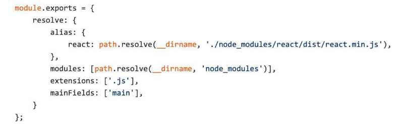

## 初级分析：使用webpack内置的stats

**package.json 中使用 stats**

```jsx
"scripts": {
	"build:stats": "webpack --env production --json > stats.json"
}
```

**Node.js 中使用**

```jsx
webpack(config, (err, stats) => {
	if (err) { ... }
	console.log(status);
})
```

颗粒度太低

## 速度分析：使用speed-measure-webpack-plugin

分析整个打包总耗时

可以看到每个 loader 和插件执行耗时

```jsx
const SpeedMeasurePlugin = require("speed-measure-webpack-plugin");
const smp = new SpeedMeasurePlugin();
 
const webpackConfig = smp.wrap({
  plugins: [
    new MyPlugin(),
    new MyOtherPlugin()
  ]
});
```

## 体积分析：使用webpack-bundle-analyzer

依赖的第三方模块文件大小

业务里面的组件代码大小

```jsx
const BundleAnalyzerPlugin = require('webpack-bundle-analyzer').BundleAnalyzerPlugin;

module.exports = {
  plugins: [
    new BundleAnalyzerPlugin()
  ]
}
```

## 使用高版本的webpack和Node.js

- 高版本node带来的优化 (for of 替代 forEach; Map 和 Set 替代 Object; includes 替代 indexOf)

webpack4 优化：

- 默认使用更快的 md4 hash 算法
- webpacks AST 可以直接从 loader 传递给 AST，减少解析时间
- 使用字符串方法替代正则表达式

## 多进程/多实例构建

webpack3 通过 happypack 实现

webpack4 使用 thread-loader 解析资源

原理：每次 webpack 解析一个模块，thread- loader 会将它及它的依赖分配给 worker 进程中

把这个 loader 放置在其他 loader 之前， 放置在这个 loader 之后的 loader 就会在一个单独的 worker 池(worker pool)中运行。

在 worker 池(worker pool)中运行的 loader 是受到限制的（详见文档）

## 多进程并行压缩代码

方法一：使用 parallel-uglify-plugin 插件

方法二：uglifyjs-webpack-plugin 开启 parallel 参数

方法三：terser-webpack-plugin 开启 parallel 参数（推荐）

parallel 默认 cpu 内核数 * 2 - 1

## 进一步分包：预编译资源模块

分包方法1：

使用 html-webpack-externals- plugin 设置 Externals 将 react、react-dom 基础包通过 cdn 引入，不打入 bundle 中

缺点：生成太多的 script 标签；split-chunks 每次都会对基础包进行分析

进一步分包 思路：

将 react、react-dom、redux、react-redux 基础包和业务基础包打包成一个文件

方法：使用 **DLLPlugin** 进行分包，**DllReferencePlugin** 对 manifest.json 引用

最后生成一个 <script src="/build/library/library.dll.js"></script>

dll: Dynamic Link Library 一个包含可由多个程序，同时使用的代码和数据的库

## 充分利用缓存提升二次构建速度

思路：

- babel-loader 开启缓存
- terser-webpack-plugin 开启缓存（压缩）
- 使用 cache-loader 或者 hard-source-webpack-plugin（模块转换）

缓存在 node_modules/.cache 下

## 缩小构建目标

目的：尽可能的少构建模块；比如 babel-loader 不解析 node_modules

**减少文件搜索范围**

- 优化 resolve.modules 配置（减少模块搜索层级）（不指定的话默认一直往父目录找）
- 优化 resolve.mainFields 配置 （优化默认入口文件查找）
- 优化 resolve.extensions 配置 （import from 不写后缀时默认只查找.js）
- 合理使用 alias （import from react 时直接从指定路径去找）



## 使用Tree Shaking擦除无用的JavaScript和CSS

PurifyCSS: 遍历代码，识别已经用到的 CSS class

uncss: HTML 需要通过 jsdom 加载，所有的样式通过PostCSS解析，通过 document.querySelector 来识别在 html 文件里面不存在的选择器

使用 purgecss-webpack-plugin

和 mini-css-extract-plugin 配合使用

## 使用webpack进行图片压缩

基于 Node 库的 imagemin 或者 tinypng API；配置 image-webpack-loader

Imagemin 优点：

- 有很多定制选项
- 可以引入更多第三方优化插件，例如pngquant
- 可以处理多种图片格式

## 使用动态Polyfill服务

babel-polyfill 打包后的体积较大

Polyfill Service原理：识别 User Agent，下发不同的 Polyfill