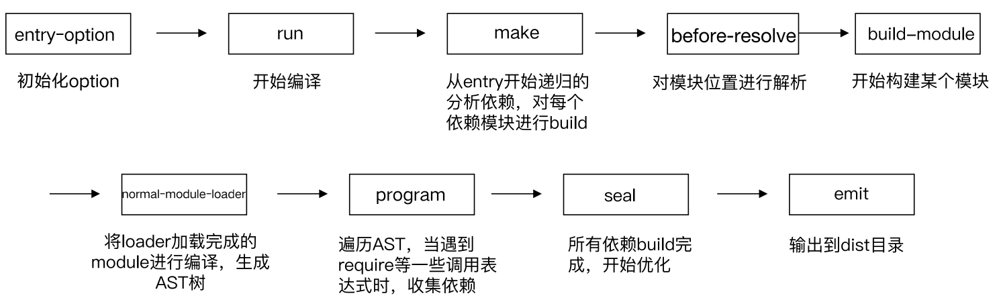

## webpack启动过程分析

通过 npm scripts 运行 webpack

- npm run dev
- npm run build

通过 webpack 直接运行

- webpack entry.js bundle.js

在命令行运行以上命令后，npm会让命令行工具进入node_modules\.bin 目录查找是否存在 webpack.sh 或者 webpack.cmd 文件，如果存在，就执行，不存在，就抛出错误。

实际的入口文件是：node_modules\webpack\bin\webpack.js

启动后的结果

webpack 最终找到 webpack-cli (webpack-command) 这个 npm 包，并且执行 CLI

## webpack-cli源码阅读

webpack-cli 做的事情

- 引入 yargs，对命令行进行定制
- 分析命令行参数，对各个参数进行转换，组成编译配置项
- 引用 webpack，根据配置项进行编译和构建

webpack-cli 执行的结果

- webpack-cli 对配置文件和命令行参数进行转换最终生成配置选项参数 options
- 最终会根据配置参数实例化 webpack 对象，然后执行构建流程

## Tapable插件架构与Hooks设计

Webpack 可以将其理解是一种基于事件流的编程范例，一系列的插件运行。

Tapable 是一个类似于 Node.js 的 EventEmitter 的库, 主要是控制钩子函数的发布与订阅,控制着 webpack 的插件系统。

Tapable库暴露了很多 Hook（钩子）类，为插件提供挂载的钩子。

## Tapable是如何和webpack进行关联起来的？

## webpack流程篇：准备阶段

webpack的编译都按照下面的钩子调用顺序执行

## webpack流程篇：模块构建和chunk生成阶段

Chunk 生成算法

1. webpack 先将 entry 中对应的 module 都生成一个新的 chunk
2. 遍历 module 的依赖列表，将依赖的 module 也加入到 chunk 中
3. 如果一个依赖 module 是动态引入的模块，那么就会根据这个 module 创建一个 新的 chunk，继续遍历依赖
4. 重复上面的过程，直至得到所有的 chunks

## webpack流程篇：文件生成

## **动手编写一个简易的 webpack**

模块化：增强代码可读性和维护性

- 传统的网页开发转变成 Web Apps 开发
- 代码复杂度在逐步增高
- 分离的 JS文件/模块，便于后续代码的维护性
- 部署时希望把代码优化成几个 HTTP 请求

常见的几种模块化方式：

- ES6 module （静态）
- CJS （动态）
- AMD （借鉴 CJS 在浏览器实现，动态）

抽象语法树（abstract syntax tree 或者缩写为 AST），或者语法树（syntax tree），是源代码的抽象语法结构的树状表现形式，这里特指编程语言的源代码。树上的每个节点都表示源代码中的一种结构。

AST 应用

- 模板引擎
- ES6 转 ES5，TS 转 JS

**动手实现一个简易的 webpack**

可以将 ES6 语法转换成 ES5 的语法

- 通过 babylon 生成AST
- 通过 babel-core 将AST重新生成源码

可以分析模块之间的依赖关系

- 通过 babel-traverse 的 ImportDeclaration 方法获取依赖属性

生成的 JS 文件可以在浏览器中运行