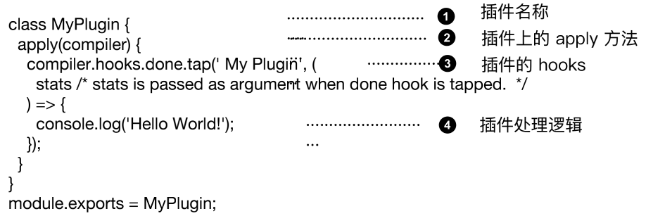

## loader的链式调用与执行顺序

定义：loader 只是一个导出为函数的 JavaScript 模块

```jsx
module.exports = function(source) { return source; };
```

多 Loader 时的执行顺序：多个 Loader 串行执行，顺序从后到前

函数组合的两种情况

- Unix 中的 pipline （左 —> 右）
- Compose(webpack采取的是这种) （右 —> 左）    compose = (f, g) => (...args) => f(g(...args));

## 使用loader-runner高效进行loader的调试

loader-runner 允许你在不安装 webpack 的情况下运行 loaders

作用：

- 作为 webpack 的依赖，webpack 中使用它执行 loader
- 进行 loader 的开发和调试

开发一个 raw-loader

```jsx
module.exports = function(source) {
	const json = JSON.stringify(source)
		// 为了安全起见, ES6模板字符串的问题
		.replace(/\u2028/g, ‘\\u2028' )
		.replace(/\u2029/g, '\\u2029');
	return `export default ${json}`;
};
```

run-loader.js

```jsx
const fs = require("fs");
const path = require("path");
const { runLoaders } = require("loader-runner");
runLoaders({
	resource: "./demo.txt",
	loaders: [path.resolve(__dirname, "./loaders/raw-loader")],
	readResource: fs.readFile.bind(fs),
},(err, result) => (err ? console.error(err) : console.log(result)));
```

node run-loader.js

## 更复杂的loader的开发场

loader 的参数获取：通过 loader-utils 的 getOptions 方法获取

loader 异常处理

- loader 内直接通过 throw 抛出
- 通过 this.callback 传递错误

loader 的异步处理：通过 this.async 来返回一个异步函数

在 loader 中使用缓存

- webpack 中默认开启 loader 缓存；可以使用 this.cacheable(false) 关掉缓存

缓存条件： loader 的结果在相同的输入下有确定的输出

有依赖的 loader 无法使用缓存

loader 如何进行文件输出

- 通过 this.emitFile 进行文件写入

## 实战开发一个自动合成雪碧图的 loader

支持的语法转换


如何将两张图片合成一张图片：使用 spritesmith

## 插件基本结构介绍

插件没有像 loader 那样的独立运行环境，只能在 webpack 里面运行

基本结构



插件使用：plugins: [ new MyPlugin() ]

## 更复杂的插件开发场景

通过插件的构造函数进行获取

```jsx
module.exports = class MyPlugin {
	constructor(options) {
		this.options = options;
	}
	apply() {
		console.log("apply", this.options);
	}
};
```

插件的错误处理

- 参数校验阶段可以直接 throw 的方式抛出
- 通过 compilation 对象的 warnings 和 errors 接收

Compilation 上的 assets 可以用于文件写入

- 可以将 zip 资源包设置到 compilation.assets 对象上

文件写入需要使用 webpack-sources

插件的插件：插件自身也可以通过暴露 hooks 的方式进行**自身扩展**

## 实战开发一个压缩构建资源为zip包的插件

[代码 github](https://github.com/geektime-geekbang/geektime-webpack-course/tree/master/code/chapter07/zip-plugin)

要求：

- 生成的 zip 包文件名称可以通过插件传入
- 需要使用 compiler 对象上的特地 hooks 进行资源的生成

Node.js 里面将文件压缩为 zip 包：使用 jszip