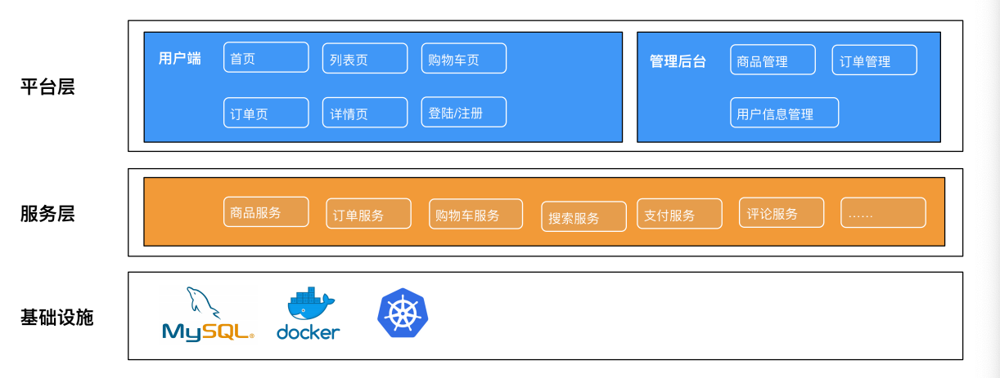
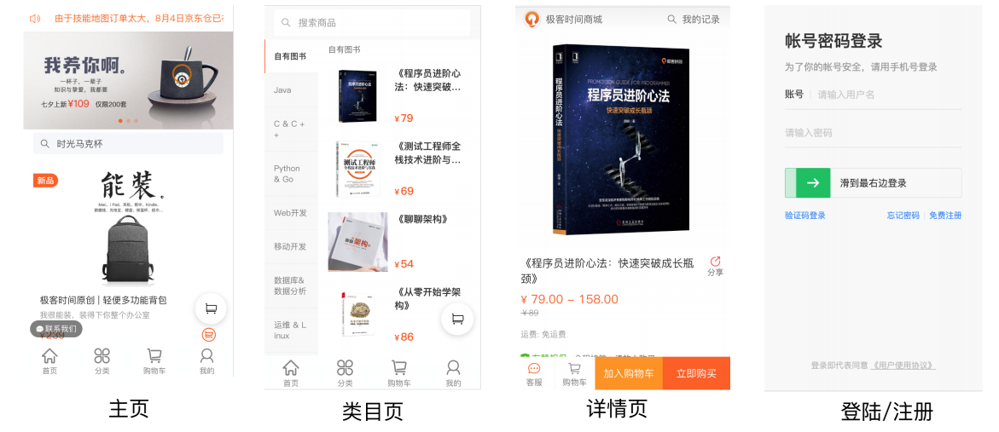
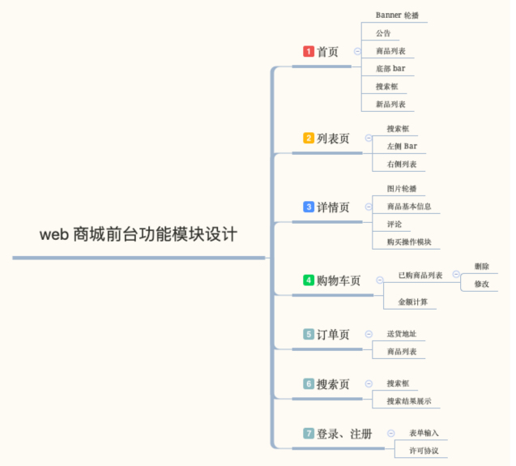
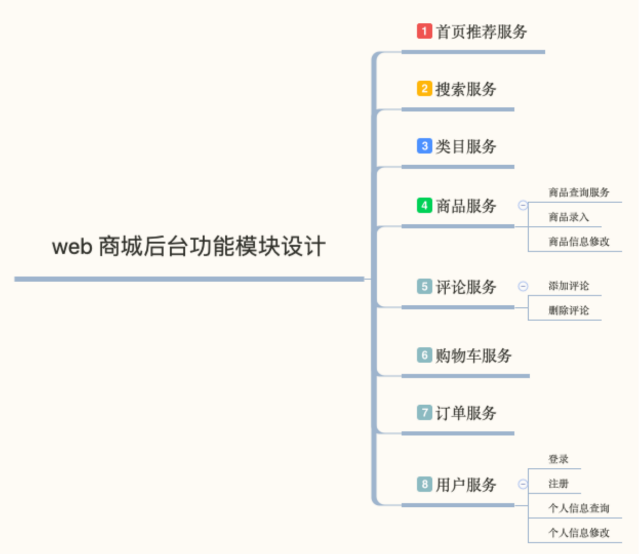
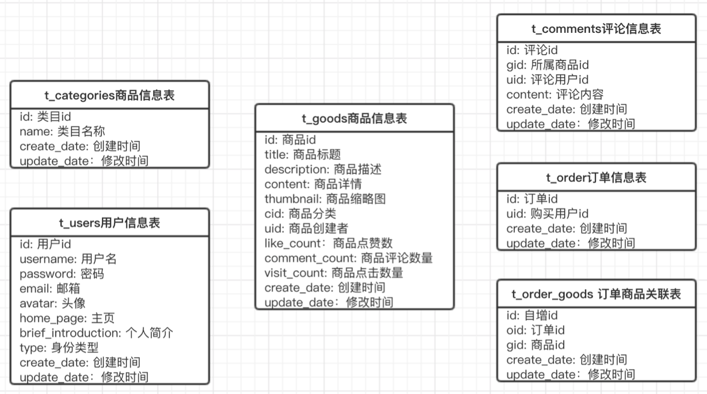
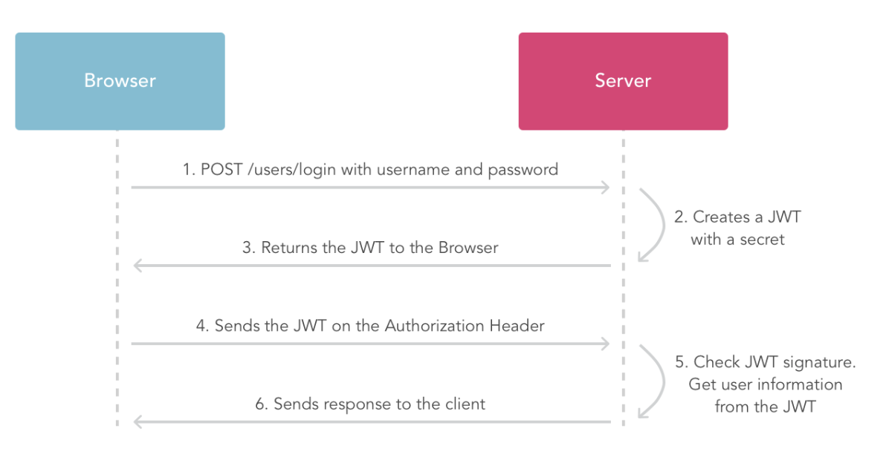

## 商城技术栈选型和整体架构

前端：react、redux、webpack

后端：koa、MySQL

**架构设计**

## 商城界⾯ UI 设计与模块拆分

**前台模块拆分**

**后台模块拆分**

## React全家桶环境搭建

初始化项⽬：npm init -y

创建项⽬目录

**安装依赖**

安装 react、react-dom、redux、react-redux

安装 @babel/core

安装 geektime-builder-webpack

- npm i geektime-builder-webpack -D

创建 actions、reducers、store

## 数据库实体设计

登陆注册 API

商品 API

- 商品列表(GET):/goods?page=1&per_page=10
- 商品详情(GET): /goods/:id
- 修改商品(PUT): /goods/:id

## JSON Web Token 工作原理

## Web 商城的性能优化策略

渲染优化

- ⾸页、列表页、详情页采用 SSR 或者 Native 渲染
- 个⼈中心页预渲染（prerender）

弱⽹优化

- 使用离线包、PWA 等离线缓存技术

Webview 优化

- 打开 Webview 的同时并行的加载页面数据

[https://github.com/cpselvis/geektime-webpack-course](https://github.com/cpselvis/geektime-webpack-course)